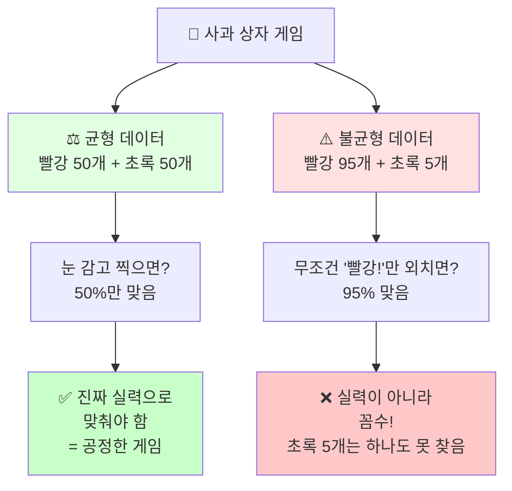
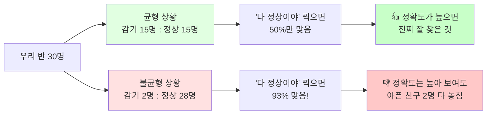
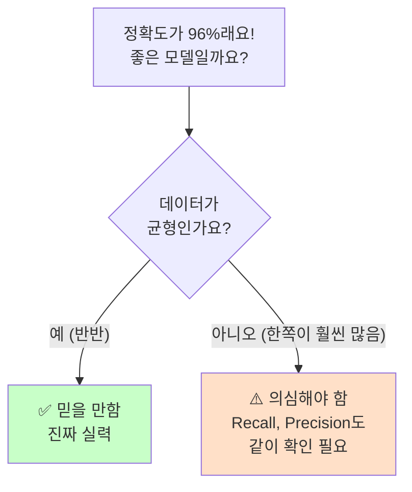
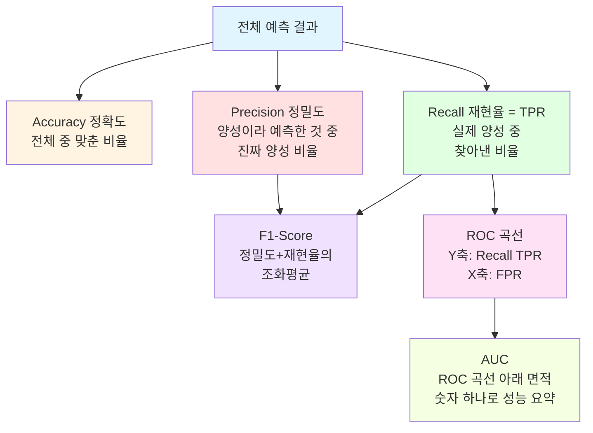
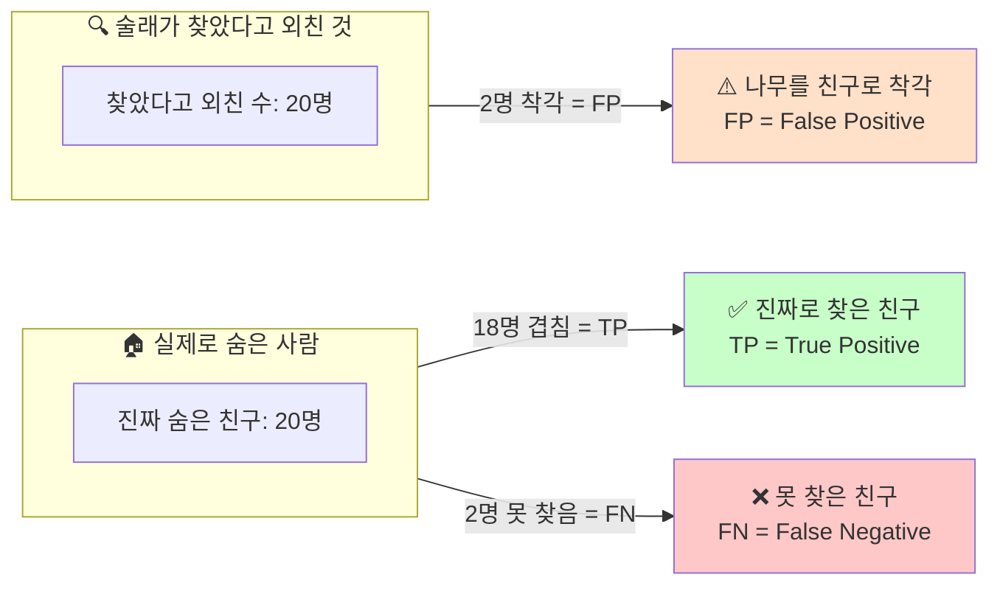

## 🍎 균형 vs 불균형 데이터 (머메이드 다이어그램)

---

## 🏥 우리 반 감기 친구 찾기 버전

---

## 💡 핵심 요약 다이어그램

이 세 개 다이어그램을 순서대로 영상에 넣으시면 "왜 정확도만 믿으면 안 되는지"가 시각적으로 확 와닿을 것 같아요. 특히 마지막 요약 다이어그램은 영상 마무리에 "그래서 오늘의 핵심은?" 하고 정리할 때 쓰기 좋습니다.

좋습니다! 정확도/정밀도/재현율을 어린이도 이해할 수 있게 "숨바꼭질" 비유로 풀어서 표와 다이어그램 만들어드릴게요.

## 📊 헷갈리는 지표 한눈에 정리

| 영어 | 한글 | 쉬운 설명 (초등학생 버전) | 공식 |
|---|---|---|---|
| **Accuracy** | 정확도 | 전체 문제 중에서 몇 개 맞았나? (시험 점수) | (TP+TN) / 전체 |
| **Precision** | 정밀도 | "이거 맞다!"라고 외친 것 중 진짜 맞은 비율 | TP / (TP+FP) |
| **Recall** | 재현율(민감도) | 진짜 정답들 중에서 내가 찾아낸 비율 | TP / (TP+FN) |
| **F1-Score** | F1 점수 | 정밀도와 재현율 둘 다 챙긴 균형 점수 | 2×(P×R)/(P+R) |
| **ROC** | ROC 곡선 | Recall(TPR)과 FPR의 관계 그래프 | - |
| **AUC** | 곡선 아래 면적 | ROC 곡선의 성능을 숫자 하나로 요약 | - |

---

## 초등학생 버전: "숨바꼭질 술래" 비유

술래가 숨은 친구 20명 중 18명을 찾아냈다고 상상해보세요.

- **Recall(재현율)** = "숨은 친구 20명 중에 몇 명 찾았어?" → **18/20 = 90%** (놓치지 않고 잘 찾았나?)
- **Precision(정밀도)** = "찾았다고 외친 것 중에 진짜 숨은 친구였어?" (나무 그림자를 친구로 착각하면 정밀도 down)
- **Accuracy(정확도)** = "이번 술래잡기 전체적으로 잘했어?" (친구도 잘 찾고, 헷갈리는 것도 잘 구별했나 종합 점수)

---

## 🔗 개념 관계 다이어그램 (Mermaid)

---

## 🎯 술래잡기 그림으로 보는 혼동행렬

이렇게 **숨바꼭질 술래** 비유는 영상 도입부에서 쓰시면 "AI 왕초보"분들이 확 이해하실 것 같아요. Recall = "놓치지 않기", Precision = "헷갈리지 않기"로 딱 두 단어로 각인시키면 기억에도 오래 남을 거예요.

**Hyperopt**는 머신러닝 모델의 **하이퍼파라미터를 자동으로 최적화(탐색)**해주는 파이썬 라이브러리입니다.

**핵심 아이디어**

기존에는 하이퍼파라미터를 튜닝할 때 보통 이런 방법을 씁니다:
- **Grid Search**: 정해진 값들을 격자 형태로 모두 다 시도 (느림, 값 개수가 늘면 조합이 폭발적으로 증가)
- **Random Search**: 범위 내에서 무작위로 값을 뽑아 시도 (빠르지만 운에 의존)

**Hyperopt**는 이보다 똑똑한 **베이지안 최적화(Bayesian Optimization)** 방식을 씁니다.
- 이전에 시도했던 하이퍼파라미터 값들과 그 결과(성능 점수)를 계속 기억해두고
- "다음엔 어떤 값을 시도하면 더 좋은 결과가 나올 것 같다"를 확률적으로 추정해서
- 성능이 좋을 것 같은 영역을 점점 더 집중적으로 탐색합니다

즉, 무작정 찍어보는 게 아니라 **이전 결과를 학습하면서 점점 더 나은 방향으로 탐색**한다는 게 핵심 차이입니다.

**지금까지 코드에서 본 3가지 구성요소**

| 구성요소 | 역할 |
|---|---|
| `hp` (search space) | 각 하이퍼파라미터를 어느 범위/분포에서 탐색할지 정의 (예: `max_depth`는 5~15 사이 정수) |
| `objective_func` (목적 함수) | 특정 하이퍼파라미터 조합을 받아서 모델을 학습·평가하고, "점수"(낮을수록 좋음)를 반환 |
| `fmin()` | 목적 함수를 반복 호출하면서 점수를 최소화하는 최적의 하이퍼파라미터 조합을 찾아냄 (아직 코드에 안 나왔지만 다음 단계일 것) |

**정리하면:**
"이 범위 안에서(`search_space`), 이 기준으로 점수를 매길 테니(`objective_func`), 가장 좋은 하이퍼파라미터 조합을 자동으로 찾아줘(`fmin`)"라고 hyperopt에게 맡기는 것입니다. 사람이 수동으로 max_depth=5, 10, 15... 하나씩 다 돌려볼 필요 없이 효율적으로 자동 튜닝해주는 도구입니다.