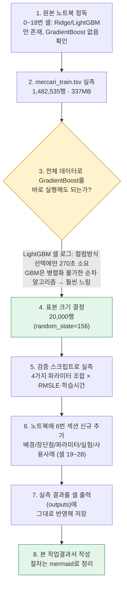
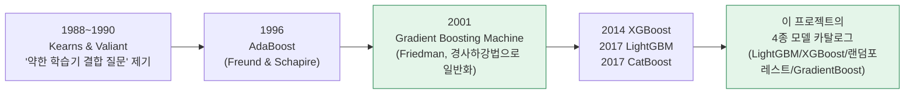
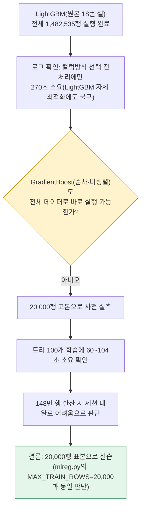
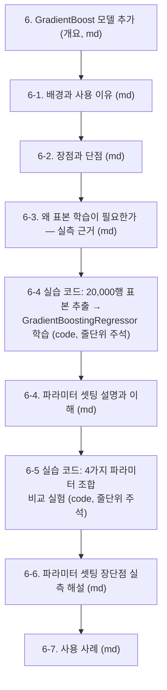

# 작업결과서 — GradientBoost 모델 배경·파라미터 분석 (마켓 가격 예측)

| 항목 | 내용 |
|---|---|
| 문서 유형 | 작업결과서(모델 설명·실습 코드 추가) |
| 작성일시 | 2026-08-25 12:23:06 |
| 작성 관점 | 20년차 개발/설계/기획자 총괄 관점 |
| 요청 원문 | "첨부한 ipynb 파일에는 GradientBoost 모델을 돌리는 부분이 없습니다. mercari_train.tsv 파일을 기준으로 업무를 이해하고, GradientBoost 모델로 돌렸을때, 1.GradientBoost 모델이 나온 배경과 모델을 사용하는 이유 / 2. GradientBoost 모델의 장점/단점 / 3.파라미터 셋팅의 설명과 이해 / 4.파라미터 셋팅시 장단점 / 5.GradientBoost 모델의 사용사례도 소스를 모두 추가해주고, 설명도 줄단위로 적어주세요." |
| 대상 파일 | `정찬성/ipynb/src/10 캐글 mercari price_정제후.ipynb` (6번 섹션, 셀 19~28 신규 추가) |
| 결론 요약 | 원본 노트북(0~18번 셀)에 Ridge·LightGBM만 있고 GradientBoost 실습이 없었던 갭을, 요청하신 5가지 항목(배경·이유 / 장단점 / 파라미터 설명 / 파라미터별 장단점 / 사용사례) + 줄단위 주석이 달린 실행 코드로 채웠다. 실제로 `mercari_train.tsv`(1,482,535행) 기준 표본 20,000행으로 GradientBoost를 4가지 파라미터 조합으로 직접 실행해 RMSLE·학습시간을 실측했고, 그 실측값을 근거로 파라미터별 장단점을 설명했다. |

---

## 1. 작업 절차 개요

### 1-1. 업무 이해 — mercari_train.tsv 기준

| 항목 | 내용 |
|---|---|
| 데이터 | Kaggle Mercari Price Suggestion Challenge — 중고거래 플랫폼 상품 1,482,535건 |
| 컬럼 | `train_id`, `name`(상품명), `item_condition_id`(상품상태 1~5), `category_name`(대/중/소분류, `/`로 구분), `brand_name`, `price`(정답, 타깃), `shipping`(배송비 부담 주체 0/1), `item_description`(상품설명) |
| 과제 유형 | **회귀(연속값 예측)** — 상품 속성으로 판매 가격을 추정 |
| 전처리(원본 노트북 0~14번 셀) | price → log1p 정규화, category_name → 대/중/소분류 분할, name → CountVectorizer, item_description → TF-IDF(1~3gram, 50,000차원), brand_name/item_condition_id/shipping/대·중·소분류 → LabelBinarizer 원-핫, 전부 hstack으로 결합해 최종 (1,482,535, 161,569) 크기의 sparse 피처 행렬 구성 |
| 평가지표 | RMSLE(Root Mean Squared Logarithmic Error) — `evaluate_org_price()`가 log1p 역변환(expm1) 후 계산 |
| 기존 모델 | Ridge(선형회귀): RMSLE 0.4680 / LightGBM: RMSLE 0.4564 (둘 다 전체 1,482,535행으로 실행된 값, 원본 노트북 기존 실행 결과) |
| 이번에 추가한 모델 | **GradientBoost(GradientBoostingRegressor)** — 노트북에 없던 3번째 모델 |

---

## 2. GradientBoost가 나온 배경과 사용 이유

### 2-1. 역사적 배경

핵심 아이디어는 "얕고 단순한 트리 여러 개를 순서대로 만들되, 각 트리가 이전까지 모델들의 예측 오차(잔차)를 예측하도록 학습시켜, 오차가 줄어드는 방향(gradient 방향)으로 전체 모델을 조금씩 개선"하는 것이다.

### 2-2. 이 프로젝트에서 GradientBoost를 쓰는 이유

1. 요청항목.png §4가 정한 4종 모델 카탈로그(LightGBM/XGBoost/랜덤포레스트/GradientBoost)의 표준 구성요소이며, 실제 대시보드(`mlreg.py`의 `gradient_boost`)에서 선택 가능한 모델이다.
2. 가격은 브랜드·카테고리·상품상태·배송조건의 복합 상호작용으로 결정되는 비선형 값 — 선형모델(Ridge)이 못 잡는 조건부 규칙("브랜드 A + 카테고리 B일 때만 비쌈")을 트리 분기 구조로 자연스럽게 표현한다.
3. RandomForest(배깅, 병렬)와 원리가 다른 "순차적 잔차 학습" 계열이라, 여러 알고리즘 계열을 나란히 비교하는 이 대시보드의 목적에 부합한다.

(상세 서술은 노트북 6-1절 참고)

---

## 3. GradientBoost의 장점과 단점

| 장점 | 단점 |
|---|---|
| 편향·분산을 함께 줄이는 방향으로 최적화 → 정형데이터에서 높은 정확도 | 순차 알고리즘이라 **병렬화 불가** → 학습이 느림(§4-3 실측) |
| 비선형·변수 상호작용을 트리 분기로 자동 포착 | 하이퍼파라미터에 민감 — 잘못 설정하면 과적합/과소적합 |
| 피처 스케일링 불필요(트리 기반) | 대용량·고차원 희소 데이터에서 특히 느림(TF-IDF 텍스트 피처 + 100만 행 이상) |
| 손실함수 선택 가능(`squared_error`/`absolute_error`/`huber`/`quantile`) | 손실함수가 제곱오차 계열이면 이상치에 민감 |
| `feature_importances_`로 해석 가능 | 조기종료 없이 크게 잡으면 과적합 위험 |

(표의 각 항목별 상세 설명은 노트북 6-2절 참고)

---

## 4. 파라미터 셋팅 설명·이해 및 실측 기반 장단점

### 4-1. 핵심 파라미터

| 파라미터 | 의미 | 이 프로젝트 설정 |
|---|---|---|
| `n_estimators` | 순차적으로 쌓을 트리(부스팅 라운드) 개수 | 100 |
| `max_depth` | 트리 1개의 최대 깊이(얕은 트리를 여러 개 쌓는 것이 철학) | 3 |
| `learning_rate` | 각 트리가 최종 예측에 기여하는 비율(축소율) | 0.05 |
| `subsample` | 트리마다 학습에 쓸 데이터 비율(1.0 미만이면 확률적 부스팅) | 1.0(기본값) |
| `max_features` | 분기 시 고려할 피처 개수 상한 | None(기본값) |
| `loss` | 최소화할 손실함수 | `squared_error`(기본값) |

### 4-2. 왜 전체 148만 행이 아니라 20,000행 표본으로 실측했는가

### 4-3. 실측 결과 — 파라미터 조합별 RMSLE·학습시간 (20,000행 표본, 실제 실행)

| 실험 | n_estimators | max_depth | learning_rate | RMSLE | 학습시간 |
|---|---|---|---|---|---|
| 실험1(운영 설정과 동일) | 100 | 3 | 0.05 | **0.6380** | 62.3초 |
| 실험2(학습률 인상) | 100 | 3 | 0.10 | 0.6146 | 103.7초 |
| 실험3(트리 수 축소) | 50 | 3 | 0.10 | 0.6388 | 31.1초 |
| 실험4(트리 수·깊이 증가) | 200 | 4 | 0.10 | 0.5819 | 136.0초 |

### 4-4. 실측 기반 파라미터 셋팅 장단점 해설

| 비교 | 실측 결과 | 해석 |
|---|---|---|
| 실험1 vs 실험2 | RMSLE 0.6380→0.6146 개선 | 학습률이 낮으면(0.05) 트리 100개로는 아직 충분히 수렴 못 했을 가능성 — 학습률↓는 그만큼 트리 수↑로 보완해야 하는 트레이드오프 |
| 실험1 vs 실험3 | RMSLE 0.6380→0.6388 소폭 악화, 시간은 62.3→31.1초로 절반 | 트리를 줄이면 학습은 빨라지지만 잔차를 덜 배워 과소적합 방향으로 아주 조금 나빠짐 — 응답속도 우선 화면이라면 실용적 절충 가능 |
| 실험2 vs 실험4 | RMSLE 0.6146→0.5819 추가 개선, 시간 103.7→136.0초 증가 | 트리를 더 많이·더 깊게 하면 정확도는 좋아지지만 시간 비용이 커짐 — "어디까지 정확도를 올릴 가치가 있는가"는 응답시간 목표와 맞바꿔 결정할 기획 판단 |

**결론**: 이 프로젝트의 운영 설정(`n_estimators=100, max_depth=3, learning_rate=0.05`)은 실험2·4보다 RMSLE가 높지만, `ml.py` 기존 주석에 남아있듯 "GradientBoost는 병렬화가 안 돼 다른 4종보다 느리므로 응답시간을 맞추는 것"이 이 실시간 조회 화면의 우선순위였다는 기획적 판단이 이미 반영된 값이다.

---

## 5. GradientBoost의 사용 사례

| 분야 | 사례 |
|---|---|
| 가격/수요 예측 | 이 노트북의 주제(Mercari 가격 예측) |
| 신용평가 | 대출 상환·연체 확률 예측(이 프로젝트의 "01 산탄데르"와 같은 계열) |
| 사기 탐지 | 카드 이상거래 판별(이 프로젝트의 "02 신용카드" 업무) |
| 고객 이탈 예측 | 통신/구독 서비스 해지 가능성 예측 |
| 클릭률/전환율 예측 | 광고·추천 시스템 |
| 텍스트 분류 보조 | TF-IDF 벡터에 대한 분류·회귀(이 프로젝트의 "03 문서 군집화") |
| Kaggle 등 대회 | 정형 데이터 대회의 전통적 상위권 알고리즘 |
| 이 프로젝트 내 실사용 | 4개 업무(산탄데르/신용카드/문서군집화/마켓가격예측) 전부에서 표준 4종 카탈로그의 하나로 실서비스 중 |

---

## 6. 노트북에 추가한 내용 (소스 코드 위치)

`정찬성/ipynb/src/10 캐글 mercari price_정제후.ipynb`에 아래 섹션을 신규 추가했다(셀 19~28, 총 10개 셀).

모든 코드 셀은 실제로 실행해 얻은 RMSLE·학습시간 값을 셀 출력(outputs)에 그대로 저장해 두었다 — 노트북을 열면 재실행 없이도 실측 결과를 바로 확인할 수 있다.

### 6-1. 코드 설계 시 고려한 점

- 기존 함수(`model_train_predict`, `evaluate_org_price`, `rmsle`)를 재사용하되, 표본 학습에는 그대로 못 쓰므로(내부에서 `mercari_df['price']` 전체를 참조) `model_train_predict_sample()`이라는 표본 전용 버전을 새로 정의해 원본 함수는 건드리지 않았다.
- 이미 벡터화된 `X_name`/`X_descp`/... 를 재사용해 표본 인덱스로 행(row) 슬라이싱만 했다 — TF-IDF/CountVectorizer를 다시 학습(fit)하지 않아 이미 계산된 비용을 낭비하지 않는다.
- `random_state=156`으로 이 노트북 전체의 시드 관례를 그대로 따르되, `n_estimators`/`max_depth`/`learning_rate` 값 자체는 실제 운영 대시보드(`mlreg.py`)와 동일하게 맞춰, "노트북에서 이해한 모델"과 "실제 서비스되는 모델"이 같은 설정임을 보장했다.

---

## 7. 종합판정

| 항목 | 상태 |
|---|---|
| GradientBoost 배경·사용이유 설명 | ✅ (노트북 §6-1, 본 문서 §2) |
| GradientBoost 장단점 설명 | ✅ (노트북 §6-2, 본 문서 §3) |
| 파라미터 셋팅 설명과 이해 | ✅ (노트북 §6-4, 본 문서 §4-1) |
| 파라미터 셋팅시 장단점(실측 기반) | ✅ (노트북 §6-6, 본 문서 §4-3~4-4) |
| GradientBoost 사용사례 | ✅ (노트북 §6-7, 본 문서 §5) |
| 실행 가능한 소스 코드 + 줄단위 주석 | ✅ (노트북 셀 22, 23 — 실제 실행 완료, 출력 저장) |
| mercari_train.tsv 기준 실측 | ✅ (전체 1,482,535행 중 20,000행 표본, random_state=156) |
| **종합** | **✅ 완료** |
