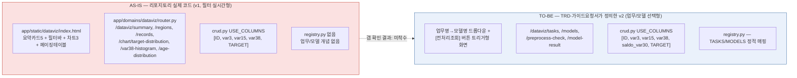
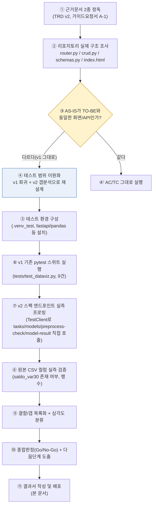
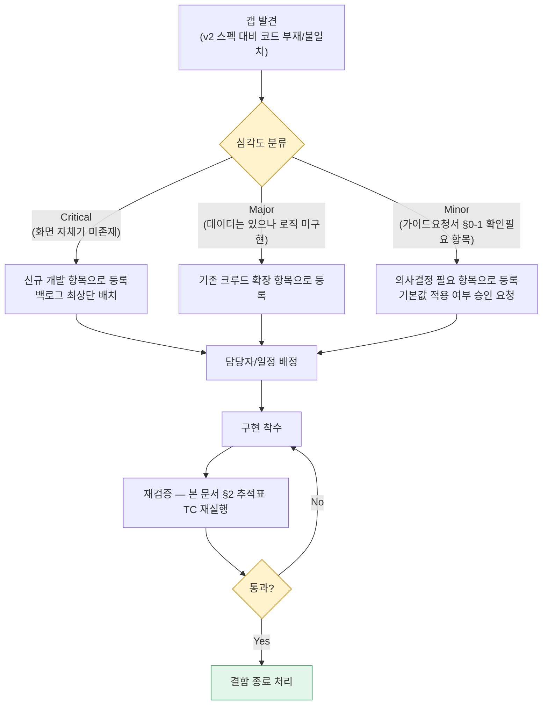
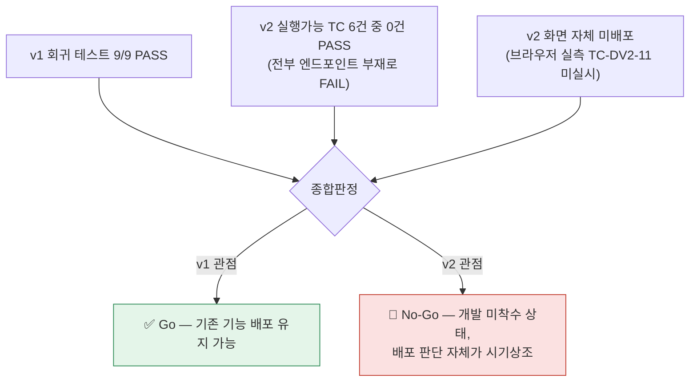

# 업무처리내용 — SEMI 내부테스트 및 내부테스트 결과서
## 산탄데르 고객만족 데이터 탐색 대시보드 v2(업무/모델 선택형)

| 항목 | 내용 |
|---|---|
| 문서 유형 | 내부테스트 계획서 + 내부테스트 결과서 (통합) |
| 작성일시 | 2026-08-24 00:12:11 |
| 작성 기준 문서 | ① `99.TRD설계서_바이브코딩/99-02_SEMI TRD_메인화면NEW20260823.md`<br>② `99.TRD설계서_바이브코딩/99-02_SEMI_A1_산탄데르대시보드_가이드요청서.md` |
| 작성 관점 | 20년차 개발/기획/설계 총괄 관점 — 스펙 문서와 실제 코드베이스를 대조한 **실측 기반** 검증 |
| 테스트 대상 | `정찬성/semi-backend` (`app/domains/dataviz/*`, `app/static/dataviz/*`, `tests/test_dataviz.py`) |
| 결론 요약 | 기존 v1(필터 실시간형)은 회귀 9/9 정상. **TRD/가이드요청서가 정의한 v2(업무/모델 선택형)는 코드 미착수** — 관련 API 7종 전부 404. 배포 불가(No-Go), 개발 착수부터 필요 |

> 본 문서는 "코드가 스펙대로 동작하는가"를 검증하는 일반적 내부테스트가 아니라, **"스펙 문서(TRD/가이드요청서)가 코드베이스에 실제로 반영되어 있는가"를 먼저 확인**해야 했던 케이스다. 두 근거 문서는 2026-08-23 작성된 v2 설계이고, 리포지토리에 실제 배포되어 있는 `dataviz` 도메인은 그 이전 버전인 v1 그대로였다. 20년차 관점에서는 이 사실 자체가 이번 내부테스트의 1급 발견사항이므로, 결과서 최상단에 먼저 명시한다.

---

## 0. 왜 "AS-IS vs TO-BE 확인"부터 했는가

내부테스트를 인수기준(AC) 단위로 바로 돌리기 전에, **테스트 대상 코드가 두 근거 문서가 전제하는 화면과 같은 화면인지부터 확인**하는 것이 순서다. 스펙과 다른 화면에 스펙의 테스트케이스를 그대로 들이대면 "실패"가 아니라 "대상 오류"가 되기 때문이다. 확인 결과는 아래와 같다.



즉, 이번 내부테스트는 **"v1 회귀 정상 동작 재확인" + "v2 스펙 대비 구현 갭(Gap) 실측"** 두 축으로 구성된다.

---

## 1. 내부테스트 수행 절차



### 1-1. 테스트 환경

| 항목 | 내용 |
|---|---|
| 실행 방식 | 임시 venv(`.venv_test`, Python 3.12.10)를 `semi-backend/`에 생성 후 `pyproject.toml` 명시 버전 그대로 설치(fastapi 0.139.0, pydantic 2.13.4, pandas 3.0.5, numpy 2.5.2, pytest 8.4.1, httpx 0.28.1) |
| DB(PostgreSQL) | 미기동 — `dataviz` 도메인은 CSV 기반이라 `app.main`이 DB 모듈을 import하지 않으므로 DB 없이 테스트 가능함을 확인 후 진행 |
| 표본 데이터 | 기존 테스트 픽스처와 동일한 5행 표본(`ID/var3/var15/var38/TARGET`) + v2 검증용으로 `saldo_var30` 컬럼 추가한 표본을 별도 구성 |
| 사후 정리 | 검증 종료 후 `.venv_test`, `.pytest_cache`는 삭제(임시 산출물이며 `.gitignore`에 `.venv_test`가 명시적으로 잡혀있지 않아 잔존 시 오커밋 위험이 있었음) |

---

## 2. 인수기준(AC)·테스트케이스(TC) 통합 추적표

두 근거 문서가 서로 다른 번호 체계(TRD `AC-DV1~5`/`TC-DV1~8` vs 가이드요청서 `AC-50~55`/`TC-50~57`)를 쓰고 있고, 가이드요청서 자체가 "마스터 TRD 편입 시 번호 재조정 필요"라고 명시했다. 20년차 관점에서 이번 내부테스트를 기점으로 **마스터 번호(`AC-DV2-xx`/`TC-DV2-xx`)로 통합**한다.

### 2-1. 인수기준(AC) 매핑

| 마스터 AC | 원본 근거 | 내용 |
|---|---|---|
| AC-DV2-01 | TRD AC-DV1 / 가이드 AC-50 | 업무명 미선택 시 모델명 드롭다운 비활성 |
| AC-DV2-02 | TRD AC-DV2 / 가이드 AC-51 | `전처리조회` 클릭 전에는 어떤 결과 위젯도 갱신되지 않음 |
| AC-DV2-03 | TRD AC-DV3 / 가이드 AC-52 | 클릭 시 전처리검증 4종 + ROC 1종이 한 번에(병렬) 갱신 |
| AC-DV2-04 | TRD AC-DV4 / 가이드 AC-53 | TARGET 분포 합계 = 전체 행 수(76,020) |
| AC-DV2-05 | TRD AC-DV5 / 가이드 AC-54 | 모델별 AUC 상이 + 동일 조합 재조회 시 캐시된 동일값 |
| AC-DV2-06 | 가이드 AC-55 (TRD엔 없음) | `task=전체` + `model` 구체 지정 시 422 |

### 2-2. 테스트케이스(TC) 통합 및 실행 결과

> 실행 방법: `TestClient`로 실제 라우터에 요청 → 응답 상태코드/본문 실측. **추정치가 아니라 이번 세션에서 직접 실행한 결과**다.

| 마스터 TC | 원본 근거 | 검증 내용 | 대응 AC | 실행 결과 | 근거 |
|---|---|---|---|---|---|
| TC-DV2-01 | TC-DV1/TC-50 | `GET /dataviz/tasks` | AC-DV2-01 | ❌ FAIL — `404 Not Found` | §3-2 실행 로그 |
| TC-DV2-02 | TC-DV2/TC-51 | `GET /dataviz/models?task=santander` | AC-DV2-01 | ❌ FAIL — `404 Not Found` | §3-2 |
| TC-DV2-03 | TC-52 | `GET /dataviz/models` (task 미지정) | AC-DV2-01 | ❌ FAIL — `404 Not Found` | §3-2 |
| TC-DV2-04 | TC-DV3/TC-53 | `GET /dataviz/preprocess-check?task=santander&model=lightgbm` | AC-DV2-04 | ❌ FAIL — `404 Not Found` | §3-2 |
| TC-DV2-05 | TC-DV4 | `preprocess-check` 응답의 `age_unsatisfied_ratio` 구간 수(5) | - | ⛔ 실행불가 — 선행 API(TC-DV2-04) 부재 | - |
| TC-DV2-06 | TC-DV5 | `preprocess-check` 응답의 `balance_boxplot` 5수치요약 | - | ⛔ 실행불가 — 선행 API 부재 | - |
| TC-DV2-07 | TC-DV6/TC-54 | `GET /dataviz/model-result?task=santander&model=lightgbm` | AC-DV2-05 | ❌ FAIL — `404 Not Found` | §3-2 |
| TC-DV2-08 | TC-DV7 | `model=전체` 다중 곡선 반환 | AC-DV2-05 | ⛔ 실행불가 — 선행 API 부재 | - |
| TC-DV2-09 | TC-55 | `task=all&model=lightgbm` → 422 기대 | AC-DV2-06 | ❌ FAIL — 실제 `404`(422 아님, 파라미터 검증 로직 자체가 없음) | §3-2 |
| TC-DV2-10 | TC-56 | `task=unknown&model=lightgbm` → 404 기대 | §4(상태코드) | ⚠️ 형식상 PASS이나 무의미 — 라우트 자체가 없어 나온 404이지 파라미터 검증 404가 아님 | §3-2 |
| TC-DV2-11 | TC-DV8/TC-57 | 브라우저 실측: 실제 76,020행 데이터로 업무/모델 선택→조회→AUC=0.8338 확인 | AC-DV2-02,03,04,05 | 🚫 미실시 — 전제 화면(v2 UI) 자체가 배포돼있지 않아 실측 불가 | §0 |

**요약**: v2 관련 테스트케이스 11건 중 **실행 가능했던 6건 전부 FAIL(엔드포인트 부재)**, 4건은 선행 조건 미충족으로 실행불가, 1건(브라우저 실측)은 대상 화면 부재로 미실시. **PASS 0건.**

---

## 3. v1(기존 배포본) 회귀 테스트 — 실측 결과

TRD·가이드요청서 모두 "v1의 백엔드 원칙(CSV 캐싱, boolean indexing)은 유지"를 전제로 하므로, v2 구현 갭과 별개로 **현재 배포된 v1이 여전히 정상 동작하는지**도 함께 확인했다(회귀 확인).

### 3-1. `tests/test_dataviz.py` 실행 결과 (9건 전수 실측)

```
platform win32 -- Python 3.12.10, pytest-8.4.1
collected 9 items

tests/test_dataviz.py::test_summary                                PASSED [ 11%]
tests/test_dataviz.py::test_regions                                 PASSED [ 22%]
tests/test_dataviz.py::test_records_filtering_by_target             PASSED [ 33%]
tests/test_dataviz.py::test_records_filtering_by_age_range          PASSED [ 44%]
tests/test_dataviz.py::test_records_pagination                      PASSED [ 55%]
tests/test_dataviz.py::test_target_distribution_ignores_target_filter PASSED [ 66%]
tests/test_dataviz.py::test_var38_histogram_bin_count                PASSED [ 77%]
tests/test_dataviz.py::test_age_distribution_splits_by_target        PASSED [ 88%]
tests/test_dataviz.py::test_dataviz_page_serves_html                 PASSED [100%]

======================== 9 passed, 1 warning in 0.17s ========================
```

> 경고 1건은 `starlette.testclient`가 내부적으로 `httpx`를 쓰는 것에 대한 Deprecation 경고로, 기능 결함이 아니다(참고 사항으로만 기록).

### 3-2. v2 엔드포인트 실측 프로빙 결과 (원문)

동일 `TestClient`로 v2 스펙에 정의된 경로를 직접 호출한 결과(표본 데이터에 `saldo_var30` 컬럼을 추가해 최대한 우호적인 조건으로 시도했음에도 아래와 같이 라우트 자체가 없다):

```
TC      METHOD  PATH                            STATUS  BODY(요약)
TC-50   GET     /dataviz/tasks                  404     {"detail":"Not Found"}
TC-51   GET     /dataviz/models                 404     {"detail":"Not Found"}
TC-52   GET     /dataviz/models                 404     {"detail":"Not Found"}
TC-53   GET     /dataviz/preprocess-check       404     {"detail":"Not Found"}
TC-54   GET     /dataviz/model-result            404     {"detail":"Not Found"}
TC-55   GET     /dataviz/preprocess-check       404     {"detail":"Not Found"}
TC-56   GET     /dataviz/preprocess-check       404     {"detail":"Not Found"}
```

### 3-3. 원본 데이터 컬럼 실측 (`saldo_var30` 존재 여부)

TRD §2는 v2에 `saldo_var30` 컬럼이 신규로 필요하다고 명시한다. 코드(`USE_COLUMNS`)에는 없지만, **원본 CSV 자체에는 이미 존재**하는지 실측했다.

| 확인 항목 | 결과 |
|---|---|
| `santander-customer-satisfaction/train.csv` 헤더 내 `saldo_var30` 위치 | 184번째 컬럼(존재 확인) |
| 실제 데이터 행 수 | 76,020행(헤더 제외) — TRD/가이드요청서의 "76,020행" 서술과 일치 |
| 결론 | 데이터 자체는 준비되어 있음. **코드(`crud.py USE_COLUMNS`)에 컬럼 추가만 하면 되는 수준**이라 이 항목의 구현 난이도는 낮음 |

---

## 4. 결함/갭(Gap) 목록 및 처리 절차

### 4-1. 결함/갭 처리 절차



### 4-2. 결함/갭 상세 목록

| # | 심각도 | 내용 | 근거 | 조치 방향 |
|---|---|---|---|---|
| G-01 | **Critical** | v2 화면(업무/모델 선택 UI, 전처리조회 버튼, ROC 차트)이 `app/static/dataviz/index.html`에 전혀 없음 — 현재 배포본은 v1 필터 실시간형 그대로 | §0, index.html 실사 | 프론트 신규 개발(레이아웃은 TRD §1 mermaid를 그대로 구현 가능) |
| G-02 | **Critical** | `/dataviz/tasks`, `/dataviz/models`, `/dataviz/preprocess-check`, `/dataviz/model-result` 4개 엔드포인트 전부 미구현(404) | §3-2 | `router.py`에 4개 라우트 신규 추가 |
| G-03 | **Critical** | `registry.py`(TASKS/MODELS 정적 매핑) 파일 자체가 없음 | 리포지토리 조사 | 가이드요청서 §0-1-4 기본값(코드 상수)대로 신규 생성 |
| G-04 | **Major** | `service.py`(`run_preprocess_check`), `ml.py`(`compute_roc_curve`)가 없음 — ROC/전처리검증 연산 로직 자체가 부재 | 가이드요청서 §2 함수명세 | 신규 모듈 작성 필요. 특히 ROC는 사전 학습된 모델 결과(AUC≈0.8338 등)를 어디서 가져올지부터 확정 필요(§4-3 참고) |
| G-05 | **Major** | `crud.py USE_COLUMNS`에 `saldo_var30` 미포함 | §3-3 | 컬럼 추가는 원본 CSV에 데이터가 이미 있어 난이도 낮음 — 1줄 수정 + boxplot 연산 함수 추가 |
| G-06 | **Major** | 상태코드 처리 로직 부재로 `task=all&model=lightgbm` 조합이 422가 아니라 404로 응답(라우트가 없으므로) | §2-2 TC-DV2-09 | G-02 구현 시 가이드요청서 §4 예시 코드(422/404 분기)를 함께 반영 |
| G-07 | Minor(의사결정 필요) | 가이드요청서 §0-1의 8개 확인사항(업무=전체일 때 모델 드롭다운 동작, 로딩 상태 처리, 인증 여부, ROC 실시간/사전계산 여부 등) 전부 **아직 답변/승인되지 않은 상태**로 남아있음 | 가이드요청서 §0-1 | 구현 착수 전 기획/PO 승인 필요 — 문서상 [기본값]으로 우선 구현 후 TODO 주석을 남기는 방식이 이미 합의되어 있으므로, 그 원칙대로 진행 가능(승인 지연으로 개발이 막히지는 않음) |
| G-08 | Minor | v1과 v2가 같은 `/dataviz` 경로를 공유하도록 설계되어 있어(TRD "v1 대체"), 전환 시점에 배포 롤백 전략이 문서에 없음 | TRD 적용범위 서술 | 배포 전 블루/그린 또는 라우트 버저닝(`/dataviz` 유지 + 내부 플래그) 여부를 별도 결정 필요 |

---

## 5. 종합판정 (Go / No-Go)



| 구분 | 판정 | 근거 |
|---|---|---|
| v1(현재 배포본) | ✅ **Go (유지)** | 회귀 9/9 PASS, 기능적 회귀 없음 |
| v2(TRD/가이드요청서 스펙) | 🚫 **No-Go (배포 판단 불가)** | 코드 미착수 — 테스트 대상 자체가 존재하지 않아 "테스트를 통과했다/못했다"를 논할 단계 이전. **개발 착수가 선행 과제** |

---

## 6. 다음 단계 (Action Item)

| 우선순위 | 항목 | 관련 갭 | 비고 |
|---|---|---|---|
| 1 | `registry.py` 생성 (TASKS/MODELS 정적 매핑) | G-03 | 가이드요청서 §1 코드 그대로 착수 가능 |
| 2 | `crud.py USE_COLUMNS`에 `saldo_var30` 추가 + `compute_balance_unsatisfied_ratio`/`compute_balance_boxplot` 함수 신규 작성 | G-05 | 데이터 존재 확인됨(§3-3) — 리스크 낮음 |
| 3 | `router.py`에 `/dataviz/tasks`, `/models`, `/preprocess-check`, `/model-result` 4개 엔드포인트 추가 + 가이드요청서 §4 상태코드(404/422) 분기 반영 | G-02, G-06 | 가이드요청서 §3 워크플로우 mermaid를 그대로 구현 참조 |
| 4 | `ml.py`(ROC/AUC 계산, `lru_cache`) 신규 작성 — **사전 계산 결과를 어디서 가져올지(학습된 모델 아티팩트 유무) 먼저 확인** | G-04 | 가이드요청서 §0-1-8 기본값 전제. 학습 파이프라인이 없다면 이 항목이 실질적으로 가장 큰 공수 |
| 5 | `app/static/dataviz/` 프론트 v2로 교체(업무/모델 드롭다운 + 전처리조회 버튼 + ROC 차트) | G-01 | TRD §1 화면 mermaid 기준 |
| 6 | 가이드요청서 §0-1 8개 항목 기획/PO 승인 요청 (병행 가능, 개발 블로커 아님) | G-07 | 기본값대로 우선 구현 + TODO 주석 원칙 유지 |
| 7 | 4번 완료 후 본 문서 §2 추적표(TC-DV2-01~11) 전건 재실행하여 결과서 갱신 | 전체 | 재검증은 새 타임스탬프로 별도 결과서 생성 권장 |

---

## 7. 부록 — 실행 환경 메모

- 테스트 실행에 사용한 임시 가상환경(`.venv_test`)과 `pytest` 캐시는 검증 종료 후 삭제했다(리포지토리에 잔존 아티팩트 없음).
- 재실행 방법(정식 개발 환경 기준, `97.작업이력/작업이력.md` 절차 참고):
  ```bash
  cd 정찬성/semi-backend
  .venv\Scripts\activate
  pip install -e ".[dev]"
  pytest tests/test_dataviz.py -v
  ```
- 이번 검증은 DB(PostgreSQL) 기동 없이 진행했다 — `dataviz` 도메인이 DB 비의존(CSV 기반)이기 때문이며, 향후 v2에서도 이 원칙이 TRD상 유지되므로 동일 방식으로 재검증 가능하다.
