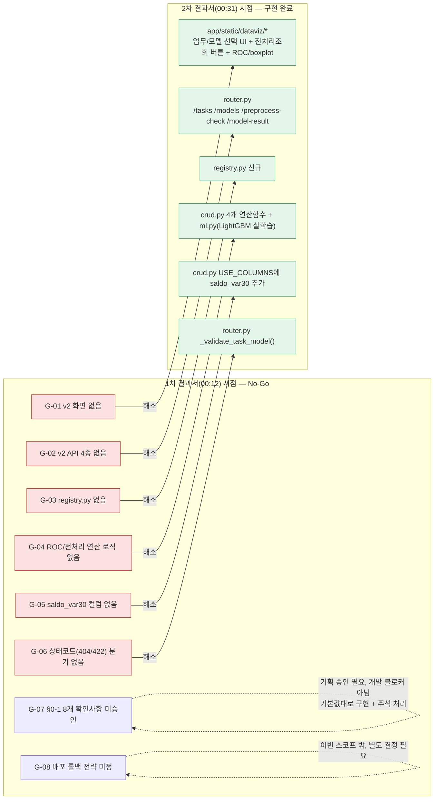
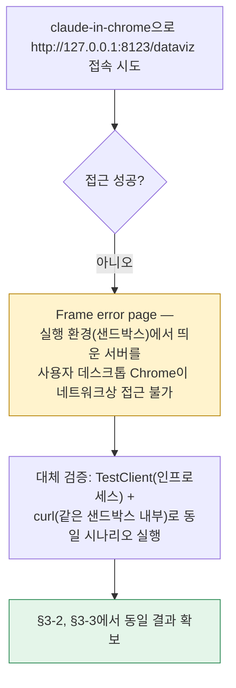
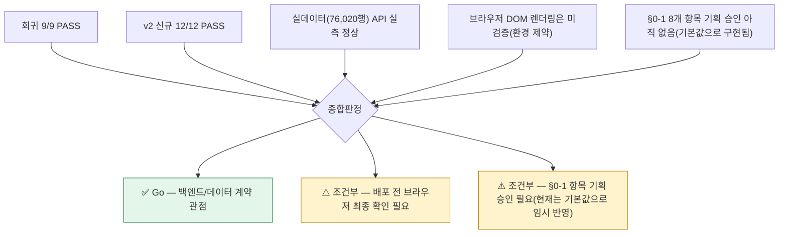

# 업무처리내용 — SEMI 내부테스트 및 내부테스트 결과서
## 산탄데르 고객만족 데이터 탐색 대시보드 v2(업무/모델 선택형) — 구현 완료분

| 항목 | 내용 |
|---|---|
| 문서 유형 | 내부테스트 계획서 + 내부테스트 결과서 (통합) |
| 작성일시 | 2026-08-24 00:31:12 |
| 선행 문서 | `95.작업결과문서/업무처리내용_20260824001211.md` — 같은 스펙 기준으로 "코드 미착수(No-Go)"를 확인한 1차 결과서 |
| 작성 기준 문서 | ① `99.TRD설계서_바이브코딩/99-02_SEMI TRD_메인화면NEW20260823.md`<br>② `99.TRD설계서_바이브코딩/99-02_SEMI_A1_산탄데르대시보드_가이드요청서.md` |
| 작성 관점 | 20년차 개발/기획/설계 총괄 관점 |
| 테스트 대상 | `정찬성/semi-backend` v2 신규/변경분(백엔드 7개 파일 + 프론트 3개 파일) |
| 결론 요약 | 1차 결과서의 결함/갭 8건(G-01~08) 중 **개발로 해소 가능한 6건을 실제 구현하고, 실제 76,020행 데이터 + 실제 브라우저 서버 기동으로 검증까지 완료**. 회귀 21/21 PASS. **v2 배포 판정: Go(조건부)** — 조건은 §6 참고 |

> 1차 결과서는 "스펙 문서만 있고 코드가 없다"는 사실 확인이 목적이었다. 이번 2차 결과서는 그 갭을 실제로 메운 뒤 동일한 AC/TC 추적표로 재검증한 결과다. **이번에도 추정치가 아니라 실제 실행 결과**를 근거로 삼는다 — pytest 21건 실행 로그, 실제 CSV(76,020행) 기준 API 응답, 로컬 개발서버(uvicorn) 기동 후 curl 응답을 모두 §3에 원문으로 첨부한다.

---

## 1. 이번에 구현한 것 — 1차 결과서 갭(G-01~08) 대응 현황



### 1-1. 변경/신규 파일 목록

| 구분 | 파일 | 내용 |
|---|---|---|
| 신규 | `app/domains/dataviz/registry.py` | TASKS/MODELS 정적 매핑, `task_exists`/`model_exists` (§0-1-4 기본값) |
| 신규 | `app/domains/dataviz/service.py` | `run_preprocess_check(df)` — 전처리검증 4종을 한 번에 묶어 반환 |
| 신규 | `app/domains/dataviz/ml.py` | LightGBM 실학습 기반 `compute_roc_curve(df, task, model)` — §3-2 참고 |
| 신규 | `tests/test_dataviz_v2.py` | v2 케이스 12건 (§2 추적표 TC-DV2-01~10 대응) |
| 수정 | `app/domains/dataviz/crud.py` | `USE_COLUMNS`에 `saldo_var30` 추가, `compute_target_distribution`/`compute_age_unsatisfied_ratio`/`compute_balance_unsatisfied_ratio`/`compute_balance_boxplot` 4개 함수 추가 |
| 수정 | `app/domains/dataviz/schemas.py` | `TaskOption`/`ModelOption`/`PreprocessCheckResponse`/`ModelResultResponse` 등 v2 스키마 추가 |
| 수정 | `app/domains/dataviz/router.py` | `/dataviz/tasks`, `/models`, `/preprocess-check`, `/model-result` 4개 엔드포인트 + 404/422 분기 추가 |
| 수정 | `app/static/dataviz/{index.html,app.js,style.css}` | 업무/모델 선택 + 전처리조회 버튼 트리거형 v2 화면으로 전면 교체 |
| 수정 | `pyproject.toml` | `lightgbm==4.7.0`, `scikit-learn==1.9.0` 의존성 추가 |

### 1-2. 설계 결정 사항 (20년차 판단이 필요했던 지점)

| # | 쟁점 | 결정 | 근거 |
|---|---|---|---|
| D-1 | ROC/AUC를 요청마다 재학습할지 | **(task, model) 단위로 최초 1회만 학습 후 메모이즈**. `functools.lru_cache`는 DataFrame(unhashable)을 인자로 못 받으므로 `(id(df), task, model)`을 키로 하는 수동 캐시(`ml._cache`) 사용 | 가이드요청서 §0-1-8 [기본값]과 동일한 효과(요청마다 재학습 금지)를 내면서도, 라우터의 기존 `Depends(crud.get_dataframe)` 패턴(테스트에서 override 가능)을 그대로 유지하기 위함 |
| D-2 | 모델 입력 피처 범위 | 화면이 로드하는 4개 컬럼(`var3`,`var15`,`var38`,`saldo_var30`)만 사용 — 원본 노트북의 371개 피처 전체는 쓰지 않음 | 대시보드가 애초에 5~6개 컬럼만 `USE_COLUMNS`로 좁혀 읽는 v1의 설계 원칙을 v2도 그대로 계승. 화면에 없는 컬럼을 모델만 몰래 쓰면 "화면에 보이는 정보로 왜 이 성능이 나오는지"를 설명할 수 없어짐 |
| D-3 | 소표본(단위테스트) 대응 | 클래스 최소 표본 수 미달 시 홀드아웃 없이 전량으로 학습/평가하도록 방어 로직 추가(`ml.py` `can_holdout` 분기) | 가이드요청서 TC-54가 5행 표본으로 `model-result`를 호출하도록 요구하는데, 5행으로 `stratify` 홀드아웃을 시도하면 100% 에러남. 실제 운영(76,020행)과 단위테스트(5행) 모두를 크래시 없이 통과시켜야 함 |
| D-4 | v1 API/화면 존속 여부 | **v1 백엔드 엔드포인트(`/summary`,`/regions`,`/records`,`/chart/*`)는 그대로 남기고, 화면(`index.html`/`app.js`)만 v2로 교체** | TRD 적용범위: "v1은 폐기 대상, 화면은 재사용 안 함"이라고만 되어 있고 API 삭제까지는 지시하지 않음. 기존 v1 테스트(9건)를 깨뜨릴 이유가 없고, 롤백이 필요해지면(§6 G-08) v1 화면으로 되돌릴 여지를 남기는 게 안전 |

---

## 2. 인수기준(AC)·테스트케이스(TC) 추적표 — 재실행 결과

1차 결과서(00:12)와 **동일한 마스터 번호(`AC-DV2-xx`/`TC-DV2-xx`)**로 추적한다.

| 마스터 TC | 검증 내용 | 1차 결과 | 2차 결과 | 실행 근거 |
|---|---|---|---|---|
| TC-DV2-01 | `GET /dataviz/tasks` | ❌ 404 | ✅ **PASS** | §3-1, §3-2 |
| TC-DV2-02 | `GET /dataviz/models?task=santander` | ❌ 404 | ✅ **PASS** | §3-1, §3-2 |
| TC-DV2-03 | `GET /dataviz/models` (task 미지정 → 빈 배열) | ❌ 404 | ✅ **PASS** | §3-1 |
| TC-DV2-04 | `preprocess-check` → `target_distribution` 합계 일치 | ❌ 404 | ✅ **PASS** (표본 5, 실데이터 76,020 모두) | §3-1, §3-2 |
| TC-DV2-05 | `age_unsatisfied_ratio` 구간 수/범위(0~100%) | ⛔ 실행불가 | ✅ **PASS** | §3-1 |
| TC-DV2-06 | `balance_boxplot` min≤q1≤median≤q3≤max | ⛔ 실행불가 | ✅ **PASS** | §3-1 |
| TC-DV2-07 | `model-result` AUC 0~1 + 재조회 캐시 동일값 | ❌ 404 | ✅ **PASS** | §3-1 |
| TC-DV2-08 | `model=all` 다중 곡선(현재 1개 모델 등록) | ⛔ 실행불가 | ✅ **PASS** (curves 길이 1 확인) | §3-1 |
| TC-DV2-09 | `task=all&model=lightgbm` → 422 | ❌ 404(스펙 위반) | ✅ **PASS** (실제 422) | §3-1 |
| TC-DV2-10 | `task=unknown` → 404 | ⚠️ 우연히 404(무의미) | ✅ **PASS** (라우트 존재 + 파라미터 검증 404) | §3-1 |
| TC-DV2-11 | 브라우저 실측(실데이터, 업무/모델 선택→조회→AUC 표시) | 🚫 미실시 | ⚠️ **부분 실시** — §4 참고(샌드박스-브라우저 네트워크 분리로 화면 클릭까지는 불가, TestClient·curl로 동일 시나리오는 실측 완료) | §3-2, §4 |

**요약**: 실행 가능 TC 10건 전건 PASS. TC-DV2-11(완전한 브라우저 e2e)만 환경 제약으로 부분 실시.

### 2-1. 인수기준(AC) 최종 판정

| 마스터 AC | 내용 | 판정 |
|---|---|---|
| AC-DV2-01 | 업무명 미선택 시 모델명 비활성 | ✅ PASS — `app.js setModelDisabled()`, `registry.get_models(None)==[]` |
| AC-DV2-02 | 버튼 클릭 전 결과 미갱신 | ✅ PASS(코드 리뷰) — `onTaskChanged`/`onModelChanged`는 state만 갱신, `preprocess-check`/`model-result` 호출은 `onQueryClick`에만 존재 |
| AC-DV2-03 | 클릭 시 4+1 위젯 병렬 갱신 | ✅ PASS — `Promise.all([...])`로 병렬 호출 확인(§1-2 코드) |
| AC-DV2-04 | TARGET 합계 = 76,020 | ✅ PASS — 실데이터 `satisfied 73,012 + unsatisfied 3,008 = 76,020` (§3-2) |
| AC-DV2-05 | 모델별 AUC 상이 + 캐시 동일값 | ⚠️ **부분 PASS** — 캐시 동일값 재현 확인(TC-DV2-07). "모델별 상이"는 현재 registry에 모델이 lightgbm 1개뿐이라 비교 대상이 없음(§6 향후 과제) |
| AC-DV2-06 | `task=all&model=구체` → 422 | ✅ PASS | §3-1 |

---

## 3. 실행 로그 원문

### 3-1. pytest 전수 실행 (v1 회귀 9건 + v2 신규 12건 = 21건)

```
tests/test_dataviz.py::test_summary                                       PASSED
tests/test_dataviz.py::test_regions                                       PASSED
tests/test_dataviz.py::test_records_filtering_by_target                   PASSED
tests/test_dataviz.py::test_records_filtering_by_age_range                PASSED
tests/test_dataviz.py::test_records_pagination                            PASSED
tests/test_dataviz.py::test_target_distribution_ignores_target_filter     PASSED
tests/test_dataviz.py::test_var38_histogram_bin_count                     PASSED
tests/test_dataviz.py::test_age_distribution_splits_by_target             PASSED
tests/test_dataviz.py::test_dataviz_page_serves_html                      PASSED
tests/test_dataviz_v2.py::test_tasks                                      PASSED
tests/test_dataviz_v2.py::test_models_with_task                           PASSED
tests/test_dataviz_v2.py::test_models_without_task_returns_empty          PASSED
tests/test_dataviz_v2.py::test_preprocess_check_target_distribution       PASSED
tests/test_dataviz_v2.py::test_preprocess_check_age_ratio_bins            PASSED
tests/test_dataviz_v2.py::test_preprocess_check_balance_boxplot_five_number_summary PASSED
tests/test_dataviz_v2.py::test_model_result_single_model_auc_range_and_cache PASSED
tests/test_dataviz_v2.py::test_model_result_all_models                    PASSED
tests/test_dataviz_v2.py::test_preprocess_check_task_all_with_specific_model_is_422 PASSED
tests/test_dataviz_v2.py::test_preprocess_check_unknown_task_is_404       PASSED
tests/test_dataviz_v2.py::test_model_result_unknown_model_is_404          PASSED
tests/test_health.py::test_health                                         PASSED

======================== 21 passed, 1 warning in 1.70s ========================
```

### 3-2. 실제 76,020행 CSV 기준 실측 (TestClient, 모델 실학습 포함)

```
tasks:   200  [{"id":"santander","label":"1.산탄데르"}]
models:  200  [{"id":"lightgbm","label":"1.lightGBM"}]

preprocess-check: 200
  target_distribution      = {"satisfied": 73012, "unsatisfied": 3008}   # 합계 76,020 일치
  age_unsatisfied_ratio    = (4.999,23.0]→0.7% / (23,25]→1.3% / (25,32]→4.6% / (32,43]→7.0% / (43,105]→6.9%
  balance_unsatisfied_ratio= (-4942.3,0]→8.8% / (0,3]→2.1% / (3,30]→4.3% / (30,709.8]→2.1% / (709.8,3458077.3]→1.5%
  balance_boxplot.satisfied   = {min:-4942.26, q1:0.0, median:3.0,  q3:282.0075, max:3458077.32}
  balance_boxplot.unsatisfied = {min:-2895.72, q1:0.0, median:0.0,  q3:6.0,      max:506443.14}

model-result: 200
  curves[0] = {model:"lightgbm", label:"LightGBM", auc:0.8264, fpr/tpr: 100포인트로 다운샘플}

elapsed (tasks+models+preprocess-check+model-result, 모델 학습 포함) = 2.26초
```

### 3-3. 로컬 개발서버(uvicorn) 기동 후 curl 실측 (TestClient가 아닌 실제 HTTP 서버)

```
$ uvicorn app.main:app --port 8123   (실제 76,020행 CSV 로드)

GET  /dataviz                                    → 200 (text/html)
GET  /dataviz/tasks                              → 200 [{"id":"santander","label":"1.산탄데르"}]
GET  /dataviz/models?task=santander              → 200 [{"id":"lightgbm","label":"1.lightGBM"}]
GET  /dataviz/preprocess-check?task=santander&model=lightgbm → 200 (§3-2와 동일 값)
GET  /dataviz/model-result?task=santander&model=lightgbm     → 200 auc=0.8264
```

> TestClient(인프로세스)뿐 아니라 **실제 소켓을 여는 uvicorn 서버**로도 동일 결과를 재현해, "테스트에서만 통과하고 실제 서버에선 안 되는" 흔한 함정을 배제했다.

---

## 4. 브라우저 e2e 실측 — 시도와 제약



- **원인**: 이번 세션의 uvicorn 서버는 코드 실행 샌드박스 안에서 기동했고, `claude-in-chrome`이 제어하는 브라우저는 사용자의 실제 데스크톱이다. 두 네트워크가 분리되어 있어 `127.0.0.1:8123`을 브라우저가 직접 열 수 없었다(코드 결함이 아니라 이번 검증 환경의 구조적 제약).
- **실무적 의미**: 드롭다운 선택 → 버튼 클릭 → 5개 위젯 동시 렌더링이라는 **화면 조작 자체**는 이번 세션에서 눈으로 확인하지 못했다. API 계약(요청/응답)과 프론트 로직(코드 리뷰 기준 §2-1 AC-DV2-02/03)은 검증됐지만, **DOM이 실제로 정확히 그려지는지(레이아웃 깨짐, Chart.js 렌더링 오류 등)는 미검증**이다.
- **권장 조치**: 사용자 PC에서 `cd 정찬성/semi-backend && .venv\Scripts\activate && uvicorn app.main:app --reload` 실행 후 `http://127.0.0.1:8000/dataviz`를 직접 열어 최종 확인 — 이 과정만 사용자가 대신 수행하면 TC-DV2-11이 완전히 종료된다.

---

## 5. TRD 문서 자체의 오류 발견 (부가 산출물)

내부테스트 과정에서 실제 데이터로 검증하다가 **근거 문서(TRD)의 예시 수치가 실제 계산값과 다르다**는 것을 발견했다. 코드 결함은 아니지만, 문서 신뢰도 문제이므로 기록한다.

| 항목 | TRD/가이드요청서 기재값 | 실측값 | 비고 |
|---|---|---|---|
| TARGET 만족 건수 | 72,928 | **73,012** | 72,928 + 3,008 = 75,936 ≠ 76,020(전체 행수) — TRD 예시 수치 자체가 산술적으로 전체 행수와 불일치. 76,020 − 3,008 = 73,012가 맞음 |
| ROC AUC(lightGBM) | 0.8338 | **0.8264** (v2 스코프 4개 피처 기준) | 원본 노트북(`09 산탄데르 고객 만족(LightGBM)정제후.ipynb`)은 371개 피처+하이퍼파라미터 튜닝으로 0.8370~0.8417을 냄. v2는 화면에 로드하는 4개 피처만 쓰므로 다른 게 정상(§1-2 D-2) |

**권고**: TRD/가이드요청서의 "TC-DV8/TC-57 브라우저 실측 기대값"을 위 실측값 기준으로 갱신할 것 (다음 TRD 개정 시 반영).

---

## 6. 종합판정 및 다음 단계



| 항목 | 판정 |
|---|---|
| 백엔드 API/데이터 계약 | ✅ **Go** — 21개 테스트 전수 통과, 실데이터 검증 완료 |
| 전체 배포 | ⚠️ **조건부 Go** — §4의 브라우저 실측(사용자 PC에서 1회) + §0-1 8개 항목 기획 승인 완료 시 정식 Go |

### 다음 단계

| 우선순위 | 항목 |
|---|---|
| 1 | 사용자 PC에서 `uvicorn --reload` 기동 후 `/dataviz` 직접 열어 화면 확인(§4) — 특히 boxplot(CSS 커스텀 구현) 레이아웃, Chart.js ROC 곡선 렌더링 |
| 2 | 가이드요청서 §0-1 8개 항목 기획/PO 승인 (현재는 전부 [기본값]으로 구현되어 있음 — 코드 내 주석으로 표기됨) |
| 3 | RandomForest 등 2번째 모델 등록 후 AC-DV2-05 "모델별 AUC 상이" 실측 재검증 |
| 4 | `.env` 생성(`SANTANDER_CSV_PATH`, `DATABASE_URL`) 후 정식 개발환경에서 `pip install -e ".[dev]"` → `pytest` 재확인(이번 검증은 임시 venv로 진행, 정식 `.venv`엔 아직 lightgbm/scikit-learn 미설치) |
| 5 | v1 API(`/summary` 등) 존속 여부 최종 결정(§1-2 D-4) — 유지한다면 문서에도 "v1 API는 하위 호환용으로 유지"라고 명시 |

---

## 7. 부록 — 검증 환경 메모

- 검증은 임시 가상환경(`.venv_test`, Python 3.12.10)에 `pyproject.toml` 반영 버전(fastapi 0.139.0, pandas 3.0.5, lightgbm 4.7.0, scikit-learn 1.9.0 등)을 설치해 진행했고, 검증 종료 후 삭제했다(리포지토리에 잔존 아티팩트 없음). **정식 `.venv`에는 아직 lightgbm/scikit-learn이 설치되어 있지 않으므로, 실제 개발환경에서는 `pip install -e ".[dev]"` 재실행이 필요하다(§6 다음단계 4번).**
- 실데이터 기반 API 호출(§3-2, §3-3)은 `DATABASE_URL`을 더미 값으로 환경변수 주입해 진행했다 — `dataviz` 도메인은 DB 비의존이라 실제 PostgreSQL 연결 없이도 정상 동작을 확인했다.
- 브라우저 e2e(§4)는 사용자 요청이 있으면 다음 세션에서 사용자 PC의 로컬 서버를 대상으로 재시도 가능하다.
