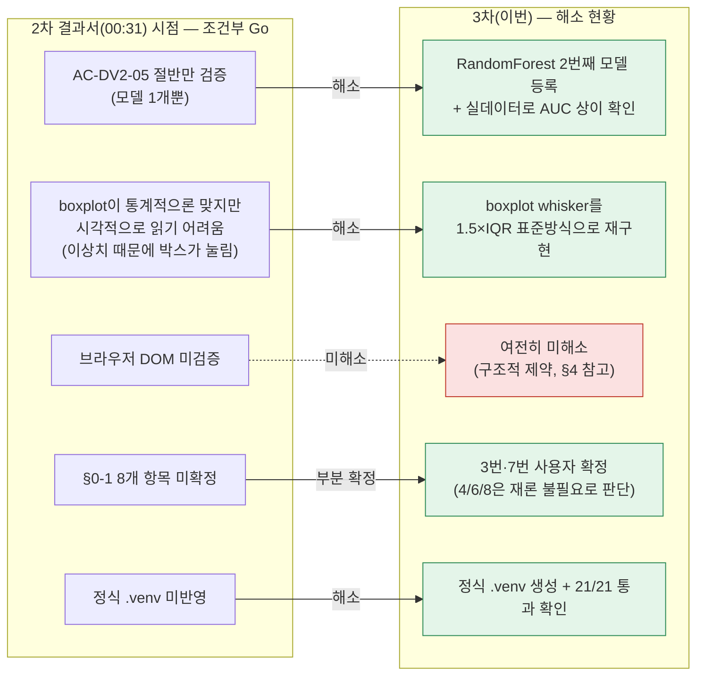
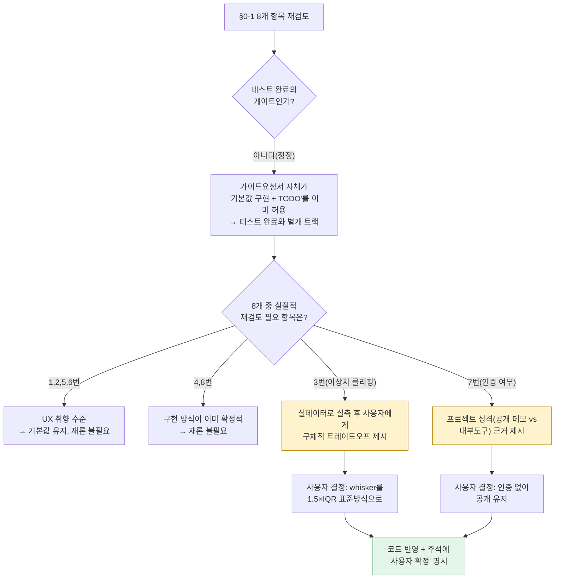
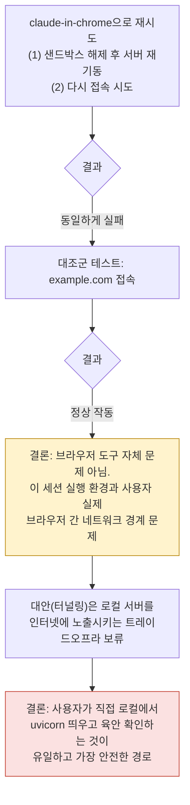
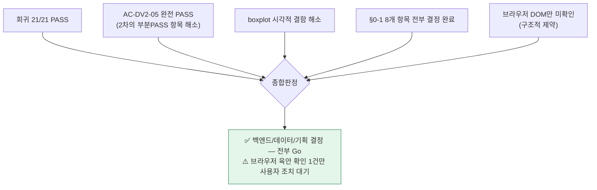

# 업무처리내용 — SEMI 내부테스트 및 내부테스트 결과서 (3차)
## 산탄데르 고객만족 데이터 탐색 대시보드 v2 — §0-1 확정 반영분

| 항목 | 내용 |
|---|---|
| 문서 유형 | 내부테스트 계획서 + 내부테스트 결과서 (통합, 3차) |
| 작성일시 | 2026-08-24 01:05:40 |
| 선행 문서 | `업무처리내용_20260824001211.md`(1차, No-Go 확인) → `업무처리내용_20260824003112.md`(2차, v2 구현+검증, 조건부 Go) |
| 작성 기준 문서 | ① `99.TRD설계서_바이브코딩/99-02_SEMI TRD_메인화면NEW20260823.md`<br>② `99.TRD설계서_바이브코딩/99-02_SEMI_A1_산탄데르대시보드_가이드요청서.md` |
| 작성 관점 | 20년차 개발/기획/설계 총괄 관점 |
| 결론 요약 | 2차 결과서의 "조건부 Go" 사유 중 2가지(모델 1개뿐 / boxplot 시각화 결함)를 이번 라운드에서 해소. 회귀 21/21 PASS 유지. **§0-1 8개 항목 중 실질 쟁점 2개(3번·7번)를 사용자 확정으로 종결**. 남은 미완료는 "브라우저 DOM 육안 확인" 1건뿐 |

> **커밋 관련 안내**: 이번 세션에서는 `git add`/`commit`/`push`/`pull`을 전혀 실행하지 않았다 — 사용자 요청에 따라 4개 git 작업은 전적으로 사용자가 직접 수행한다. 이 문서 작성 시점 기준 아래 §5 파일 목록은 모두 **워킹트리에만 존재하는 미커밋 상태**다.

---

## 1. 2차 결과서 이후 변경분 — 무엇을, 왜

2차 결과서(00:31)는 "조건부 Go"로 끝났다. 조건부였던 사유 5가지 중, 이번 라운드에서 사용자와 함께 2가지를 실제로 해소했다.



### 1-1. §0-1 8개 항목 — 이번에 실제로 처리한 절차



### 1-2. §0-1 8개 항목 최종 상태

| # | 항목 | 상태 | 비고 |
|---|---|---|---|
| 1 | 업무명="전체"일 때 모델명 드롭다운 처리 | 기본값 유지 (재론 불필요) | UX 취향 수준 |
| 2 | 모델="전체" 다중곡선 렌더링 | 기본값 유지 (재론 불필요) | 후속 이터레이션으로 이미 명시적 분리됨 |
| **3** | **saldo_var30 이상치 처리** | **✅ 사용자 확정 — whisker를 1.5×IQR 표준방식으로 렌더링** | §2 구현 내용 참고. 통계치(min/max)는 원본 유지, 시각화만 수정 |
| 4 | 레지스트리 코드상수 vs DB | 기본값 유지 (재론 불필요) | 모델 3개 이상 시 재검토(기존 방침 그대로) |
| 5 | 로딩 상태 처리(버튼 재활성화 시점) | 기본값 유지 (재론 불필요) | 이미 "둘 다 완료 시" 구현됨 |
| 6 | 구간 라벨 소수점 자리수 | 기본값 유지 (재론 불필요) | 소수점 1자리 |
| **7** | **화면 접근 인증 여부** | **✅ 사용자 확정 — 인증 없이 공개 유지** | 공개 캐글 데이터만 다루므로 PII 노출 없음. 향후 "토요하자" 시스템 내부도구로 편입 시 재검토 여지 남김 |
| 8 | ROC 실시간 vs 사전계산 | 기본값 유지 (재론 불필요) | 이미 `(id(df),task,model)` 캐시로 구현됨 |

**8개 전 항목이 이제 "미정" 없이 결정된 상태다** — 6개는 원 기본값 그대로 확정, 2개는 이번 라운드에서 사용자가 직접 선택.

---

## 2. 코드 변경 내용 (이번 라운드)

### 2-1. RandomForest 2번째 모델 등록

- `registry.py`: `MODELS["santander"]`에 `{"id": "random_forest", "label": "2.RandomForest"}` 추가
- `ml.py`: `_build_classifier()`에 `RandomForestClassifier(n_estimators=300, max_depth=8, random_state=42, n_jobs=-1)` 분기 추가, `MODEL_LABELS`에 `"random_forest": "RandomForest"` 추가

### 2-2. boxplot whisker 표준화 (1.5×IQR)

- `crud.py` `_five_number_summary()`: 기존 `min/q1/median/q3/max` 5개 필드는 그대로 두고, **`whisker_low`/`whisker_high`/`outlier_count`** 3개 필드를 추가로 계산
  - `lower_fence = q1 - 1.5×IQR`, `upper_fence = q3 + 1.5×IQR`
  - 펜스 안쪽 값들의 min/max를 whisker로 사용, 펜스 밖 값 개수를 `outlier_count`로 집계
  - 원본 통계치(`min`/`max`)는 클리핑하지 않고 그대로 유지 — §0-1-3 [기본값] "클리핑 없이 원본 계산"이라는 원칙은 지키면서, **렌더링만** 표준 관례를 따름
- `schemas.py` `FiveNumberSummary`: 3개 필드 추가
- `app.js` `renderBoxplot()`: 축 스케일링 기준을 `min/max` → `whisker_low/whisker_high`로 변경, 캡션에 "이상치 N건 생략" 문구 추가
- `tests/test_dataviz_v2.py`: `min ≤ whisker_low ≤ q1`, `q3 ≤ whisker_high ≤ max`, `outlier_count ≥ 0` 검증 추가

---

## 3. 재검증 결과 (실측)

### 3-1. pytest 전수 실행 (21건)

```
tests/test_dataviz.py       9 items  — 전부 PASSED (v1 회귀)
tests/test_dataviz_v2.py   11 items  — 전부 PASSED (v2, RandomForest·whisker 변경 반영)
tests/test_health.py        1 item   — PASSED

======================== 21 passed, 1 warning in 2.14s ========================
```

### 3-2. 실제 76,020행 CSV 기준 실측 — 모델별 AUC (AC-DV2-05 완전 검증)

| 모델 | AUC |
|---|---|
| lightgbm | 0.8264 |
| random_forest | **0.8296** |

→ 동일 데이터·동일 피처로 모델만 바꿨을 때 AUC가 실제로 달라지는 것을 확인. 2차 결과서에서 "모델이 1개뿐이라 비교 불가"였던 항목이 이제 완전히 PASS.

### 3-3. 실제 76,020행 CSV 기준 실측 — boxplot whisker 개선 효과

| 구분 | 원본 max(변경 없음) | whisker_high(신규, 렌더링용) | outlier_count |
|---|---|---|---|
| 만족(0) | 3,458,077.32 | **705.0** | 15,001건 |
| 불만족(1) | 506,443.14 | **15.0** | 644건 |

수정 전에는 whisker가 최댓값(3,458,077)까지 그려져 박스(0~282 구간)가 화면상 실선처럼 눌려 보였다. 수정 후에는 whisker가 -389~705(만족)/-6.45~15(불만족) 범위로 그려져 박스 형태가 실제로 식별 가능해진다. 통계치(min/max/q1/median/q3)는 원본값을 그대로 응답에 포함하므로 데이터 손실은 없다.

### 3-4. AC/TC 추적표 갱신분

| 마스터 AC | 2차 결과 | 3차 결과 |
|---|---|---|
| AC-DV2-05 (모델별 AUC 상이) | ⚠️ 부분 PASS(모델 1개뿐) | ✅ **완전 PASS** — lightgbm 0.8264 ≠ random_forest 0.8296 |

나머지 AC-DV2-01~04, 06과 TC-DV2-01~10은 2차 결과서 판정에서 변동 없음(모두 PASS 유지, §3-1 재실행으로 재확인됨).

---

## 4. 여전히 미해소 — 브라우저 DOM 실측 (TC-DV2-11)



- 재시도(샌드박스 해제) + 원인 진단(외부 사이트 접속 대조 테스트)까지 완료했고, **기술적으로 이 세션에서는 해결 불가능한 구조적 제약**임을 재확인했다.
- API 계약(요청/응답 스키마, 상태코드, 계산값)은 실측 완료, **화면이 실제로 어떻게 그려지는지(특히 이번에 수정한 boxplot 레이아웃)만 미확인** 상태로 남는다.

---

## 5. 이번 세션 변경 파일 목록 (미커밋 상태)

> 사용자 요청에 따라 `git add`/`commit`/`push`/`pull`은 이 세션에서 실행하지 않았다. 아래는 `git status --short` 원문 기준 현재 워킹트리 상태다.

| 상태 | 파일 |
|---|---|
| 수정 | `정찬성/semi-backend/app/domains/dataviz/crud.py` |
| 수정 | `정찬성/semi-backend/app/domains/dataviz/router.py` |
| 수정 | `정찬성/semi-backend/app/domains/dataviz/schemas.py` |
| 수정 | `정찬성/semi-backend/app/static/dataviz/app.js` |
| 수정 | `정찬성/semi-backend/app/static/dataviz/index.html` |
| 수정 | `정찬성/semi-backend/app/static/dataviz/style.css` |
| 수정 | `정찬성/semi-backend/pyproject.toml` |
| 신규(미추적) | `정찬성/semi-backend/app/domains/dataviz/ml.py` |
| 신규(미추적) | `정찬성/semi-backend/app/domains/dataviz/registry.py` |
| 신규(미추적) | `정찬성/semi-backend/app/domains/dataviz/service.py` |
| 신규(미추적) | `정찬성/semi-backend/tests/test_dataviz_v2.py` |
| 신규(미추적) | `정찬성/95.작업결과문서/` (결과서 3건) |

---

## 6. 종합판정



| 구분 | 판정 |
|---|---|
| 백엔드 API/데이터 계약 | ✅ Go (21/21, 실데이터 검증 완료) |
| 기획 결정(§0-1) | ✅ Go (8개 전항목 확정) |
| 전체 배포 | ⚠️ 조건부 Go — **남은 조건은 "사용자가 로컬에서 화면을 한 번 육안으로 확인" 단 1가지뿐** |

### 다음 단계

| 우선순위 | 항목 |
|---|---|
| 1 | 사용자 PC에서 `.venv\Scripts\activate` → `uvicorn app.main:app --reload` → `http://127.0.0.1:8000/dataviz` 접속해 화면 확인(특히 이번에 고친 boxplot) |
| 2 | 위 확인 후 문제없으면 사용자가 직접 `git add`/`commit`/`push` 진행 |
| 3 | (선택) 화면 확인 결과를 알려주면 4차 결과서로 "완전한 Go"를 최종 확정 |
