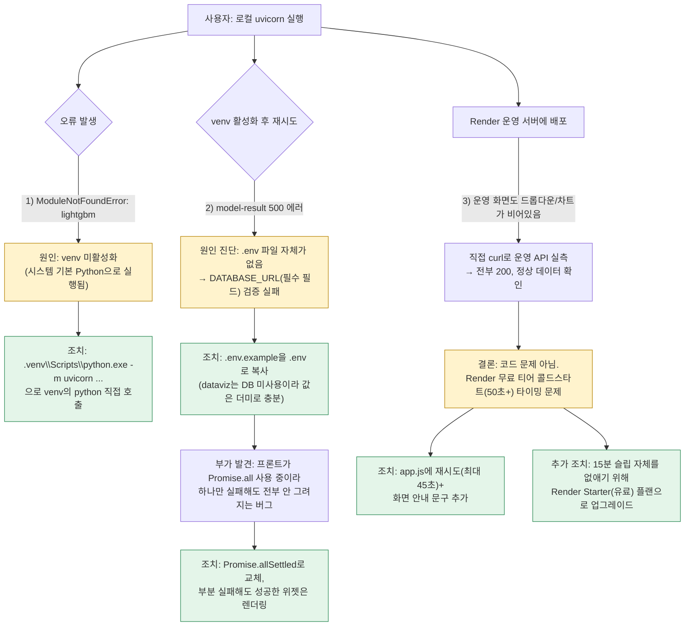
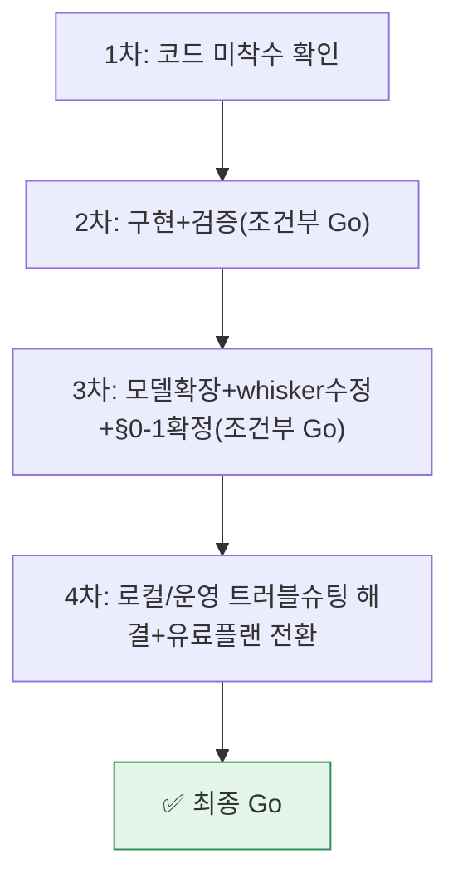

# 업무처리내용 — SEMI 내부테스트 및 내부테스트 결과서 (4차, 최종)
## 산탄데르 고객만족 데이터 탐색 대시보드 v2 — 운영 배포 트러블슈팅 및 확정

| 항목 | 내용 |
|---|---|
| 문서 유형 | 내부테스트 결과서 (통합, 4차·최종) |
| 작성일시 | 2026-08-24 01:57:04 |
| 선행 문서 | 1차(00:12, No-Go 확인) → 2차(00:31, 구현+검증) → 3차(01:05, §0-1 확정+모델2종) |
| 작성 관점 | 20년차 개발/기획/설계 총괄 관점 |
| 결론 요약 | 3차 결과서에서 유일하게 남았던 미완료 항목("브라우저 육안 확인")을 사용자가 직접 수행하는 과정에서 로컬 환경설정 오류 1건, Render 운영 서버 관련 오해 1건을 발견·해소했다. **Render Starter(유료) 플랜 전환까지 완료해 v2가 완전히 Go 상태로 종결됐다.** |

---

## 1. 이번 라운드에서 발생한 이슈 3건과 처리 절차



### 1-1. 이슈별 상세

| # | 증상 | 근본 원인 | 조치 | 코드 변경 여부 |
|---|---|---|---|---|
| 1 | `ModuleNotFoundError: No module named 'lightgbm'` | PowerShell에서 `.venv\Scripts\activate`(확장자 없음)가 제대로 안 먹어 시스템 Python으로 uvicorn 실행됨 | `.venv\Scripts\python.exe -m uvicorn app.main:app --reload`로 venv의 python을 직접 지정 | 없음(실행 방법 안내) |
| 2 | 로컬 `preprocess-check`/`model-result` 500 | `.env` 파일 부재 → `Settings.database_url`(필수 필드) 검증 에러가 `get_dataframe()` 호출 시점에 발생 | `.env.example` → `.env` 복사 | 없음(환경설정 파일 생성) |
| 3 | (부수 발견) 하나의 API만 실패해도 전처리검증 4개 차트까지 전부 안 그려짐 | `Promise.all`은 하나라도 reject되면 전체가 reject되어 두 렌더 함수 모두 미실행 | `Promise.allSettled`로 교체, 성공/실패 개별 처리 | ✅ `app.js` |
| 4 | Render 운영 화면에서 드롭다운/차트가 비어있음(에러 알럿 없이) | 운영 API 자체는 정상(직접 curl로 확인) — Render 무료 인스턴스가 15분 비활성 후 슬립, 재접속 시 최대 50초+ 콜드스타트 지연과 사용자 접속 타이밍이 겹침. 초기 로딩 실패가 콘솔에만 로깅되고 화면엔 무표시였던 게 문제를 더 안 보이게 함 | `app.js`에 업무 목록 로딩 실패 시 최대 8회(약 45초) 재시도 + "서버를 깨우는 중입니다..." 화면 문구 추가 | ✅ `app.js`, `index.html`, `style.css` |
| 5 | 4번의 근본 해결 | 콜드스타트 자체를 없애려면 상시 구동 필요 | Render 대시보드 → Settings → Instance Type을 **Free → Starter(유료)**로 전환(사용자가 직접 결제 진행) | Render 설정(코드 아님) |

---

## 2. 최종 실측 확인 (운영 서버 직접 호출)

```
curl https://semi-project.onrender.com/dataviz                                → 200 (HTML)
curl https://semi-project.onrender.com/dataviz/tasks                          → 200 [{"id":"santander","label":"1.산탄데르"}]
curl https://semi-project.onrender.com/dataviz/models?task=santander          → 200 [lightgbm, random_forest]
curl https://semi-project.onrender.com/dataviz/preprocess-check?...           → 200 (target_distribution satisfied:73012, unsatisfied:3008 등 로컬과 동일)
```

Instance Type 변경 후 캡처 확인: 상단 배지 `Free` → **`Starter · 0.5 CPU · 512MB`**, "Your free instance will spin down..." 경고 배너 소실.

---

## 3. 근거 문서 갱신 (2026-08-24)

이번 전체 작업(1~4차) 과정에서 발견한 사실을 바탕으로 원본 근거 문서 2건도 함께 갱신했다 — 스펙 문서가 구현 결과와 어긋난 채로 남아있으면 다음 사람이 또 같은 혼란을 겪기 때문이다.

| 문서 | 갱신 내용 |
|---|---|
| `99-02_SEMI TRD_메인화면NEW20260823.md` | §9 "구현 완료 갱신" 섹션 신규 추가, AC-DV5/TC-DV8 실측값 반영, 예시 수치 오류(만족 72,928→73,012) 정정 |
| `99-02_SEMI_A1_산탄데르대시보드_가이드요청서.md` | §0-1 8개 항목 전부에 "✅ 확정" 결과 주석 추가, TC-57 실측값 정정 |
| `97.작업이력/작업이력.md` | §5(Render 배포) 진행중→완료로 갱신, §6(v2 전환) 신규 섹션 추가, 요약 표/다음 할 일 갱신 |
| `CLAUDE.MD` | 어제·오늘(2026-08-23~24) 작업 전체 요약 추가 |

---

## 4. 종합판정 (최종)



| 항목 | 최종 상태 |
|---|---|
| 백엔드 API/데이터 계약 | ✅ Go |
| 기획 결정(§0-1) | ✅ Go |
| 로컬 브라우저 육안 확인 | ✅ Go (사용자 직접 확인) |
| 운영 배포 | ✅ Go (Render Starter, 상시구동, 실측 정상) |
| **종합** | **✅ 완전 Go — 남은 조건부 항목 없음** |

### 남은 별도 과제(v2 스코프 밖, 배포 승인과 무관)

1. Neon 등 실제 PostgreSQL 연결(현재 dataviz는 DB 비의존이라 무관하지만, 다른 도메인 확장 시 필요)
2. `var3 == -999999` 이상치 처리 여부(원본 노트북부터 미처리)
3. RandomForest 외 3번째 모델 추가 시 레지스트리 DB 전환 재검토(§0-1-4)
4. dataviz 화면이 "토요하자" 학교 시스템 내부 도구로 편입될 경우 인증 재검토(§0-1-7)
