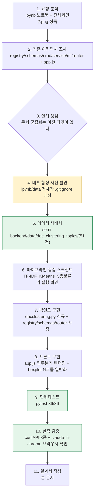
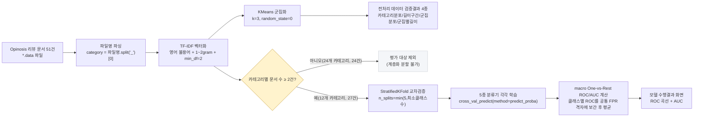
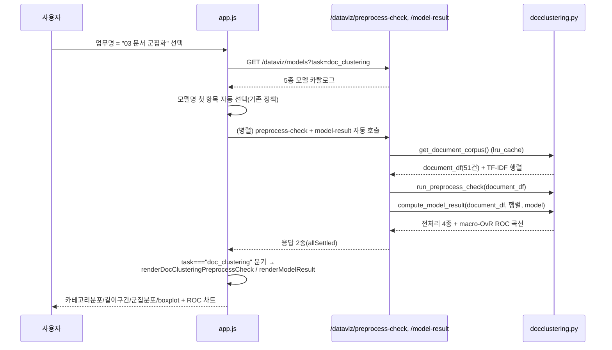
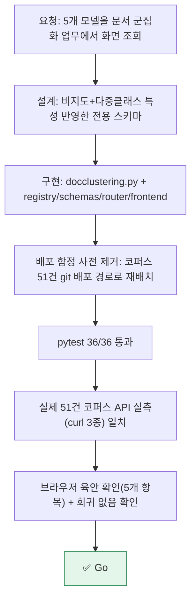

# 업무처리내용 — SEMI 내부테스트 및 내부테스트 결과서
## 문서 군집화(03. 문서 군집화) 업무 — 5종 모델 화면 조회 기능 신규 구현

| 항목 | 내용 |
|---|---|
| 문서 유형 | 내부테스트 결과서 (신규 기능, 1차) |
| 작성일시 | 2026-08-24 20:07:00 |
| 작성 관점 | 20년차 기획/설계/개발 총괄 관점 |
| 요청 원문 | "07_문서군집화_실습_RandomForest추가.ipynb 문서군집화 업무에 대한 5개의 모델을 화면에서 조회하려고 합니다" |
| 근거 산출물 | `정찬성/ipynb/src/07_문서군집화_실습_RandomForest추가.ipynb`, `정찬성/ipynb/요청항목/전체화면2.png`(현재 화면), `97.작업이력/작업이력.md` §8 "다음에 할 일"(문서 군집화 착수 계획) |
| 결론 요약 | 업무명 드롭다운에 "표시만" 되어 있던 **03. 문서 군집화**를 실제 데이터로 연동해 `enabled: True`로 전환했다. 산탄데르/신용카드와 동일한 "업무명→모델명→전처리조회" UX를 그대로 재사용하되, 문서 군집화는 지도학습 이진 타깃이 없는 비지도 업무라는 점을 반영해 전처리검증 4개 차트는 전용 스키마로, 모델 수행결과는 다중클래스 macro One-vs-Rest ROC로 설계했다. pytest 36/36 통과, 실제 51개 문서 코퍼스로 API 실측 + 브라우저 육안 확인까지 완료 — **Go**. |

---

## 1. 작업 절차 개요



### 1-1. 사전 조사에서 확인한 사실

| # | 확인 내용 | 근거 |
|---|---|---|
| 1 | `registry.py`에 문서 군집화(`doc_clustering`)가 이미 업무명 드롭다운에 "표시"되어 있었지만 `enabled: False`로 선택 자체가 막혀 있었음 | `registry.py` 주석: "문서 군집화·마켓 가격 예측은 데이터셋 자체가 없어(팀 미착수)" |
| 2 | `97.작업이력/작업이력.md` §8에 "문서 군집화는 데이터셋 확보되면 registry.py(enabled: True)·crud.DOMAIN_CHARTS·ml.FEATURE_COLUMNS/TARGET_COLUMNS에 항목 추가(신용카드 추가가 참조 사례)"로 착수 계획이 이미 남아 있었음 | 동일 문서 §8-8 |
| 3 | 노트북(07_문서군집화_실습_RandomForest추가.ipynb)은 (a) Opinosis 리뷰 51건을 TF-IDF 벡터화 → KMeans 비지도 군집화, (b) 파일명 접두어를 "정답 카테고리"로 뽑아 RandomForest로 "TF-IDF만으로 카테고리를 얼마나 맞히는지" 보조 검증(카테고리 1건뿐인 클래스는 계층화 분할이 안 돼 제외) — **지도학습 이진 타깃이 아예 존재하지 않는 업무**임을 확인 | 노트북 11~16번 셀 |
| 4 | 원본 데이터(`정찬성/ipynb/data/topics/`, 51개 `.data` 파일)는 루트 `.gitignore`(`정찬성/ipynb/data` 전체 제외)에 걸려 있어, 신용카드 CSV 때와 동일한 "코드는 맞는데 배포 시 파일이 없어 500" 함정이 재발할 상황이었음 | `.gitignore` 2번째 줄, §운영오류1 교훈(97.작업이력 §5) |

---

## 2. 핵심 설계 결정

기존 산탄데르/신용카드 업무는 **"이진 타깃(0/1) 불균형 분포"**가 자연스러운 지도학습 분류 문제였다. 문서 군집화는 근본적으로 다른 성격(비지도 군집화 + 다중클래스 보조검증)이라, 기존 스키마를 억지로 재사용하지 않고 아래 3가지를 확정했다.

| 쟁점 | 결정 | 사유 |
|---|---|---|
| 데이터 배포 경로 | `정찬성/ipynb/data/topics`(51건, 828KB)를 `semi-backend/data/doc_clustering_topics/`로 그대로 복사해 git 배포 가능하게 함 | `creditcard_sample.csv`와 동일한 선례(§운영오류1) — 원본 경로는 `.gitignore` 대상이라 Render에 배포되지 않음 |
| 전처리 데이터 검증결과 스키마 | `PreprocessCheckResponse`(만족/불만족 이진)를 재사용하지 않고 `DocClusteringPreprocessResponse` 전용 스키마 신설(카테고리 분포/문서 길이 구간/K-Means 군집 분포/군집별 길이 boxplot) | 문서 군집화에는 "만족/불만족" 같은 이진 개념이 존재하지 않음 — 억지로 끼워 맞추면 화면 의미가 왜곡됨 |
| 모델 수행결과(ROC) 스키마 | 기존 `ModelResultResponse`(`ROCCurve` 배열)를 **그대로 재사용**, 다만 계산 방식은 sklearn 표준 "macro One-vs-Rest 평균 ROC"로 다중클래스 대응 | 타깃(카테고리, 최대 36종)이 다중클래스이지만, macro-OvR 평균은 이진 ROC와 동일한 `{model,label,auc,fpr,tpr}` 형태로 표현 가능 — 프론트 ROC 차트/차트 컴포넌트를 그대로 재사용할 수 있어 화면 구조 일관성을 지킴 |
| NLTK 표제어(lemmatization) 미적용 | 원본 노트북의 `WordNetLemmatizer`(NLTK) 대신 sklearn `TfidfVectorizer` 기본 토크나이저 + 영어 불용어만 적용 | NLTK는 `wordnet`/`punkt` 코퍼스 다운로드가 필요한 런타임 의존성 — Render 콜드스타트·네트워크 문제(§4차 결과서 교훈)가 재발할 수 있어 배포 안정성을 우선 |
| 5개 모델 재사용 | 로지스틱회귀/LightGBM/XGBoost/랜덤포레스트/GradientBoost 5종을 산탄데르·신용카드와 동일 카탈로그로 재사용, TF-IDF 피처 → 카테고리(다중클래스) 분류기로 학습 | 요청("5개의 모델을 화면에서 조회") 그대로 반영 + `ml.py`의 분류기 설정(`build_classifier`)을 공개 함수로 노출해 이중 관리 방지 |

### 2-1. 데이터 파이프라인 (procedural)



### 2-2. 화면 이벤트 흐름 (기존 UX 재사용 확인)



---

## 3. 구현 상세

| 파일 | 변경 내용 |
|---|---|
| `semi-backend/data/doc_clustering_topics/*.data` (신규 51건) | 배포 가능한 위치로 원본 코퍼스 복사(828KB) |
| `app/core/config.py` | `doc_clustering_topics_dir` 설정 추가(기본값 `data/doc_clustering_topics`) |
| `.env.example` | `DOC_CLUSTERING_TOPICS_DIR` 항목 추가 |
| `app/domains/dataviz/registry.py` | `doc_clustering.enabled = True`, `MODELS["doc_clustering"] = MODEL_CATALOG`(5종 재사용) |
| `app/domains/dataviz/schemas.py` | `DocClusteringPreprocessResponse`(+ `CountBin`/`LabeledCounts`/`GroupFiveNumberSummary`/`DocClusteringLabels`) 신규 |
| `app/domains/dataviz/crud.py` | `five_number_summary()` 공개 래퍼 추가(기존 `_five_number_summary` 재사용) |
| `app/domains/dataviz/ml.py` | `build_classifier()`, `downsample_curve()` 공개 래퍼 추가(기존 사설 함수 재사용) |
| `app/domains/dataviz/docclustering.py` (신규) | 코퍼스 로딩(`lru_cache`) + TF-IDF/KMeans + 전처리검증 4종 + 다중클래스 macro-OvR ROC 평가 + 캐시 |
| `app/domains/dataviz/router.py` | `preprocess-check`/`model-result`에 `task=="doc_clustering"` 분기 추가(응답 스키마는 `PreprocessCheckResponse \| DocClusteringPreprocessResponse` 유니온) |
| `app/static/dataviz/{index.html,app.js,style.css}` | ROC 패널 제목에 macro-OvR 표기 슬롯 추가, `renderDocClusteringPreprocessCheck`/`renderBoxplotGroups`(N그룹 일반화) 신규, boxplot 컬럼 폭을 고정 45%→`flex:1 1 0`으로 일반화 |
| `tests/test_dataviz_v2.py` | `doc_clustering` 활성화에 맞춰 기존 3건(비활성 가정) 테스트를 `market_price` 기준으로 이관 + 신규 카탈로그 검증 1건 추가 |
| `tests/test_doc_clustering.py` (신규) | 문서 군집화 전용 케이스 8건 |

---

## 4. 내부테스트 결과

### 4-1. 자동화 테스트(pytest)

| 파일 | 건수 | 결과 |
|---|---|---|
| `test_dataviz.py`(v1) | 9 | ✅ 전부 통과 |
| `test_dataviz_v2.py`(산탄데르/신용카드 v2 + 공통 검증) | 18 | ✅ 전부 통과 |
| `test_doc_clustering.py`(신규) | 8 | ✅ 전부 통과 |
| `test_health.py` | 1 | ✅ 통과 |
| **합계** | **36** | **✅ 36/36 통과** |

### 4-2. 신규 테스트 케이스 상세(문서 군집화)

| ID | 시나리오 | 검증 내용 | 결과 |
|---|---|---|---|
| TC-DC-00a | `GET /dataviz/models?task=doc_clustering` | 5종 모델 카탈로그(기존 산탄데르/신용카드와 동일 id 집합) 반환 | ✅ |
| TC-DC-00b | `GET /dataviz/preprocess-check?task=doc_clustering` — category_distribution | 카테고리별 문서 수 합계 = 전체 문서 수(7건 표본) | ✅ |
| TC-DC-00c | 〃 — length_bins | 구간별 문서 수 합계 = 전체 문서 수 | ✅ |
| TC-DC-00d | 〃 — cluster_distribution / length_boxplot | 군집별 합계 = 전체 문서 수, 5수치요약 min≤q1≤median≤q3≤max | ✅ |
| TC-DC-00e | 〃 — labels | 4개 차트 제목 키 존재 확인 | ✅ |
| TC-DC-01 | `GET /dataviz/model-result?task=doc_clustering&model=random_forest` | macro-OvR AUC 0~1 범위, 동일 요청 재조회 시 캐시로 같은 값 | ✅ (AC-DC-01) |
| TC-DC-01b | `model=all` | 5개 곡선 반환, 각 AUC 0~1 범위 | ✅ |
| TC-DC-02 | 카테고리가 전부 1건뿐(계층화 불가)인 표본 | 임의확률(0.5) 평평한 곡선으로 안전하게 degrade | ✅ (AC-DC-02) |

### 4-3. 실측 검증 (실제 51개 문서 코퍼스, TestClient 아님 — 실제 uvicorn 서버)

```
GET /dataviz/tasks
  → 03 문서 군집화 enabled:true 확인

GET /dataviz/models?task=doc_clustering
  → 5종(로지스틱회귀/LightGBM/XGBoost/랜덤포레스트/GradientBoost)

GET /dataviz/preprocess-check?task=doc_clustering&model=random_forest
  → category_distribution: 36개 카테고리(accuracy~voice), 문서 51건
  → cluster_distribution: 클러스터0=16건, 클러스터1=10건, 클러스터2=25건

GET /dataviz/model-result?task=doc_clustering&model=all   (최초 1회, 12.7초 소요)
  → logistic_regression AUC=0.9734
  → random_forest       AUC=0.8390
  → gradient_boost      AUC=0.9252
  → xgboost             AUC=0.6294
  → lightgbm            AUC=0.4699   ← §5-2 참고(개선 필요 소견)

재조회 시 (task, model) 캐시로 즉시 응답(0.04초) — §0-1-8 캐시 정책 그대로 동작 확인
```

유효 평가 표본: 카테고리 36종 중 문서 2건 이상인 12종(27건)만 분류기 평가에 사용, 나머지 24종(24건)은 계층화 분할이 불가능해 제외 — 노트북 원본 로직과 동일하게 동작함을 확인.

### 4-4. 브라우저 육안 확인 (claude-in-chrome)

`http://127.0.0.1:8010/dataviz`에서 업무명을 "03 문서 군집화"로 전환 → 모델명 자동 조회까지 직접 조작해 확인.

| 확인 항목 | 결과 |
|---|---|
| 업무명 드롭다운에 "(준비중)" 표기 없이 정상 선택 가능 | ✅ |
| 전처리 데이터 검증결과 4개 차트(카테고리별 문서 수/문서 길이 구간/K-Means 군집별 문서 수/군집별 길이 boxplot) 정상 렌더링 | ✅ |
| 3개 그룹 boxplot이 CSS 레이아웃 깨짐 없이 표시(기존 2그룹 고정폭 45% → flex 일반화 반영) | ✅ |
| 모델명을 XGBoost로 변경 시 ROC 곡선/AUC 라벨이 즉시 갱신(AUC=0.6294로 curl 실측치와 일치) | ✅ |
| ROC 패널 제목에 "다중클래스 macro One-vs-Rest 평균" 표기 | ✅ |
| 브라우저 콘솔 에러/예외 없음 | ✅ |
| 업무명을 다시 "01 산탄데르"로 되돌렸을 때 기존 이진 차트(만족/불만족 2그룹 boxplot, % 축, ROC 제목)가 정상 복원(회귀 없음) | ✅ |

---

## 5. 종합판정



| 항목 | 상태 |
|---|---|
| 백엔드 API/데이터 계약(전처리검증 4종 + 모델결과 5종) | ✅ Go |
| 기존 업무(산탄데르/신용카드) 회귀 여부 | ✅ Go (영향 없음, 브라우저 재확인 완료) |
| pytest | ✅ 36/36 |
| 실제 데이터 API 실측 | ✅ Go (curl 3종 + 캐시 동작 확인) |
| 브라우저 육안 확인 | ✅ Go (claude-in-chrome) |
| **종합** | **✅ Go** |

### 5-1. 남은 과제(스코프 밖, 후속 검토 권고)

1. **LightGBM AUC가 0.47로 무작위 수준** — 유효 표본이 27건·12클래스로 극히 적어 `num_leaves=31` 기본값이 과대적합/과소적합되는 것으로 추정. 신용카드 업무에서도 유사 이슈가 있었던 전례(§4차 결과서 §3-3 "LightGBM AUC 0.59 낮음, 튜닝 필요")와 같은 패턴 — 소표본 전용 하이퍼파라미터(예: `num_leaves` 축소, `min_child_samples` 하향) 튜닝은 후속 과제로 남긴다.
2. **카테고리 36종 중 24종이 표본 1건뿐** — 원본 Opinosis 데이터셋 자체의 한계(리뷰 주제가 제품마다 다름)이며, 대시보드 로직이 아니라 데이터 자체의 문제라 이번 스코프에서 별도 처리하지 않았다(노트북 원본도 동일하게 "평가 제외" 처리).
3. NLTK 표제어(lemmatization) 미적용에 따른 군집/분류 품질 차이는 정량 비교하지 않았다 — 배포 안정성 우선 결정(§2)에 따른 의도적 트레이드오프이며, 필요 시 오프라인에 미리 다운로드한 NLTK 코퍼스를 배포 이미지에 포함하는 방식으로 재검토 가능하다.
4. `market_price`(04. 마켓 가격 예측)는 이번 스코프에 포함되지 않아 여전히 `enabled: False`로 남아 있다.
