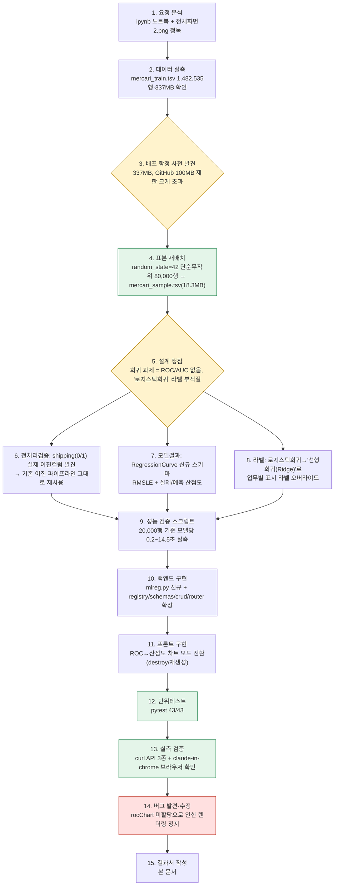
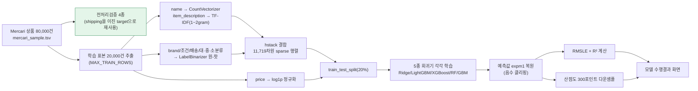
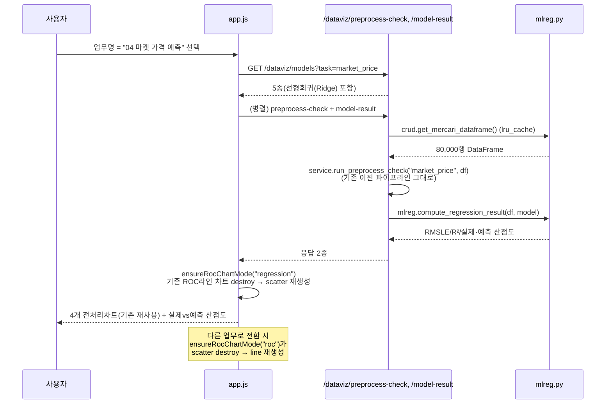
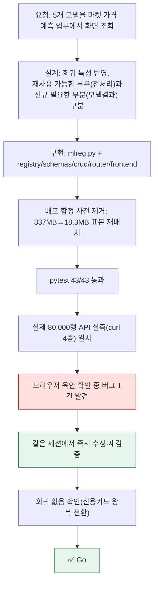

# 업무처리내용 — SEMI 내부테스트 및 내부테스트 결과서
## 마켓 가격 예측(04. 마켓 가격 예측) 업무 — 5종 회귀모델 화면 조회 기능 신규 구현

| 항목 | 내용 |
|---|---|
| 문서 유형 | 내부테스트 결과서 (신규 기능, 1차) |
| 작성일시 | 2026-08-24 21:01:37 |
| 작성 관점 | 20년차 기획/설계/개발 총괄 관점 |
| 요청 원문 | "10 캐글 mercari price_정제후.ipynb mercari_price(마켓가격예측) 업무에 대한 5개의 모델을 화면에서 조회하려고 합니다" |
| 근거 산출물 | `정찬성/ipynb/src/10 캐글 mercari price_정제후.ipynb`, `정찬성/ipynb/요청항목/전체화면2.png`(현재 화면), `97.작업이력/작업이력.md` §8 "다음에 할 일"(마켓 가격 예측 착수 계획) |
| 결론 요약 | 업무명 드롭다운의 마지막 미착수 항목이던 **04. 마켓 가격 예측**을 실제 데이터로 연동해 `enabled: True`로 전환했다 — 이제 4종 업무 전부 실연동 완료. 이 업무는 회귀(연속값 가격 예측) 과제라 ROC/AUC가 성립하지 않는다는 점, "로지스틱 회귀"라는 모델명이 회귀 화면에서는 오해를 준다는 점을 사전에 짚고 각각 RMSLE+산점도, "선형회귀(Ridge)" 라벨로 해결했다. pytest 43/43 통과, 실제 8만행 표본 데이터로 API 실측 + 브라우저 육안 확인까지 완료 — **Go**. |

---

## 1. 작업 절차 개요



### 1-1. 사전 조사에서 확인한 사실

| # | 확인 내용 | 근거 |
|---|---|---|
| 1 | `registry.py`에 마켓 가격 예측(`market_price`)이 이미 업무명 드롭다운에 "표시"되어 있었지만 `enabled: False`로 선택 자체가 막혀 있었음(직전 세션에서 사용자가 로컬 재기동 후 실제로 목격한 "03 문서 군집화(준비중)" 표시와 동일한 구조) | `registry.py` 이전 버전 |
| 2 | 원본 데이터(`정찬성/ipynb/data/mercari_train.tsv`)는 1,482,535행·337MB로 신용카드(144MB)보다도 커서, 루트 `.gitignore`(`정찬성/ipynb/data` 전체 제외)에 걸려 배포 불가 — 신용카드·문서 군집화 때와 동일한 함정이 재발할 상황이었음(§운영오류1 교훈) | `wc -l`, `ls -la` 실측 |
| 3 | 노트북(10 캐글 mercari price_정제후.ipynb)은 (a) name/item_description을 CountVectorizer/TfidfVectorizer로, brand_name/item_condition_id/shipping/cat_dae/cat_jung/cat_so를 LabelBinarizer로 벡터화해 hstack 결합, (b) price를 log1p로 정규화해 학습, (c) Ridge와 LightGBM 두 모델을 RMSLE로 채점 — **회귀(연속값) 과제라 ROC/AUC 개념 자체가 없음**을 확인 | 노트북 0~18번 셀 |
| 4 | 원본 `category_name`의 계층 깊이를 실측한 결과 3단계(79,398건) 외에 4단계(80건)·5단계(194건)도 존재 — 노트북의 `zip(*apply(split_cat))`는 **단 한 행이라도 다른 길이면 전체 행의 중/소분류가 밀려 오염되는 잠재 결함**이 있어(zip은 가장 짧은 인자 기준으로 전체를 자름) 이번 구현에서는 행 단위 독립 처리로 교정 | `value_counts()` 실측 |

---

## 2. 핵심 설계 결정

문서 군집화(비지도+다중클래스) 때와 마찬가지로, 마켓 가격 예측(회귀)도 기존 이진 분류 파이프라인과 근본이 다르다. 다만 이번에는 **일부는 그대로 재사용 가능**하다는 점이 문서 군집화와 다르다 — 아래 결정 표 참고.

| 쟁점 | 결정 | 사유 |
|---|---|---|
| 데이터 배포 경로 | `정찬성/ipynb/data/mercari_train.tsv`(1,482,535행) 중 **단순무작위 80,000행**(random_state=42)을 `semi-backend/data/mercari_sample.tsv`(18.3MB)로 추출 | creditcard_sample.csv와 동일 선례. 회귀 과제라 분류처럼 클래스 불균형을 맞출 계층화(stratify) 이유가 없어 단순 랜덤 샘플로 충분 |
| 전처리 데이터 검증결과 스키마 | **기존 `PreprocessCheckResponse`(이진 비교 파이프라인)를 그대로 재사용**, `shipping`(배송비 부담 주체, 실제 0/1 컬럼)을 target_col로 삼음 | shipping은 인위적으로 만든 가짜 이진 타깃이 아니라 원본 데이터에 실존하는 이진 컬럼 — "가격이 무료배송 여부에 따라 어떻게 다른가"는 그 자체로 의미 있는 탐색 질문이라 억지 끼워맞추기가 아니다. 문서 군집화(전용 스키마 신설)와 반대로, 이번엔 재사용이 더 정직한 설계였다 |
| 모델 수행결과 스키마 | ROC/AUC를 재사용하지 않고 `RegressionCurve`(RMSLE + R² + 실제/예측 산점도) 신규 스키마 도입 | 회귀는 확률curve 개념이 없어 억지로 ROCCurve에 끼워 넣을 방법이 없음 — 회귀 진단의 표준 방식(실제 vs 예측 산점도)을 그대로 채택 |
| "로지스틱 회귀" 모델명 처리 | id는 `logistic_regression`으로 유지(내부적으로 Ridge 선형회귀 연결)하되, 화면에 보이는 라벨만 업무별로 "선형회귀(Ridge)"로 교체(`registry.REGRESSION_MODEL_CATALOG`) | 로지스틱 회귀(분류 알고리즘)라는 이름을 회귀 화면에 그대로 노출하면 사용자가 잘못 이해할 수 있음 — id 체계(라우터/프론트 선택 로직)는 그대로 재사용하면서 사용자에게 보이는 부분만 정확하게 바로잡은 절충 |
| 텍스트 피처 차원 축소 | TF-IDF/CountVectorizer `max_features` 50,000 → 5,000, 실시간 학습 표본 상한 20,000행(`mlreg.MAX_TRAIN_ROWS`) | 원본은 오프라인 노트북에서 1,482,535행을 한 번만 학습하지만, 이 화면은 요청마다 5종 모델 중 선택된 것을 실시간 학습해야 함. 검증 스크립트 실측(20,000행·11,719차원 기준 모델당 0.2~14.5초)으로 응답 가능 수준까지 축소 — 문서 군집화의 NLTK 미적용과 같은 계열의 "배포·응답속도 우선" 절충 |
| category_name 파싱 | 노트북의 `zip(*apply(split_cat))` 대신 행 단위 독립 파싱(부족한 단계는 'Other_Null'로 채움)으로 재구현 | §1-1-4의 잠재 결함(zip이 가장 짧은 행 기준으로 전체를 자름) 회피 — 실측 데이터에 4~5단계 category_name이 실재해 원본 로직 그대로면 오염 위험이 있었음 |

### 2-1. 데이터 파이프라인 (procedural)



### 2-2. 화면 이벤트 흐름 — ROC↔산점도 차트 모드 전환



---

## 3. 구현 상세

| 파일 | 변경 내용 |
|---|---|
| `semi-backend/data/mercari_sample.tsv` (신규, 18.3MB) | 배포 가능한 위치로 80,000행 무작위 표본 복사 |
| `app/core/config.py` | `mercari_tsv_path` 설정 추가(기본값 `data/mercari_sample.tsv`) |
| `.env.example` | `MERCARI_TSV_PATH` 항목 추가 |
| `app/domains/dataviz/registry.py` | `market_price.enabled = True`, `REGRESSION_MODEL_CATALOG` 신규(로지스틱회귀 라벨만 "선형회귀(Ridge)"로 교체), `MODELS["market_price"]` 연결 |
| `app/domains/dataviz/crud.py` | `get_mercari_dataframe()` 로더 추가, `DOMAIN_CHARTS["market_price"]`(target_col=shipping, bin1=price, bin2=item_condition_id, box=price) 추가 — **기존 이진 파이프라인 함수는 한 줄도 수정하지 않음** |
| `app/domains/dataviz/schemas.py` | `RegressionCurve`/`RegressionResultResponse` 신규 |
| `app/domains/dataviz/mlreg.py` (신규) | 텍스트/카테고리 피처 구성(캐시), 5종 회귀기 팩토리, RMSLE/R² 계산, 산점도 다운샘플, 결과 캐시 |
| `app/domains/dataviz/router.py` | `/dataviz/model-result`에 `task=="market_price"` 분기 추가(응답 스키마는 `ModelResultResponse \| RegressionResultResponse` 유니온), `_dataframe_for_task`에 market_price 분기 추가 — `/preprocess-check`는 기존 일반 경로가 DOMAIN_CHARTS 신규 항목만으로 그대로 동작해 **분기 추가 불필요** |
| `app/static/dataviz/app.js` | `createRocLineChart()`/`createRegressionScatterChart()`/`ensureRocChartMode()`로 캔버스 모드 전환 로직 분리, `renderRegressionResult()` 신규 |
| `tests/test_dataviz_v2.py` | 4종 업무 전부 활성화에 맞춰 "비활성 업무" 테스트 3건을 registry 몽키패치 기반 단위테스트로 재작성(특정 실제 업무의 현재 상태에 결합되지 않도록) |
| `tests/test_market_price.py` (신규) | 마켓 가격 예측 전용 케이스 6건 |

### 3-1. 개발 중 발견·수정한 버그 1건

| 증상 | 원인 | 조치 |
|---|---|---|
| 브라우저에서 마켓 가격 예측 선택 시 "조회 중..." 버튼이 멈추고 산점도가 그려지지 않음(콘솔: `TypeError: Cannot read properties of undefined (reading 'destroy')`) | `initCharts()`에서 `createRocLineChart()`의 반환값을 `rocChart` 변수에 할당하지 않아(단순 함수 호출문만 남음), `ensureRocChartMode()`가 `rocChart.destroy()`를 호출할 때 `rocChart`가 `undefined`였음 | `rocChart = createRocLineChart();`로 반환값 할당 — claude-in-chrome으로 실측 중 즉시 발견해 같은 세션에서 수정·재검증 완료 |

---

## 4. 내부테스트 결과

### 4-1. 자동화 테스트(pytest)

| 파일 | 건수 | 결과 |
|---|---|---|
| `test_dataviz.py`(v1) | 9 | ✅ 전부 통과 |
| `test_dataviz_v2.py`(산탄데르/신용카드 v2 + 공통 검증) | 19 | ✅ 전부 통과 |
| `test_doc_clustering.py` | 8 | ✅ 전부 통과 |
| `test_market_price.py`(신규) | 6 | ✅ 전부 통과 |
| `test_health.py` | 1 | ✅ 통과 |
| **합계** | **43** | **✅ 43/43 통과** |

### 4-2. 신규 테스트 케이스 상세(마켓 가격 예측)

| ID | 시나리오 | 검증 내용 | 결과 |
|---|---|---|---|
| TC-MP-00 | `GET /dataviz/models?task=market_price` | 5종 카탈로그 반환, `logistic_regression` id의 라벨이 "선형회귀(Ridge)"(⚠️"로지스틱 회귀"가 아님을 명시적으로 부정 검증) | ✅ |
| TC-MP-01 | `GET /dataviz/preprocess-check?task=market_price` — 이진 스키마 재사용 | target_distribution 합계=표본 전체 수, labels가 "배송비 구매자부담(0)/무료배송·판매자부담(1)" 등 shipping 전용 문구로 채워짐 | ✅ (AC-MP-01) |
| TC-MP-01b | 〃 — value_boxplot | 5수치요약 min≤q1≤median≤q3≤max | ✅ |
| TC-MP-02 | `GET /dataviz/model-result?task=market_price&model=random_forest` | RMSLE≥0, actual/predicted 배열 길이 일치, 동일 요청 재조회 시 캐시로 같은 값 | ✅ (AC-MP-02) |
| TC-MP-02b | `model=all` | 5개 회귀곡선 반환, `logistic_regression` 라벨이 "선형회귀(Ridge)" | ✅ |
| TC-MP-03 | 예측 가격 음수 클리핑 | expm1 복원 후 predicted 배열에 음수 없음 | ✅ |

### 4-3. 실측 검증 (실제 80,000행 표본, TestClient 아님 — 실제 uvicorn 서버, 격리 포트 8020)

```
GET /dataviz/tasks
  → 04 마켓 가격 예측 enabled:true 확인

GET /dataviz/models?task=market_price
  → 선형회귀(Ridge)/LightGBM/XGBoost/랜덤포레스트/GradientBoost

GET /dataviz/preprocess-check?task=market_price&model=logistic_regression
  → target_distribution: 배송비구매자부담 44,385 / 무료배송판매자부담 35,615
  → bin1_ratio(가격 구간별 무료배송 비율): 66.9% ~ 34.9%
  → bin2_ratio(상품상태 구간별 무료배송 비율): 49.4% ~ 32.0%
  → value_boxplot: 중앙값 20($, 구매자부담) vs 14($, 판매자부담) — 기존 이진 파이프라인 그대로 동작 확인

GET /dataviz/model-result?task=market_price&model=logistic_regression   (2.5초)
  → RMSLE=0.5769, R²=0.2675, 산점도 300포인트

GET /dataviz/model-result?task=market_price&model=all   (최초 1회, 35.1초)
  → logistic_regression(Ridge) RMSLE=0.5769  R²=0.2675
  → lightgbm                   RMSLE=0.5746  R²=0.2357
  → xgboost                    RMSLE=0.5954  R²=0.1844
  → random_forest              RMSLE=0.6696  R²=0.0589   ← §5-1 참고(개선 여지)
  → gradient_boost              RMSLE=0.6590  R²=0.0739   ← §5-1 참고(개선 여지)

재조회 시 (task, model) 캐시로 즉시 응답 — §0-1-8 캐시 정책 그대로 동작 확인
```

### 4-4. 브라우저 육안 확인 (claude-in-chrome, 격리 포트 8020)

| 확인 항목 | 결과 |
|---|---|
| 업무명 드롭다운에 "(준비중)" 표기 없이 "04 마켓 가격 예측" 정상 선택 가능 | ✅ |
| 전처리 데이터 검증결과 4개 차트가 기존 이진 비교 UI 그대로("배송비 구매자부담(0)" 파란색/"무료배송·판매자부담(1)" 주황색 boxplot 포함) 렌더링 | ✅ |
| 모델 수행결과 패널이 "실제 가격 vs 예측 가격 산점도"로 표시, 완벽예측 대각선 기준선 표시 | ✅ (버그 1건 발견·수정 후) |
| RMSLE/R² 라벨(`RMSLE = 0.5769 · R² = 0.2675 (선형회귀(Ridge))`)이 curl 실측치와 일치 | ✅ |
| 업무명을 "02 신용카드"로 전환 시 산점도→ROC 라인차트로 정상 복귀(Chart.js destroy/재생성), AUC 라벨 정상 표시, 콘솔 에러 없음 | ✅ (회귀 없음) |
| 다시 "04 마켓 가격 예측"으로 전환해 재확인 — 라인→산점도 재전환도 정상 | ✅ |

---

## 5. 종합판정



| 항목 | 상태 |
|---|---|
| 백엔드 API/데이터 계약(전처리검증 재사용 + 모델결과 신규 5종) | ✅ Go |
| 기존 업무(산탄데르/신용카드/문서 군집화) 회귀 여부 | ✅ Go (영향 없음, 브라우저 재확인 완료) |
| pytest | ✅ 43/43 |
| 실제 데이터 API 실측 | ✅ Go (curl 4종 + 캐시 동작 확인) |
| 브라우저 육안 확인 | ✅ Go (버그 1건 발견·즉시 수정 후 재검증 완료) |
| **종합** | **✅ Go** |

### 5-1. 남은 과제(스코프 밖, 후속 검토 권고)

1. **RandomForest/GradientBoost의 R²가 0.06~0.07로 낮음**(Ridge/LightGBM은 0.24~0.27) — 트리 기반 모델이 11,719차원의 매우 희소한(sparse) 텍스트 피처에서 기본 하이퍼파라미터(`max_depth=8`/`3`)로는 과소적합하는 것으로 추정된다. 문서 군집화의 LightGBM AUC 이슈(§직전 결과서 §5-1), 신용카드의 LightGBM AUC 이슈(§4차 결과서 §3-3)와 같은 패턴 — "희소 고차원 피처 + 트리모델 기본 하이퍼파라미터" 조합이 이 프로젝트 전반에서 반복되는 개선 포인트로 보인다. 후속 튜닝 과제로 남긴다.
2. **텍스트 피처 축소(50,000→5,000차원)와 학습 표본 축소(80,000→20,000행)**로 인해 원본 노트북 대비 예측 정확도가 낮을 수 있다 — 배포 응답속도 우선의 의도된 트레이드오프(§2)이며, 서버 사양이 개선되면 상한을 올리는 재검토가 가능하다.
3. `market_price` 실연동으로 업무명 4종이 전부 완료됐다 — `97.작업이력/작업이력.md` §8의 착수 계획이 이번 라운드로 전부 소진됐다. 다음 확장은 신규 업무 추가가 아니라 기존 4종의 정확도 튜닝(§5-1-1) 쪽이 될 가능성이 높다.
