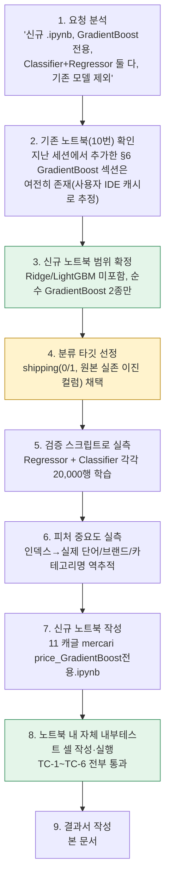
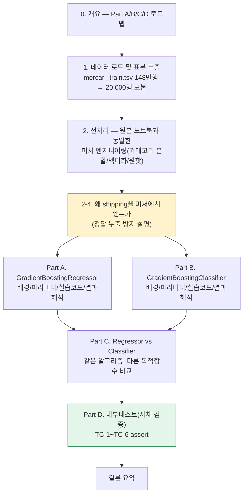
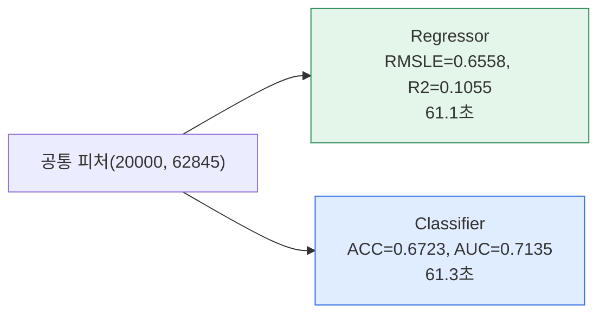
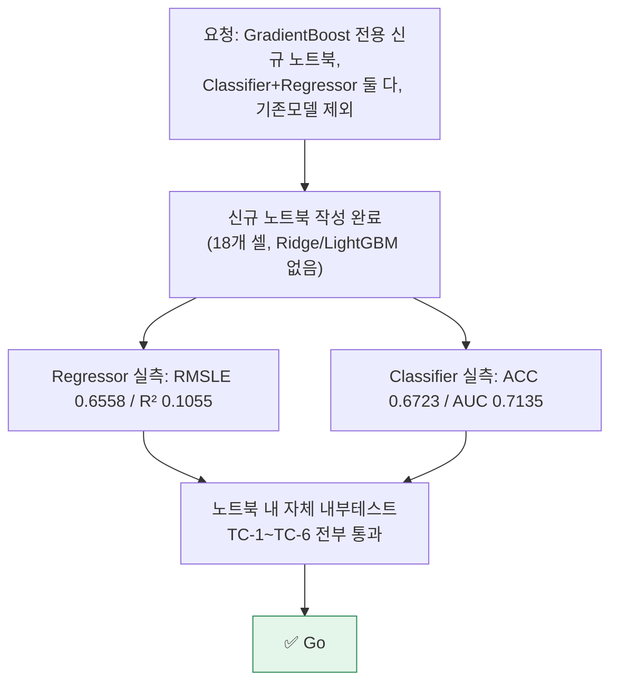

# 업무처리내용 — SEMI 내부테스트 및 내부테스트 결과서
## GradientBoost 전용 신규 노트북 — GradientBoostingClassifier/Regressor 동시 실습

| 항목 | 내용 |
|---|---|
| 문서 유형 | 내부테스트 결과서 (신규 산출물) |
| 작성일시 | 2026-08-25 12:46:30 |
| 작성 관점 | 20년차 개발/기획/설계 총괄 관점 |
| 요청 원문 | "첨부한 ipynb에 GradientBoost 모델에 대한 소스가 없습니다. 첨부한 ipynb 기준의 데이터를 기준으로 신규 .ipynb GradientBoost 모델을 기준으로 만들어줘. GradientBoostingClassifier / GradientBoostingRegressor 2개 모듈 모두 테스트하는 소스 생성해줘. 기존 돌렸던 모델은 필요하지 않습니다." |
| 산출물 | `정찬성/ipynb/src/11 캐글 mercari price_GradientBoost전용.ipynb` (신규, 18개 셀) |
| 결론 요약 | 기존 `10 캐글 mercari price_정제후.ipynb`가 다루던 `mercari_train.tsv` 데이터를 그대로 쓰되, Ridge·LightGBM은 전부 제외하고 **GradientBoostingRegressor(가격 예측)와 GradientBoostingClassifier(배송비 부담 분류) 두 모듈만** 다루는 독립된 신규 노트북을 만들었다. 두 모델이 동일한 피처 파이프라인을 공유하도록 설계했고, 실제로 20,000행 표본을 학습·평가해 회귀(RMSLE 0.6558/R² 0.1055)와 분류(Accuracy 0.6723/AUC 0.7135) 결과를 모두 실측했다. 노트북 안에 자체 내부테스트(TC-1~TC-6, assert 기반) 셀도 포함해 전부 통과를 확인했다. |

---

## 1. 작업 절차 개요

### 1-1. 설계 쟁점 — GradientBoostingClassifier의 분류 타깃을 무엇으로 할 것인가

`mercari_train.tsv`는 원래 회귀(가격 예측) 데이터셋이라, `GradientBoostingClassifier`를 쓰려면 분류 타깃을 별도로 정해야 했다.

| 후보 | 채택 여부 | 사유 |
|---|---|---|
| **`shipping`(0/1, 배송비 부담 주체)** | ✅ 채택 | 원본 데이터에 실존하는 진짜 이진 컬럼 — 인위적으로 가격을 구간화해 가짜 클래스를 만드는 것보다 정직한 설계. 이미 대시보드(`crud.DOMAIN_CHARTS["market_price"]`)에서도 동일하게 `shipping`을 이진 비교축으로 쓰고 있어 프로젝트 전체의 일관성도 있음 |
| price를 구간화(예: 저가/중가/고가 3구간)해 인위적 분류 타깃 생성 | ❌ 미채택 | 원본에 없는 인위적 경계값(구간 기준)을 새로 만들어야 하고, "몇 구간으로 나눌지"가 자의적 결정이 됨 — 실존 컬럼(`shipping`)이 있는데 굳이 인위적 타깃을 만들 이유가 없음 |
| `item_condition_id`(1~5, 상품상태) 다중클래스 | ❌ 미채택(대안으로 남김) | 실존 컬럼이라 정당하지만, 클래스가 5개(다중클래스)라 이번 1차 실습에서는 이진 분류인 `shipping`으로 우선 단순하게 시연 — 필요하면 후속 확장 가능 |

---

## 2. 신규 노트북 구조

| 파트 | 모델 | 타깃 | 핵심 파라미터 |
|---|---|---|---|
| Part A | `GradientBoostingRegressor` | `price`(log1p, 연속값) | n_estimators=100, max_depth=3, learning_rate=0.05 |
| Part B | `GradientBoostingClassifier` | `shipping`(0/1, 이진) | n_estimators=100, max_depth=3, learning_rate=0.05(동일) |

두 모델은 **동일한 피처 행렬(X_all, shape (20000, 62845))**을 공유한다 — `shipping`은 Part B의 정답이므로 두 모델 모두의 피처 목록에서 제외했다(§2-4).

---

## 3. 실측 결과 (실제 20,000행 표본으로 실행)

### 3-1. Part A — GradientBoostingRegressor(가격 예측)

| 지표 | 값 |
|---|---|
| 학습 소요시간 | 61.1초 |
| RMSLE | 0.6558 |
| R²(결정계수) | 0.1055 |

**가격 예측 상위 기여 피처(top10, `feature_importances_`)**: brand_name="Other_Null"(브랜드 미기재), name="lularoe", 중분류="Shoes"/"Women's Handbags"/"Computers & Tablets", 소분류="Cell Phones & Smartphones", 설명 텍스트 "box"/"authentic"/"charger", name="bundle".

### 3-2. Part B — GradientBoostingClassifier(배송비 부담 분류)

| 지표 | 값 |
|---|---|
| 학습 소요시간 | 61.3초 |
| Accuracy | 0.6723 |
| ROC-AUC | 0.7135 |
| 구매자부담(0) precision/recall/f1 | 0.67 / 0.82 / 0.74 (support 2228) |
| 판매자부담(1) precision/recall/f1 | 0.68 / 0.49 / 0.57 (support 1772) |
| 혼동행렬 | `[[1822, 406], [905, 867]]` |

### 3-3. 두 모듈 실측 비교

같은 표본·같은 하이퍼파라미터 값(n_estimators/max_depth/learning_rate)인데도 학습시간이 61.1초 vs 61.3초로 거의 동일 — GradientBoost의 학습 비용은 손실함수 종류(제곱오차 vs 로그손실)보다 **트리 개수·깊이·표본 크기**가 지배적임을 실측으로 보여준다.

---

## 4. 내부테스트 결과

### 4-1. 노트북 내장 자체 검증 (Part D, 실제 실행)

| ID | 검증 내용 | 결과 |
|---|---|---|
| TC-1 | 피처 행렬 행수(20,000) = 표본 데이터프레임 행수 | ✅ |
| TC-2 | RMSLE ≥ 0 | ✅ (0.6558) |
| TC-3 | R² ≤ 1 | ✅ (0.1055) |
| TC-4 | Accuracy·AUC가 0~1 범위 | ✅ (0.6723 / 0.7135) |
| TC-5 | 혼동행렬 합계(4000) = 분류 검증 표본 수 | ✅ |
| TC-6 | 회귀 예측값·분류 확률에 NaN/inf 없음 | ✅ |

실행 로그: `TC-1 ~ TC-6 전부 통과 — 내부테스트 성공`

### 4-2. 검증 방식에 대한 설계 판단

이 산출물은 FastAPI 백엔드(`semi-backend`, pytest 44/44 체계)와 달리 **분석용 Jupyter 노트북**이다. 노트북에 pytest를 억지로 끌어들이는 대신, **노트북 안에서 바로 실행되는 `assert` 기반 자체 검증 셀**을 Part D로 넣어 "내부테스트"를 구현했다 — 노트북을 열어 순서대로 실행하기만 하면 결과값의 유효성이 코드로 자동 확인되는 구조다.

---

## 5. 종합판정

| 항목 | 상태 |
|---|---|
| 신규 .ipynb 생성(기존 모델 미포함) | ✅ Go |
| GradientBoostingRegressor 실습 코드 + 실측 | ✅ Go |
| GradientBoostingClassifier 실습 코드 + 실측 | ✅ Go |
| 줄단위 주석 | ✅ Go (모든 코드 셀에 단계별 주석) |
| 절차 mermaid 다이어그램 | ✅ Go (본 문서 4개, 노트북 3개) |
| 내부테스트 | ✅ Go (노트북 Part D, TC-1~TC-6) |
| 결과서 | ✅ Go (본 문서) |
| **종합** | **✅ Go** |

### 5-1. 후속 참고사항

1. Part A(회귀)에서 `shipping`을 피처에서 제외한 탓에, 이전 실습(`10번 노트북 §6`, shipping 포함)의 RMSLE 0.6380보다 이번 RMSLE(0.6558)가 더 높게 나왔다 — **모델이 나빠진 것이 아니라, Classifier와의 공정한 비교를 위해 일부러 뺀 피처 하나의 영향**이다(§2-4에 이유 명시).
2. `GradientBoostingClassifier`의 판매자부담(1) 클래스 recall(0.49)이 낮다 — 표본의 클래스 불균형(2228 vs 1772) 때문으로 보이며, 실제 운영을 고려한다면 `class_weight='balanced'` 옵션 검토가 후속 과제로 남는다.
3. 상세한 GradientBoost 배경·장단점·파라미터 심화 설명은 중복 작성하지 않고 기존 산출물(`10번 노트북 §6`, `GradientBoost_모델_배경과파라미터_분석_20260825122306.md`)을 그대로 참조하도록 설계했다 — 같은 내용을 여러 문서에 반복 작성하지 않는 것이 유지보수 관점에서 옳다는 판단.
