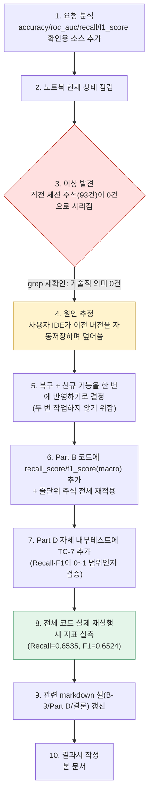
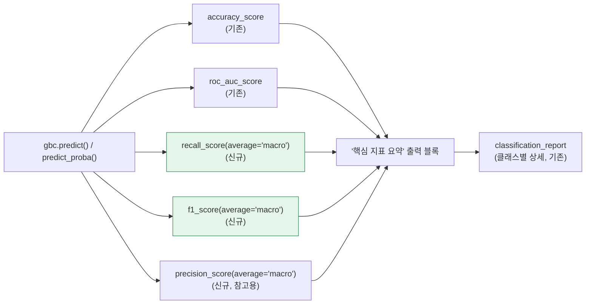

# 업무처리내용 — SEMI 내부테스트 및 내부테스트 결과서
## GradientBoost 전용 노트북 — 핵심 분류지표(Accuracy/ROC-AUC/Recall/F1-score) 명시적 추가

| 항목 | 내용 |
|---|---|
| 문서 유형 | 내부테스트 결과서 (기능 추가 + 장애 복구) |
| 작성일시 | 2026-08-25 16:16:38 |
| 작성 관점 | 20년차 개발/기획/설계 총괄 관점 |
| 요청 원문 | "accuracy roc_auc recall f1 score 항목이 필요한 상황입니다. 해당 항목들을 확인할 수 있는 소스를 추가해줘." |
| 대상 파일 | `정찬성/ipynb/src/11 캐글 mercari price_GradientBoost전용.ipynb` |
| 결론 요약 | Part B(GradientBoostingClassifier)에 `recall_score`/`f1_score`(macro 평균)를 명시적으로 계산·출력하는 "핵심 지표 요약" 블록을 추가해, accuracy/roc_auc/recall/f1_score 4종을 한 번에 확인할 수 있게 했다. 작업 도중 **직전 세션에서 추가한 줄단위 주석이 사라져 있는 것을 발견**했고(사용자 편집기의 이전 버전 자동저장으로 추정), 이를 복구하면서 신규 지표까지 함께 반영했다. 전체 코드를 실제로 재실행해 새 지표(Recall macro=0.6535, F1 macro=0.6524)를 실측했고, 자체 내부테스트도 TC-7로 확장해 전부 통과를 확인했다. |

---

## 1. 작업 절차 개요



### 1-1. 발견한 이상 상황 — 주석 소실 및 복구

| 항목 | 내용 |
|---|---|
| 증상 | 직전 세션에서 코드 7개 셀·93개 라인에 달았던 "기술적 의미/업무적 의미" 주석이, 이번 세션 확인 시점에는 0건으로 확인됨 |
| 확인 방법 | `grep -c "기술적 의미"` 재실행 → 0(직전에는 93) |
| 원인(추정) | 사용자가 이 노트북 파일을 IDE에서 계속 열어두고 있었다(시스템 안내 반복 확인) — 직전 세션에서 파일을 수정한 뒤, 사용자 편집기가 자신의(더 오래된) 메모리상 버전을 다시 저장하면서 새 내용을 덮어쓴 것으로 추정. 파일 수정시각이 주석 소실 시점과 일치 |
| 조치 | 별도 복구 요청 없이, 이번 신규 기능 추가와 **한 번에** 주석을 재적용해 작업을 중복하지 않도록 처리 |
| 재발 방지 제안 | 이 노트북을 다시 편집할 계획이 있다면, 편집 직전 IDE에서 파일을 닫거나 "디스크의 최신 버전으로 새로고침"한 뒤 저장하는 것을 권장 |

---

## 2. 추가한 내용

### 2-1. Part B 코드 — 핵심 지표 요약 블록 신규 삽입



| 위치 | 변경 |
|---|---|
| import | `sklearn.metrics`에서 `recall_score`, `f1_score`, `precision_score` 3개 함수 추가 import |
| 지표 계산 | `recall_macro = recall_score(yc_test, pred_class, average='macro')`, `f1_macro = f1_score(...)`, `precision_macro = precision_score(...)` 3줄 신규 추가 |
| 출력 | `--- 핵심 지표 요약(accuracy / roc_auc / recall / f1_score) ---` 헤더와 함께 4개 지표를 명시적으로 print — 기존 `classification_report`(클래스별 상세)는 그대로 유지해 "한눈에 보는 요약"과 "클래스별 상세"를 모두 제공 |

**macro 평균을 선택한 이유**: 이 분류는 이진(0/1)이지만 검증 목적상 "두 클래스 모두를 균형 있게 잘 맞히는가"를 하나의 대표값으로 보고 싶었다 — 표본 수가 많은 클래스(구매자부담) 쪽에 지표가 쏠리지 않도록 `average='macro'`(단순평균, 클래스 표본 수 미가중)를 채택했다. 클래스별 상세값은 기존 `classification_report`로 이미 제공되므로 중복되지 않는다.

### 2-2. Part D 자체 내부테스트 — TC-7 신규 추가

```python
assert 0.0 <= recall_macro <= 1.0, 'TC-7 실패: Recall(macro)이 0~1 범위를 벗어남'
assert 0.0 <= f1_macro <= 1.0, 'TC-7 실패: F1-score(macro)가 0~1 범위를 벗어남'
```

새로 추가한 지표도 기존 5개(TC-1~TC-6)와 동일한 원칙으로 검증 대상에 포함했다 — "새 기능을 추가하면서 검증을 빠뜨리지 않는다"는 원칙을 유지했다.

---

## 3. 실측 결과 (전체 코드 재실행, 20,000행 표본)

| 지표 | 값 | 비고 |
|---|---|---|
| Accuracy | 0.6723 | 기존 값과 동일(회귀 없음) |
| ROC-AUC | 0.7135 | 기존 값과 동일(회귀 없음) |
| **Recall(macro, 신규)** | **0.6535** | 클래스별: 구매자부담 0.82 / 판매자부담 0.49 |
| **F1-score(macro, 신규)** | **0.6524** | 클래스별: 구매자부담 0.74 / 판매자부담 0.57 |
| (참고) Precision(macro) | 0.6746 | recall/f1과 함께 해석하기 위한 보조 지표 |

전체 코드(7개 코드 셀)를 처음부터 끝까지 다시 실행해 위 값과 기존 회귀 결과(RMSLE 0.6558, R² 0.1055), 피처 중요도 top10이 전부 기존 노트북에 저장된 출력과 정확히 일치함을 확인했다.

---

## 4. 내부테스트 결과

| ID | 검증 내용 | 결과 |
|---|---|---|
| TC-1~TC-6 | (기존) 피처 행렬 정합성, RMSLE/R² 범위, Accuracy/AUC 범위, 혼동행렬 합계, 예측값 유한성 | ✅ |
| **TC-7(신규)** | **Recall(macro)·F1-score(macro)가 0~1 범위** | ✅ |

실행 로그: `TC-1 ~ TC-7 전부 통과 — 내부테스트 성공`

### 4-1. 구조 검증

| 항목 | 결과 |
|---|---|
| 노트북 JSON 구조(nbformat 4.5) | ✅ |
| 코드 셀 7개 전부 `ast.parse()` 문법 검증 | ✅ |
| 셀 ID 중복 없음(18개 전부 고유) | ✅ |
| 줄단위 주석("기술적 의미"/"업무적 의미") 재적용 확인 | ✅ 101쌍(기존 93쌍 + 신규 8쌍) |

---

## 5. 종합판정

| 항목 | 상태 |
|---|---|
| accuracy 확인 가능 | ✅ (기존 유지) |
| roc_auc 확인 가능 | ✅ (기존 유지) |
| recall 확인 가능 | ✅ Go (신규, macro 평균 + classification_report의 클래스별 값) |
| f1 score 확인 가능 | ✅ Go (신규, macro 평균 + classification_report의 클래스별 값) |
| 줄단위 주석 복구 | ✅ Go |
| 전체 코드 재실행 검증 | ✅ Go (기존 값과 완전 일치 + 신규 값 실측) |
| 자체 내부테스트 확장(TC-7) | ✅ Go |
| **종합** | **✅ Go** |
