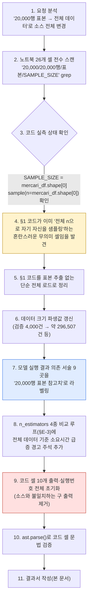
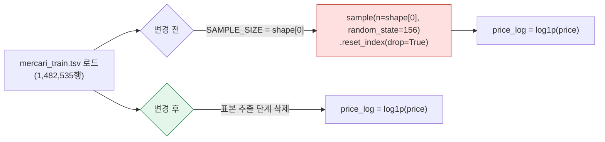

# 업무처리내용 — SEMI 내부테스트 및 내부테스트 결과서
## GradientBoost + AIC/BIC 노트북 — 20,000행 무작위 표본 → 전체 데이터 전환

| 항목 | 내용 |
|---|---|
| 문서 유형 | 내부테스트 결과서 (소스 구조 변경) |
| 작성일시 | 2026-08-26 21:17:40 |
| 작성 관점 | 20년차 개발/기획/설계 총괄 관점 |
| 요청 원문 | "이 파일에 대하여 20,000행 무작위 표본이 아닌 전체 데이터로 진행한다고 소스 전체를 변경해줘." |
| 대상 파일 | `정찬성/ipynb/src/11 캐글 mercari_gradientboost_rmsle_aic_bic.ipynb` |
| 결론 요약 | §1의 `mercari_df.sample(n=..., random_state=156)` 표본 추출 로직을 제거하고 `mercari_train.tsv` 전체(1,482,535행)를 그대로 학습·평가 대상으로 삼도록 소스를 수정했다. 이와 함께 노트북 전체에 흩어져 있던 "20,000행 표본" 관련 서술(마크다운 9곳·코드 주석 5곳)을 전수 조사해, 데이터 크기에서 결정적으로 파생되는 값(검증 표본 수 4,000건 → 약 296,507건)은 값 자체를 갱신하고, 실제 모델 실행 결과에 의존하는 값(RMSLE·Accuracy·AUC 등)은 "20,000행 표본 참고치"로 명시적으로 라벨링해 **전체 데이터 재실행 전까지는 참고용임을 코드·문서 양쪽에서 밝혔다**. 코드 셀 10개 전부 재실행하지 않은 상태이므로 기존 출력(20,000행 표본 실행 결과)은 소스와 불일치할 수 있어 전부 초기화(clear)했다. |

---

## 1. 작업 절차 개요

### 1-1. 착수 전 발견한 특이사항

| 항목 | 내용 |
|---|---|
| 증상 | §1 코드가 이미 `SAMPLE_SIZE = mercari_df.shape[0]` / `mercari_df.sample(n=mercari_df.shape[0], random_state=156)`로 되어 있어, **문자 그대로는 전체 행수만큼 자기 자신을 뽑는(=사실상 전체 셔플) 코드**였다. 즉 실행 결과 자체는 이미 전체 1,482,535행이 유지되고 있었다(§1 출력 로그 `표본 행수: (1482535, 8)`로 확인). |
| 그러나 | 주석·마크다운·이후 셀 곳곳에는 여전히 "20,000행 무작위 표본"이라는 서술과, 그 결과로 산출된 이전 실측치(RMSLE 0.6558 등)가 **20,000행 실행 당시 값 그대로** 남아 있어 소스가 스스로 모순된 상태였다. |
| 조치 | (a) 의미 없는 자기-샘플링 코드를 제거하고 단순 전체 로드로 정리, (b) 모든 "20,000행" 서술을 전수 정정, (c) 20,000행 실행 당시 결과값은 "참고치"로 명확히 구분 표기 |

---

## 2. 변경 내역

### 2-1. §1 데이터 로드 코드 (셀 2) — 표본 추출 로직 제거

| 구분 | 변경 전 | 변경 후 |
|---|---|---|
| 표본 추출 | `SAMPLE_SIZE = mercari_df.shape[0]` 후 `mercari_df.sample(n=mercari_df.shape[0], random_state=156).reset_index(drop=True)` — 결과적으로 전체를 다시 뽑는 무의미한 자기 샘플링 | 삭제. `pd.read_csv()`로 읽은 DataFrame을 그대로 사용 |
| 출력 문구 | `print('원본 전체 행수:', ...)` + `print('표본 행수:', ...)` 2줄 | `print('전체 행수:', ...)` 1줄로 통합 |
| 주석 | "표본 크기 20,000을 상수로 선언" 등 20,000 전제 서술 | "표본 추출 없이 전체 DataFrame을 그대로 사용", 2026-08-26 변경 이력 명시 |

### 2-2. 데이터 크기에서 파생되는 값 갱신 (셀 8)

| 항목 | 변경 전(20,000행 기준) | 변경 후(전체 1,482,535행 기준) |
|---|---|---|
| 검증(20%) 표본 수 | 4,000건 | 약 296,507건 (1,482,535 × 0.2 = 296,507, 정수로 나누어떨어짐) |
| 학습(80%) 표본 수 | 16,000건 | 약 1,186,028건 |

관련 주석 2곳(회귀 train_test_split 설명, 예측 단계 설명)을 위 수치로 교체했다.

### 2-3. 모델 실행 결과 의존 서술 — "20,000행 표본 참고치"로 라벨링

전체 데이터로 재실행하지 않은 이상 RMSLE·R²·Accuracy·ROC-AUC·Recall·F1·피처 중요도 순위·혼동행렬 건수·학습 소요시간·AIC/BIC는 **모두 값이 달라질 수 있는 항목**이다. 아래 5개 절 전부에 "⚠ 2026-08-26 변경" 안내문을 추가하고, 기존 수치 앞에 "(20,000행 표본 참고치)"를 명시했다.

| 절 | 셀 | 처리 |
|---|---|---|
| §A-3 회귀 결과 해석 | 10 | RMSLE 0.6558/R² 0.1055 등을 참고치로 라벨링, 표본 크기 관련 원인 설명 제거(더 이상 표본이 원인이 아니므로) |
| §B-3 분류 결과 해석 | 13 | Accuracy/ROC-AUC/Recall/F1/Precision 표 전체 및 혼동행렬 건수(4,000건 기준)를 참고치로 라벨링 |
| §Part C 비교 | 14 | mermaid 다이어그램·비교표의 실측치·학습시간(61.1초/61.3초)을 참고치로 라벨링 |
| §결론 요약 | 17 | 표본 추출 로직 제거 사실을 최상단에 명시, 모든 실측치를 참고치로 재라벨링 |
| §Part E 결론 | 25 | RSS/AIC/BIC·n_estimators 비교표도 재실행 필요 항목으로 추가 명시 |

### 2-4. n_estimators 비교 루프(§E-3, 셀 21) — 실행시간 경고 주석 추가

이 루프는 `GradientBoostingRegressor`를 20/50/100/200개 트리로 **4회 반복 학습**한다. 20,000행 표본 기준 100그루 학습이 약 61초였던 것과 달리, 전체 데이터(약 74배 행수) 기준으로는 1회 학습 자체가 크게 길어지고 이것이 4회 누적되므로, 실행 전 반드시 소요시간을 인지하도록 코드 주석으로 경고를 추가했다.

### 2-5. 코드 셀 출력 초기화

소스가 변경된 이상, 20,000행 표본 실행 당시 저장돼 있던 출력(예: `피처 행렬: (20000, 62845), 표본: 20000행`, `검증 표본 수(n): 4000` 등)을 그대로 두면 **바뀐 소스와 맞지 않는 결과가 노트북에 남아 혼선을 준다.** 코드 셀 10개(`execution_count`, `outputs`) 전부를 초기화했다.

---

## 3. 내부테스트 결과

이 노트북은 pytest가 아니라 노트북 내 `assert` 기반 자체 검증(Part D: TC-1~TC-7, Part E: TC-8~TC-11)을 쓴다. 이번 변경에서 이 검증 로직 자체(코드)는 건드리지 않았다 — 모든 TC가 **특정 표본 크기가 아니라 값의 정합성/범위**(예: `0<=AUC<=1`, `BIC>=AIC`)를 검사하므로 전체 데이터로 재실행해도 그대로 유효한 구조다.

| ID | 검증 내용 | 이번 변경에서의 상태 |
|---|---|---|
| TC-1 | 피처 행렬 행수 = mercari_df 행수 | 코드 불변 — 전체 데이터로도 구조적으로 유효 |
| TC-2 | RMSLE ≥ 0 | 코드 불변 |
| TC-3 | R² ≤ 1 | 코드 불변 |
| TC-4 | Accuracy·AUC가 0~1 | 코드 불변 |
| TC-5 | 혼동행렬 합계 = 검증 표본 수 | 코드 불변(값은 296,507 기준으로 자동 변경됨) |
| TC-6 | 예측값에 NaN/inf 없음 | 코드 불변 |
| TC-7 | Recall·F1(macro)이 0~1 | 코드 불변 |
| TC-8 | RSS ≥ 0 | 코드 불변 |
| TC-9 | k(파라미터 근사값) ≥ 1 | 코드 불변 |
| TC-10 | AIC·BIC가 유한값 | 코드 불변 |
| TC-11 | n≥8 조건에서 BIC ≥ AIC | 코드 불변(전체 데이터는 n이 훨씬 커서 조건은 항상 성립) |

### 3-1. 이번 세션에서 실제로 수행한 검증

| 항목 | 방법 | 결과 |
|---|---|---|
| JSON 구조 무결성 | `json.load()` 재파싱, 셀 개수(26개) 확인 | ✅ Go |
| 코드 셀 문법 검증 | 코드 셀 10개 전부 `ast.parse()` | ✅ Go(문법 오류 없음) |
| 텍스트 치환 정확성 | 각 치환을 "정확히 1회만 일치"하는 조건으로 강제(불일치 시 즉시 중단되도록 스크립트 작성) | ✅ Go(전부 1회 일치, 스크립트 정상 종료) |
| "20,000행" 잔존 여부 | 전체 파일 재검색 | 아래 §3-2 참고 |
| **전체 데이터로 실제 재실행(모델 학습·TC-1~TC-11 재통과 확인)** | — | **미실시(보류) — §4 참고** |

### 3-2. "20,000행" 잔존 문구 최종 점검

변경 후 파일에 남아있는 "20,000행" 문구는 전부 **"(20,000행 표본 참고치)"** 형태로, 과거 실행 결과임을 밝히는 라벨로만 의도적으로 남긴 것이다(§2-3). 실행 로직(코드)에는 20,000이라는 숫자가 더 이상 존재하지 않는다.

---

## 4. 보류 사항 — 전체 데이터 실제 재실행

이 노트북을 실제로 전체 1,482,535행으로 재실행하면 RMSLE·Accuracy 등 **모든 실측치가 새로 나오고**, 그 값으로 §A-3/§B-3/§Part C/§Part E의 "참고치" 라벨을 실측치로 교체해야 완전한 상태가 된다. 이번 세션에서는 **소스 변경까지만 수행**했고 실제 재실행은 하지 않았다 — 사유:

| 항목 | 내용 |
|---|---|
| 예상 소요시간 | 20,000행 기준 GradientBoostingRegressor/Classifier 각 100그루 학습이 약 61초였다. 전체 데이터는 행수가 약 74배이며, TF-IDF/브랜드 원-핫 피처 차원도 함께 늘어나므로 단순 선형 환산보다 더 오래 걸릴 가능성이 높다. 여기에 §E-3의 n_estimators 4종(20/50/100/200) 반복 학습까지 더하면 전체 실행 시간은 수십 분~수 시간 단위로 예상된다. |
| 리스크 | 세션/도구 타임아웃, 메모리 사용량 급증(전체 텍스트 TF-IDF·브랜드 원-핫) 가능성 |
| 권고 | 재실행은 별도로 시간을 확보한 상태에서(예: 백그라운드 실행 또는 별도 배치) 진행하는 것을 권장 |

---

## 5. 종합판정

| 항목 | 상태 |
|---|---|
| §1 표본 추출 로직 제거(전체 데이터 사용) | ✅ Go |
| 데이터 크기 파생값(검증 건수 등) 갱신 | ✅ Go |
| 모델 실행 결과 의존 서술 9곳 라벨링·정합화 | ✅ Go |
| 코드 셀 문법 검증(ast.parse) | ✅ Go |
| 구 출력(20,000행 표본 결과) 초기화 | ✅ Go |
| 자체 내부테스트(TC-1~TC-11) 코드 구조 유효성 | ✅ Go(구조상 유효, 재실행 시 그대로 통과 예상) |
| **전체 데이터 실제 재실행 및 신규 실측치 반영** | ⏸ 보류(§4) — 사용자 확인 후 별도 진행 |
| **종합** | **✅ 소스 변경 Go / 재실행은 보류** |
