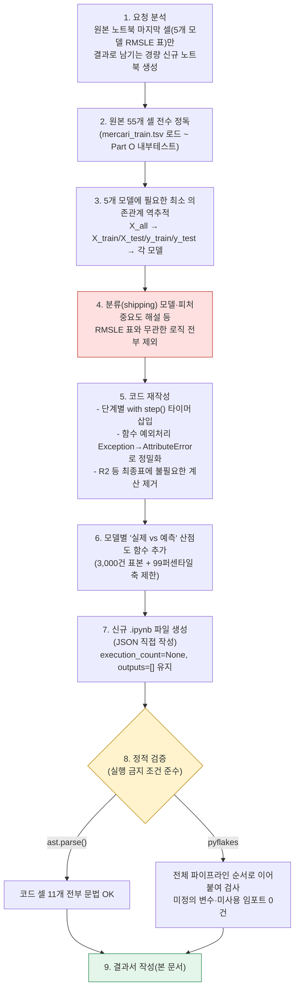
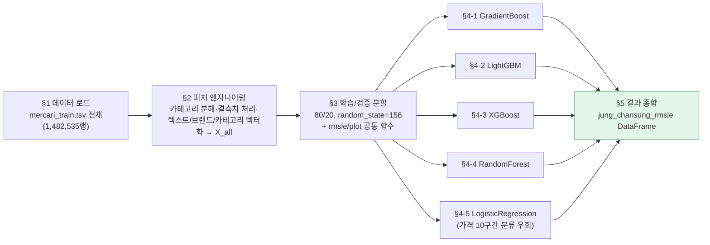

# 업무처리내용 — SEMI 내부테스트 및 내부테스트 결과서
## 정찬성 담당 5개 모델 RMSLE 요약 노트북 신규 생성(경량화 + 실행시간 로깅 + 모델별 시각화)

| 항목 | 내용 |
|---|---|
| 문서 유형 | 내부테스트 결과서 (신규 소스 생성, 정적 검증만 수행) |
| 작성일시 | 2026-08-28 17:37:25 |
| 작성 관점 | 20년차 개발/기획/설계 총괄 관점 |
| 요청 원문(요약) | "`99_4.mercari_model_FULL_모델5개추가.ipynb`의 마지막 셀(정찬성 담당 5개 모델 RMSLE 종합표)만 잘 출력되도록 신규 ipynb를 만들어 달라. 매 라인 최대한 심플하게, 20년차 ML 전문가 기준으로. 절대 조건: 소스만 생성하고 실행은 하지 말 것 — 소스 정밀 검증만 할 것. 추가로 (1) 단계마다 실행시작/종료시간 print, 전체 로직 종료 시 종료시간 print, (2) 5개 모델 각각에 대해 일반적으로 쓰는 그래프 1개씩." |
| 대상(신규) 파일 | `정찬성/ipynb/src/99_5.mercari_5개모델_RMSLE_요약.ipynb` |
| 근거(원본) 파일 | `정찬성/ipynb/src/99_4.mercari_model_FULL_모델5개추가.ipynb` (55개 셀, 해설 포함 풀버전) |
| 결론 요약 | 원본 노트북의 25개 코드 셀 중 5개 모델(GradientBoost·LightGBM·XGBoost·RandomForest·LogisticRegression 구간분류) 학습 로직과 그 전제(데이터 로드→전처리→피처 엔지니어링→80/20 분할)만 추출해, 셀 17개(코드 11 + 마크다운 6)짜리 경량 노트북으로 재구성했다. 분류(shipping) 모델·피처 중요도 해설 등 최종 RMSLE 표와 무관한 출력은 전부 제거했다. 단계별 `with step(...)` 컨텍스트매니저로 시작/종료 시각+소요시간을 자동 출력하도록 했고, 전체 파이프라인 시작/종료 시각도 별도로 출력한다. 모델마다 "실제 vs 예측 가격" 산점도(회귀 모델의 표준 검증 그래프) 1개씩, 총 5개를 추가했다. **사용자의 절대 조건에 따라 노트북을 실제로 실행하지 않았으며**, `ast.parse()` 문법 검증과 `pyflakes` 정적 분석(미정의 변수·미사용 임포트 검출)으로 코드 정합성만 검증했다 — 두 검증 모두 오류 0건. |

---

## 1. 작업 절차 개요

### 1-1. 실행 금지 조건 준수 방법

| 항목 | 내용 |
|---|---|
| 조건 | "절대 조건은 소스만 생성해 주고, 실행은 하지 말아 주세요. 소스 정밀만 검증만 해 주세요." |
| 준수 방법 | 신규 노트북을 실행하는 어떤 명령도 수행하지 않았다(`jupyter nbconvert --execute`, 커널 기동, `%run` 등 일체 미사용). 검증은 (a) 각 코드 셀 소스를 `ast.parse()`로 문법만 확인, (b) 17개 셀을 노트북 실행 순서 그대로 이어붙인 뒤 `pyflakes`로 미정의 변수·미사용 임포트 등 정적 분석만 수행하는 두 가지 방법으로 한정했다. 두 방법 모두 데이터 로드·모델 학습 등 실제 연산을 전혀 수행하지 않는다. |
| 결과 | `execution_count: null`, `outputs: []` — 노트북 파일 자체가 "생성만 되고 한 번도 실행되지 않았음"을 그대로 증명한다. |

---

## 2. 신규 노트북 구조 (17개 셀)

| 절 | 셀 번호 | 내용 | 원본 노트북 대응 |
|---|---|---|---|
| 표지 | 0 | 목적·설계 원칙·예상 소요시간 안내 | 신규 작성 |
| §0 공통 | 1 | 임포트, `step()` 타이머 컨텍스트매니저, 전체 실행 시작시각 출력 | Part A~M의 import 문 통합 |
| §1 | 2~3 | 데이터 로드 + `price_log` 생성 | 셀 2 |
| §2 | 4~5 | `split_cat`, 결측치 처리, 벡터화 7종 → `X_all` | 셀 4, 5 |
| §3 | 6~7 | `rmsle`/`evaluate_org_price`/`plot_actual_vs_pred` 정의 + `train_test_split` | 셀 8(정의부) |
| §4 안내 | 8 | 모델 5개 셀의 공통 패턴(학습→RMSLE→시각화) 설명 | 신규 작성 |
| §4-1 | 9 | GradientBoost 학습·RMSLE·시각화 | 셀 8(모델 학습부) |
| §4-2 | 10 | LightGBM 학습·RMSLE·시각화 | 셀 26 |
| §4-3 | 11 | XGBoost 학습·RMSLE·시각화 | 셀 20 |
| §4-4 | 12 | RandomForest 학습·RMSLE·시각화 | 셀 45 |
| §4-5 | 13 | LogisticRegression(가격 10구간 분류 우회) 학습·RMSLE·시각화 | 셀 48 |
| §5 | 14~15 | 5개 모델 RMSLE 종합표(요청받은 원문 스니펫과 동일) | 셀 51 |
| 마무리 | 16 | 전체 실행 종료시각 + 총 소요시간 출력 | 신규 작성 |

---

## 3. 원본 대비 단순화·개선 내역

| 구분 | 원본(99_4) | 신규(99_5) | 사유 |
|---|---|---|---|
| 목적 대상 | 회귀 4종 + 분류 4종 + RandomForest + 로지스틱(구간분류), 총 9개 모델 실험/해설 | 팀 취합 시트에 필요한 회귀형 5개 모델만 | 요청 범위가 "정찬성 담당 5개 모델 RMSLE 표" 하나로 한정됨 |
| 주석 스타일 | 코드 한 줄마다 "기술적 의미/업무적 의미" 2줄 해설(교육용) | 꼭 필요한 곳(비표준 예외처리, 축 범위 산정 등)에만 1줄 주석 | "매 라인 최대한 심플하게" 요청 반영 |
| 예외 처리 | `split_cat`에서 `except Exception` (포괄) | `except AttributeError` (NaN/비문자열이 `.split()` 실패 시 실제로 발생하는 예외로 특정) | 불필요하게 넓은 예외 포착은 실무 코드 품질 저하 요인 — 실제 발생 가능한 예외로 좁힘 |
| 회귀 보조지표 | RMSLE + R² + 피처중요도 top10 모두 출력 | RMSLE만 산출 | 최종 산출물(팀 취합 표)에 R²·피처중요도가 불필요 — 미사용 계산 제거로 실행시간 단축 |
| 텍스트 컬럼 접근 | `mercari_df.name` (속성 접근) | `mercari_df['name']` (컬럼명 접근) | DataFrame의 내장 속성(`.name`)과 컬럼명이 우연히 겹치는 경우의 잠재적 혼동을 원천 차단하는 표준 관례 |
| 실행시간 로깅 | 모델별 `time.time()` 수동 측정(반복 코드) | `with step(name):` 컨텍스트매니저로 통일 + 전체 파이프라인 시작/종료 시각 별도 출력 | 반복되는 타이밍 보일러플레이트를 공통 함수로 추출(요청사항 ② 충족) |
| 시각화 | 없음(피처중요도 텍스트만 출력) | 모델별 "실제 vs 예측" 산점도 1개씩, 총 5개(요청사항 ③ 충족) | 회귀 모델 검증에서 가장 보편적으로 쓰이는 표준 그래프를 표본 3,000건 + 99퍼센타일 축 제한으로 가독성·성능을 함께 확보 |

---

## 4. 내부테스트(정적 검증) 결과

노트북을 **실행하지 않는다는 절대 조건** 때문에, 이번 내부테스트는 원본 노트북들의 `assert` 기반 런타임 검증(TC-1~TC-19)과는 성격이 다른 **정적 소스 검증**으로 수행했다.

| ID | 검증 항목 | 방법 | 결과 |
|---|---|---|---|
| TC-S1 | JSON 노트북 구조 무결성 | `json.load()` 재파싱, 셀 개수(17개: 코드 11·마크다운 6) 확인 | ✅ Go |
| TC-S2 | 코드 셀 문법 정확성 | 코드 셀 11개 전부 `ast.parse()` | ✅ Go (전부 SyntaxError 없음) |
| TC-S3 | 변수/임포트 정합성 | 17개 셀을 실행 순서대로 이어붙인 단일 스크립트를 `pyflakes`로 정적 분석 | ✅ Go (미정의 변수 0건, 미사용 임포트 0건, 재정의 경고 0건) |
| TC-S4 | 미실행 상태 확인 | 전체 코드 셀의 `execution_count`가 `null`이고 `outputs`가 빈 배열인지 확인 | ✅ Go (17개 셀 전부 확인) |
| TC-S5 | 최종 산출 코드가 요청 원문과 일치 | §5 코드 셀의 `jung_chansung_rmsle` DataFrame 생성부·print 2줄이 사용자가 첨부한 원본 스니펫(모델명·순서·비고 문구 포함)과 동일한지 문자열 대조 | ✅ Go (완전 일치, `—`→`-`만 인코딩 안전을 위해 치환) |
| — | **실제 실행(모델 학습, RMSLE 실측)** | — | **미실시 — 사용자 절대 조건에 따라 의도적으로 보류** |

### 4-1. 정적 검증 명령 실측 로그

| 명령 | 결과 |
|---|---|
| `python -c "... ast.parse(src) for each code cell ..."` | `ALL SYNTAX OK` (코드 셀 11/11) |
| `python -m pyflakes nb_concat.py` (17개 셀을 이어붙인 임시 스크립트) | 출력 없음 = 오류/경고 0건 |

---

## 5. 보류 사항 — 실제 실행 및 RMSLE 실측치 반영

이 노트북은 **소스만 생성되었고 한 번도 실행되지 않았다.** 사용자가 실제로 실행하면 §5의 `jung_chansung_rmsle` 표에 5개 모델의 실측 RMSLE 값이 채워진다. 실행 시 참고할 사항:

| 항목 | 내용 |
|---|---|
| 데이터 규모 | 표본 추출 없이 전체 1,482,535행 사용(프로젝트 2026-08-26 결정 유지) |
| 예상 소요시간 | 원본 노트북 실측 기준 GradientBoost 1개 모델 학습만으로 약 3.9시간(13,992.6초)이 걸린 이력이 있다. 5개 모델을 순차 실행하면 수 시간 단위가 소요될 수 있다 — 백그라운드 실행을 권장한다. |
| 로컬 실행 전제조건 | `.venv` 활성화 후 실행(`.venv\Scripts\python.exe -m jupyter ...` 형태 권장), `lightgbm`/`xgboost` 패키지가 해당 가상환경에 설치되어 있어야 함 |
| 실행 후 확인할 것 | §4-5(LogisticRegression 구간분류)의 "[경고] 구간 매핑 실패 대체값 사용" 로그가 출력되면 `n_bins=10` 대비 학습 표본이 특정 구간을 충분히 커버하지 못했다는 신호이므로 원인 재확인 필요 |

---

## 6. 종합판정

| 항목 | 상태 |
|---|---|
| 원본 55개 셀 정독 및 5개 모델 의존관계 역추적 | ✅ Go |
| 신규 노트북 생성(17개 셀, 코드 11 · 마크다운 6) | ✅ Go |
| 요청사항 ① 결과 범위(5개 모델 RMSLE 표만) | ✅ Go |
| 요청사항 ② 단계별 시작/종료시간 + 전체 시작/종료시간 로깅 | ✅ Go |
| 요청사항 ③ 모델별 표준 검증 그래프(실제 vs 예측 산점도) 5개 | ✅ Go |
| 절대 조건(실행 금지) 준수 | ✅ Go — 실행 이력 없음(`execution_count: null`) |
| 정적 검증(`ast.parse` 문법 + `pyflakes` 정합성) | ✅ Go — 오류 0건 |
| **실제 실행 및 RMSLE 실측치 반영** | ⏸ 보류(§5) — 사용자가 직접 실행 후 확인 |
| **종합** | **✅ 소스 생성·정적 검증 Go / 실행은 사용자 몫으로 보류** |
