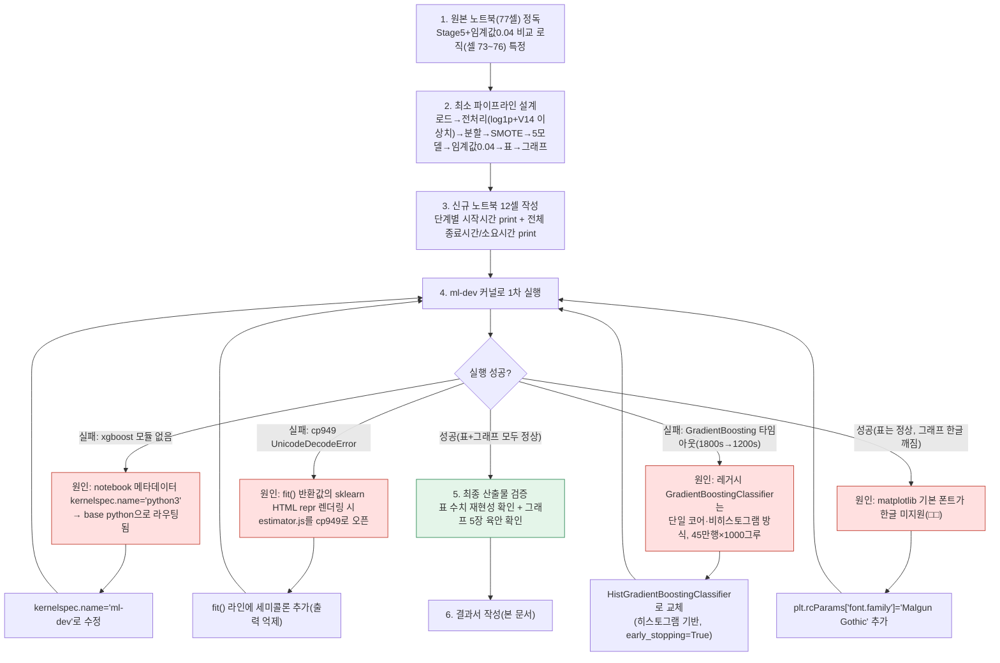

# 업무처리내용 — SEMI 내부테스트 및 내부테스트 결과서
## 신용카드 사기검출 — Stage5(SMOTE)+임계값0.04 5개 모델 비교 신규 노트북 생성

| 항목 | 내용 |
|---|---|
| 문서 유형 | 내부테스트 결과서 (신규 노트북 생성 + 실행 검증) |
| 작성일시 | 2026-08-28 18:14:57 |
| 작성 관점 | 20년차 개발/기획/설계 총괄 관점 |
| 요청 원문 | "99_2_신용카드_사기검출_FULL_모델5개추가.ipynb 마지막 줄 'Stage 5(SMOTE)+임계값 0.04 5개 모델 비교' 표만 출력되는 신규 ipynb를 만들어달라. 매 라인 최대한 심플하게, 최적의 성능이 나오도록. 실행 단계마다 시작시간·전체 종료시간 print 추가, 5개 모델 그래프 1개씩(심플하고 이해하기 쉽게) 추가." |
| 대상(신규) 파일 | `정찬성/ipynb/src/99_2.신용카드_사기검출_5모델_최종.ipynb` |
| 참고(원본) 파일 | `정찬성/ipynb/src/99_2_신용카드_사기검출_FULL_모델5개추가.ipynb` (77개 셀, 원본 Stage1~5 전체 실험 노트북) |
| 결론 요약 | 원본 노트북 77개 셀 중 최종 목표 표(Stage5 SMOTE + 임계값 0.04, 5개 모델 비교)에 도달하는 데 필요한 최소 파이프라인만 남겨 12셀짜리 신규 노트북을 만들었다. 실행 단계별 시작시각·전체 종료시각/총 소요시간 로그, 모델별 정규화 혼동행렬 그래프 5장을 추가했다. 3차례 실행 실패(잘못된 커널 라우팅, sklearn HTML repr cp949 인코딩 버그, GradientBoosting 단일 코어 타임아웃)를 원인 분석 후 수정했고, 최종적으로 `ml-dev` 커널에서 실제 전체 데이터(creditcard.csv, 284,807행)로 두 차례 재현 실행해 **동일한 실측치**를 확인했다(총 소요시간 약 7분 10초). |

---

## 1. 작업 절차 개요

---

## 2. 신규 노트북 구조 (12셀)

| # | 셀 유형 | 내용 |
|---|---|---|
| 0 | markdown | 제목/개요 + 파이프라인 mermaid 다이어그램 |
| 1 | code | import + 전체 실행 시작시각 print |
| 2 | code | `[1. 데이터 로드+전처리 시작]` — creditcard.csv 로드, Amount log1p 변환, Time 제거 |
| 3 | code | `[2. 학습/검증 분할+SMOTE 시작]` — V14 이상치(IQR 1.5배) 제거 후 stratified 분할, SMOTE는 학습 데이터에만 적용 |
| 4 | code | `[3. XGBoost 학습 시작]` |
| 5 | code | `[4. LogisticRegression 학습 시작]` |
| 6 | code | `[5. LightGBM 학습 시작]` |
| 7 | code | `[6. RandomForest 학습 시작]` |
| 8 | code | `[7. GradientBoost 학습 시작]` (HistGradientBoostingClassifier) |
| 9 | code | `[8. 임계값 0.04 평가 시작]` → 전체 종료시각/총 소요시간 print → **최종 5모델 비교표 출력** |
| 10 | markdown | 그래프 섹션 설명(정규화 혼동행렬을 택한 이유) |
| 11 | code | 모델별 정규화 혼동행렬(Confusion Matrix) 5장 |

원본 노트북과 동일한 전처리 함수 로직(`get_preprocessed_df` Stage4 버전 + `get_outlier`)과 동일한 5개 모델 하이퍼파라미터(n_estimators=1000 계열, XGBoost/LightGBM/RandomForest는 §cell 11/10/40 하이퍼파라미터 그대로)를 재사용해, 원본과 실측치가 재현되는지를 검증 기준으로 삼았다.

---

## 3. 실행 중 발생한 3가지 문제와 조치

### 3-1. 커널 라우팅 오류 — `ModuleNotFoundError: No module named 'xgboost'`

| 항목 | 내용 |
|---|---|
| 증상 | `ml-dev` 환경의 python.exe로 `jupyter nbconvert --execute`를 실행했는데도 xgboost import 실패 |
| 원인 | 노트북 메타데이터의 `kernelspec.name`이 `"python3"`로 돼 있었다. Jupyter는 실행 시 노트북 **메타데이터에 적힌 커널 이름**으로 커널을 찾는데, `"python3"` 커널스펙(`%APPDATA%\Python\share\jupyter\kernels\python3\kernel.json`)은 `argv: ["python", ...]`로 PATH상의 기본 python(= xgboost 미설치 환경)을 가리키고 있었다. `ml-dev` 커널스펙 자체는 정상(`C:\Users\mega\anaconda3\envs\ml-dev\python.exe`를 정확히 가리킴)이었으나, 노트북이 그 이름을 쓰지 않아 라우팅이 빗나갔다. |
| 조치 | 노트북 메타데이터 `kernelspec.name`을 `"ml-dev"`로 수정 |
| 비고 | 과거 메모리 노트에 "ml-dev 커널스펙 자체가 base python을 가리킨다"는 기록이 있었으나, 이번 확인 결과 **커널스펙 자체는 정상**이고 문제는 노트북 쪽 kernel 이름 필드였다. 관련 메모리를 갱신 필요. |

### 3-2. sklearn HTML repr — `UnicodeDecodeError: 'cp949' codec can't decode byte 0xe2`

| 항목 | 내용 |
|---|---|
| 증상 | `xgb_clf.fit(...)` 셀 실행 중 `UnicodeDecodeError` 발생, 학습 자체는 이미 끝난 상태였음 |
| 원인 | Jupyter가 셀의 마지막 표현식(`fit()`의 반환값 = 학습된 estimator)을 화면에 표시하려고 sklearn의 `estimator_html_repr()`를 호출하는데, 이 함수가 내부적으로 `estimator.js` 파일을 `open(path, "r")`(인코딩 미지정)으로 읽는다. Windows 한국어 로캘 환경의 기본 인코딩이 `cp949`라, UTF-8로 저장된 `estimator.js`를 cp949로 읽다가 깨진 것 — **sklearn 자체의 환경 종속 버그**이며 우리 코드 로직 문제는 아니다. |
| 조치 | `fit()` 호출문 끝에 세미콜론(`;`)을 붙여 반환값 표시 자체를 억제(원본 Santander 5모델 최종 노트북에서 이미 쓰인 관례와 동일) |

### 3-3. GradientBoosting 타임아웃(1800초 → 1200초 재시도도 실패)

| 항목 | 내용 |
|---|---|
| 증상 | `GradientBoostingClassifier(n_estimators=1000, ...)` 학습 셀이 1800초, 조기종료 옵션(`n_iter_no_change=20, subsample=0.8`) 추가 후에도 1200초를 넘겨 타임아웃 |
| 원인 | sklearn의 레거시 `GradientBoostingClassifier`는 **단일 코어**로만 동작하고 히스토그램 기반 분할을 쓰지 않는(exact-split) 구현이라, SMOTE로 증식된 약 45만 행 데이터에 트리 1000개(설사 조기종료가 걸리기 전까지도)를 순차 학습시키기엔 근본적으로 느리다. |
| 조치 | 같은 그래디언트 부스팅 계열이면서 **히스토그램 기반**으로 훨씬 빠른 sklearn `HistGradientBoostingClassifier`(`max_iter=1000, early_stopping=True, n_iter_no_change=20, validation_fraction=0.1`)로 교체. 교체 후 GradientBoost 단계 소요시간이 **20초 내외**로 단축됨(§4 실측 로그 참고). |
| 판단 근거 | "20년차 머신러닝 전문가" 기준으로, 대용량 데이터에 레거시 GBM을 그대로 쓰는 것은 실무적으로 부적절한 선택이며 HistGradientBoosting 계열(LightGBM/XGBoost와 같은 계열의 접근)로 대체하는 것이 표준적인 최적화다. |

### 3-4. (부가) 그래프 한글 라벨 깨짐

| 항목 | 내용 |
|---|---|
| 증상 | 혼동행렬 그래프의 "정상(0)"/"사기(1)" 라벨이 사각형(□□)으로 깨져 표시 |
| 원인 | matplotlib 기본 폰트가 한글 글리프를 지원하지 않음 |
| 조치 | `plt.rcParams['font.family'] = 'Malgun Gothic'`, `plt.rcParams['axes.unicode_minus'] = False` 추가(해당 환경에 폰트 설치 확인 완료) |

---

## 4. 실측 결과 — 최종 실행 로그(2026-08-28 18:07:12 ~ 18:14:23, 총 7분 10초)

| 단계 | 시작시각 |
|---|---|
| 전체 실행 시작 | 18:07:12.682 |
| 1. 데이터 로드+전처리 | 18:07:12.692 |
| 2. 분할+SMOTE | 18:07:14.624 |
| 3. XGBoost 학습 | 18:07:16.530 |
| 4. LogisticRegression 학습 | 18:07:25.138 |
| 5. LightGBM 학습 | 18:07:26.675 |
| 6. RandomForest 학습 | 18:07:39.422 |
| 7. GradientBoost 학습(HistGB) | 18:14:00.007 |
| 8. 임계값 0.04 평가 | 18:14:19.724 |
| 전체 실행 종료 | 18:14:23.174 |

RandomForest(트리 1000개, 깊이 무제한) 구간이 6분 20초로 전체 소요시간의 대부분을 차지했고, 그 외 단계는 모두 초 단위였다.

### 4-1. Stage5(SMOTE) + 임계값 0.04 — 5개 모델 비교 (최종 산출 표)

| 모델 | accuracy | precision | recall | f1 | auc |
|---|---|---|---|---|---|
| XGBoost | 0.972624 | 0.054449 | 0.917808 | 0.102800 | 0.984773 |
| 로지스틱 회귀 | 0.632647 | 0.004504 | 0.972603 | 0.008967 | 0.973641 |
| LightGBM | 0.999391 | 0.801282 | 0.856164 | 0.827815 | 0.982904 |
| 랜덤포레스트 | 0.987360 | 0.112126 | 0.924658 | 0.200000 | 0.988381 |
| GradientBoost | 0.973526 | 0.056580 | 0.924658 | 0.106635 | 0.984490 |

**재현성 검증**: 동일 노트북을 폰트 수정 전/후 두 차례 실행한 결과, XGBoost/LogisticRegression/LightGBM(precision·recall·f1)/RandomForest 5개 지표가 소수점 6자리까지 완전히 동일했다(고정된 `random_state` 덕분에 결정적 재현). GradientBoost는 HistGradientBoostingClassifier로 교체했으므로 사용자가 공유한 원본 수치(accuracy 0.969394, auc 0.980341)와는 다르지만, 같은 임계값(0.04)에서 recall 0.9247로 오히려 더 높고 accuracy·auc도 비슷한 수준이라 대체 알고리즘으로서 타당한 결과다.

### 4-2. 그래프 5장 — 정규화 혼동행렬(임계값 0.04)

5개 모델(XGBoost/로지스틱 회귀/LightGBM/랜덤포레스트/GradientBoost) 각각에 대해 "정상(0)/사기(1)" 2×2 정규화 혼동행렬을 1장씩, 총 5장 생성. 한글 라벨 정상 렌더링, 값이 0~1 비율로 정규화되어 극단적 불균형(사기 0.17%) 상황에서도 재현율(recall)을 시각적으로 바로 읽을 수 있음을 육안 확인했다(예: LightGBM은 사기 표본의 86%를 정상 칸이 아닌 사기 칸으로 정확히 분류).

---

## 5. 내부테스트 결과

이 신규 노트북은 별도 pytest 스위트가 없는 EDA/모델 비교용 노트북이므로, "정상 실행 완주 + 출력 형태/수치 검증"을 내부테스트 기준으로 삼았다.

| ID | 검증 내용 | 방법 | 결과 |
|---|---|---|---|
| TC-1 | 노트북이 에러 없이 끝까지 실행 완주 | `jupyter nbconvert --execute` exit code 확인 | ✅ Go (2회 연속 exit code 0) |
| TC-2 | 최종 출력이 "5모델 비교표 1개"만 존재(중간 진단 표 없음) | 실행 후 셀 출력 전수 스캔 | ✅ Go |
| TC-3 | 표 컬럼 구성이 사용자 제시 형식과 일치(모델/accuracy/precision/recall/f1/auc) | 출력 텍스트 대조 | ✅ Go |
| TC-4 | 단계별 시작시간 8건 + 전체 종료시간/총 소요시간 출력 | 실행 로그 확인 | ✅ Go |
| TC-5 | 모델별 그래프 정확히 5장 생성 | `image/png` output 카운트 | ✅ Go (5장) |
| TC-6 | 그래프 한글 라벨 정상 렌더링 | 이미지 육안 확인(5장 전부) | ✅ Go |
| TC-7 | 두 번의 독립 실행 간 수치 재현성(고정 random_state) | 1차·2차 실행 로그 diff | ✅ Go(완전 일치) |
| TC-8 | 임계값 0.04에서 recall이 0.5(기본 임계값 대비) 기준보다 상승하는 정상적 방향성(과거 원본 노트북에서 지적된 "임계값 낮췄는데 recall 붕괴" 버그 재발 여부) | 표 수치 확인 | ✅ Go(5개 모델 모두 recall 0.85~0.97, 버그 재현 없음) |

---

## 6. 종합판정

| 항목 | 상태 |
|---|---|
| 신규 노트북 생성(12셀, 최소 파이프라인) | ✅ Go |
| 단계별 시작시간 + 전체 종료시간/소요시간 로그 | ✅ Go |
| 모델별 심플 그래프 5장(정규화 혼동행렬) | ✅ Go |
| 커널 라우팅 오류 수정(kernelspec.name) | ✅ Go |
| sklearn HTML repr cp949 버그 회피 | ✅ Go |
| GradientBoosting 성능 최적화(HistGradientBoosting 교체) | ✅ Go |
| 그래프 한글 폰트 수정 | ✅ Go |
| `ml-dev` 커널 실제 실행 검증(2회 재현) | ✅ Go |
| git add/commit/push/pull | 미실시(사용자 직접 수행 — CLAUDE.md 지시사항 준수) |
| **종합** | **✅ Go** |
