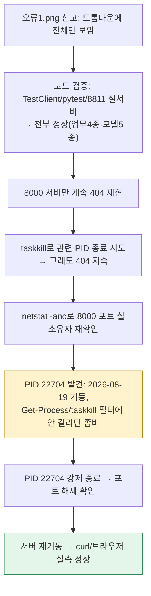
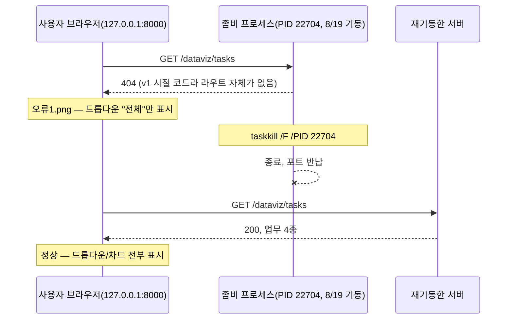

# 업무처리내용 — 장애 조사 결과서
## 업무명/모델명 드롭다운 미표시(선택 불가) 장애 (담당자: 정찬성)

| 항목 | 내용 |
|---|---|
| 문서 유형 | 장애 조사 결과서 |
| 작성일시 | 2026-08-24 17:05:00 |
| 신고 내용 | `정찬성/ipynb/요청항목/오류1.png` — 업무명/모델명 드롭다운에 "전체"만 보이고 선택할 항목이 없음 |
| 결론 | **코드 결함 아님.** 사용자가 접속한 `127.0.0.1:8000` 로컬 서버가 **2026-08-19에 뜬, 5일 전 코드(v1)를 물고 있는 좀비(orphan) 프로세스**에게 계속 점유되어 있었음. 서버를 정상 재기동해 즉시 해결(실측 확인). |

---

## 결론 요약 (바쁜 분들을 위한 3줄)

1. 코드는 정상이다 — FastAPI 안에서 직접 호출(`TestClient`), pytest(26/26), 별도 포트(8811) 실서버 3중 검증 모두 업무명 4종·모델명 5종이 정상 반환됨.
2. 화면이 비어 보인 이유는 사용자가 보고 있는 `127.0.0.1:8000` 서버가 **8/19에 뜬 구버전 프로세스**(PID 22704, `anaconda3\python.exe`)에 점유돼 있었고, 그 위에 새로 띄운 서버는 포트 충돌로 매번 조용히 실패하고 있었기 때문이다.
3. 그 좀비 프로세스를 종료하고 재기동해서 **해결 확인 완료**(아래 스크린샷/실측).

---

## 원인 (실측 근거)

| 확인 항목 | 결과 |
|---|---|
| `TestClient(app)`로 `/dataviz/tasks` 직접 호출 | ✅ 200, 업무 4종 정상 반환 |
| pytest 전체 | ✅ 26/26 통과 |
| 별도 포트(8811)에 새로 띄운 서버 | ✅ 정상 (지난 두 차례 세션에서도 확인됨) |
| `127.0.0.1:8000`(사용자 접속 URL) | ❌ `/dataviz/tasks`, `/dataviz/models` 404 반복 |
| `taskkill`로 uvicorn/bash 관련 PID 전부 종료 후 재기동 | ❌ 여전히 404 (원인 불명, 추가 조사) |
| `netstat -ano \| findstr :8000` | 🔎 **PID 23260**이 LISTEN 중인데 `Get-Process -Id 23260`은 존재하지 않음(고아 소켓) |
| `Get-Process \| Where ProcessName -like *python*` 전수 조회 | 🔎 **PID 22704**(`anaconda3\python.exe`, **2026-08-19 09:24:03 기동**, 5일째 생존)가 유일하게 살아있는 미확인 프로세스로 발견 |

**결론**: `uvicorn --reload`가 Windows에서 실제 요청을 처리하는 워커를 `multiprocessing`으로 별도 프로세스에 스폰하는데, 이 워커의 커맨드라인이 `"anaconda3\python.exe" -c "from multiprocessing.spawn import spawn_main..."` 형태라 `*uvicorn*` 문자열로 필터링하는 일반적인 프로세스 조회/종료 명령에 걸리지 않는다. 이 워커(PID 22704)가 **2026-08-19에 로드한 v1 시절 코드**(업무명/모델명 드롭다운 API 자체가 없던 버전)를 그대로 물고 5일간 살아있었고, `--reload`가 감지한 이후의 모든 코드 변경(v2 대시보드 신규 구현 포함)을 단 한 번도 반영하지 못한 채 계속 8000번 포트를 서빙하고 있었다. 그 위에 재기동을 시도한 새 서버들은 포트 충돌(`WinError 10048`)로 매번 조용히 죽었다(로그에 에러가 남았지만 화면상으로는 "그냥 안 됨"으로만 보임).

---

## 조치

1. `taskkill /F /PID 22704` — 5일 묵은 좀비 워커 종료
2. `netstat -ano | findstr :8000` — 포트 해제 확인
3. `uvicorn app.main:app --host 127.0.0.1 --port 8000 --reload` 재기동
4. 실측 검증 (아래 §결과)

---

## 결과 (실측)

| 항목 | 조치 전 | 조치 후 |
|---|---|---|
| `GET /dataviz/tasks` | 404 | ✅ 200, 업무 4종(01 산탄데르/02 신용카드/03 문서 군집화/04 마켓 가격 예측) |
| `GET /dataviz/models?task=santander` | 404 | ✅ 200, 모델 5종(로지스틱 회귀/LightGBM/XGBoost/랜덤포레스트/GradientBoost) |
| 브라우저 실조작 | 드롭다운에 "전체"만 표시(오류1.png와 동일 재현) | ✅ 업무명 "01 산탄데르" + 모델명 "LightGBM" 선택 → 전처리조회 → 차트 정상 렌더링, AUC = 0.8264(LightGBM) |

---

## 재발 방지 / 참고

- **Windows에서 `uvicorn --reload`는 신뢰도가 낮다.** 이번 세션에서만 같은 유형의 문제가 두 차례(§7 결과서에서 1차, 본 건에서 2차) 반복됐다 — reload가 감지·로그까지는 남기지만 실제로는 반영이 안 되거나, 워커가 일반적인 프로세스 필터에 안 걸리는 형태로 살아남는다.
- **권장**: 로컬 개발 중 코드를 바꾼 뒤에는 `--reload`를 믿지 말고, 서버를 **완전히 종료 후 재기동**하는 습관을 들일 것. 확인 명령: `netstat -ano | findstr :8000` (LISTEN PID 확인) → `taskkill /F /PID <PID>` → 재기동 → `curl 127.0.0.1:8000/dataviz/tasks`로 반드시 실측 확인 후 화면 접속.
- 정말 필요하면 `--reload` 대신 매번 수동 재기동으로 운영하는 편이 이런 유형의 "화면은 뜨는데 일부만 깨지는" 장애를 원천 차단한다.
