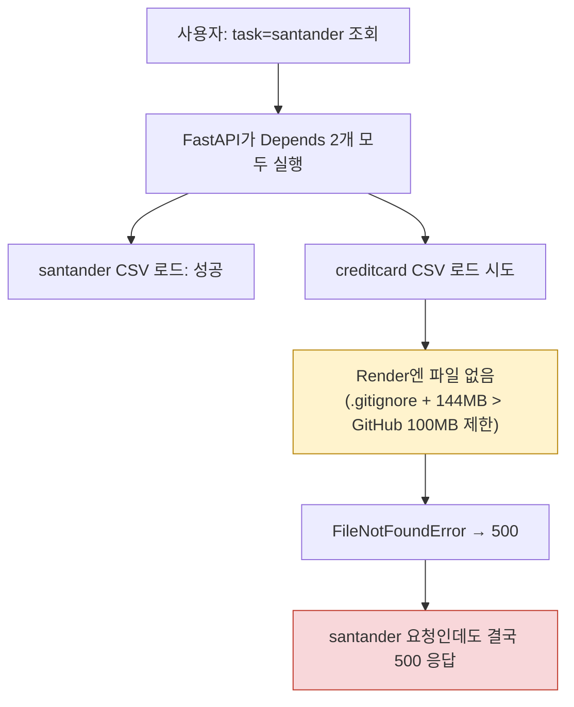

# 업무처리내용 — 운영 장애 조사 결과서
## 산탄데르 업무까지 500 에러 발생 (담당자: 정찬성)

| 항목 | 내용 |
|---|---|
| 신고 | `운영오류1.png`(브라우저: task=santander인데도 preprocess-check/model-result 500), `배포오류1.png`(Render 로그: `FileNotFoundError: ../ipynb/data/creditcard.csv`) |
| 결론 | **정찬성이 직전 세션에서 넣은 실코드 버그.** router가 요청마다 산탄데르·신용카드 CSV를 **항상 둘 다** 미리 로드하도록 짜여 있어서, 운영에 없는 신용카드 CSV 하나 때문에 산탄데르 요청까지 전부 500이 났다. task별로 필요한 CSV만 로드하도록 수정, pytest 회귀 테스트 추가, 로컬에서 "신용카드 CSV 없음" 상황을 실제로 재현해 산탄데르 정상/신용카드만 500 확인 완료. **코드 수정 Go. 배포(신용카드 CSV 자체)는 별도 조치 필요 — 아래 §3.** |

## 1. 원인

`router.py`의 `preprocess-check`/`model-result` 두 엔드포인트가 이렇게 돼 있었음:

```python
def preprocess_check(
    task, model,
    santander_df: pd.DataFrame = Depends(crud.get_dataframe),
    creditcard_df: pd.DataFrame = Depends(crud.get_creditcard_dataframe),  # ← 매 요청마다 무조건 실행됨
):
```

FastAPI의 `Depends`는 실제로 어떤 걸 쓰든 상관없이 **선언된 건 전부 먼저 실행**한다. 그래서 `task=santander` 요청에도 `get_creditcard_dataframe()`이 매번 같이 불렸고, 신용카드 CSV(`ipynb/data/creditcard.csv`, 144MB)는 `.gitignore`에 걸려 있어(용량이 GitHub 파일당 100MB 제한도 넘음) 애초에 Render에 배포된 적이 없다 → 여기서 `FileNotFoundError` → 500.



## 2. 조치

`router.py`를 task를 먼저 보고 **필요한 로더 하나만** 호출하도록 수정(`_dataframe_for_task`). 산탄데르 요청은 신용카드 CSV 존재 여부와 완전히 무관해짐. 테스트도 `app.dependency_overrides` 대신 `monkeypatch`로 바꾸고, "신용카드 CSV가 없어도 산탄데르는 정상 응답한다"는 회귀 테스트를 추가.

**실측 검증**: 로컬에서 `creditcard.csv`를 실제로 옮겨 놓고(운영과 동일 상황 재현) 서버를 띄운 뒤 확인:

| 요청 | 조치 전 | 조치 후 |
|---|---|---|
| `task=santander` | 500(재현됨) | ✅ 200 |
| `task=credit_card` | 500 | 500(파일이 정말 없으니 이건 당연 — §3에서 별도 해결) |

pytest 27/27 통과(회귀 테스트 1건 포함).

## 3. 남은 조치 (별도 결정 필요 — 신용카드 CSV 자체를 운영에 올리는 문제)

이번 수정으로 **"신용카드 하나 때문에 산탄데르까지 죽는" 문제는 해결**됐지만, 신용카드 업무 자체는 운영에서 여전히 500이 난다(파일이 없으니 당연함). 이건 코드 문제가 아니라 **144MB 파일을 어떻게 배포하느냐**의 문제라 사용자 결정이 필요하다:

| 방안 | 설명 |
|---|---|
| A. Git LFS | `.gitignore` 해제 + Git LFS로 커밋. Render가 LFS를 지원하는지 먼저 확인 필요 |
| B. 외부 저장소 + 앱 기동 시 다운로드 | S3/구글드라이브 등에 CSV 올려두고, 서버 시작 시 없으면 다운로드하는 코드 추가 |
| C. 표본 축소본만 배포 | 284,807행 원본 대신 일부만 추출한 축소 CSV를 만들어 git에 포함(용량 100MB 이하로) |

세 방안 다 추가 작업이 필요해서, 다음에 어느 쪽으로 갈지 정해주시면 바로 진행하겠습니다.
