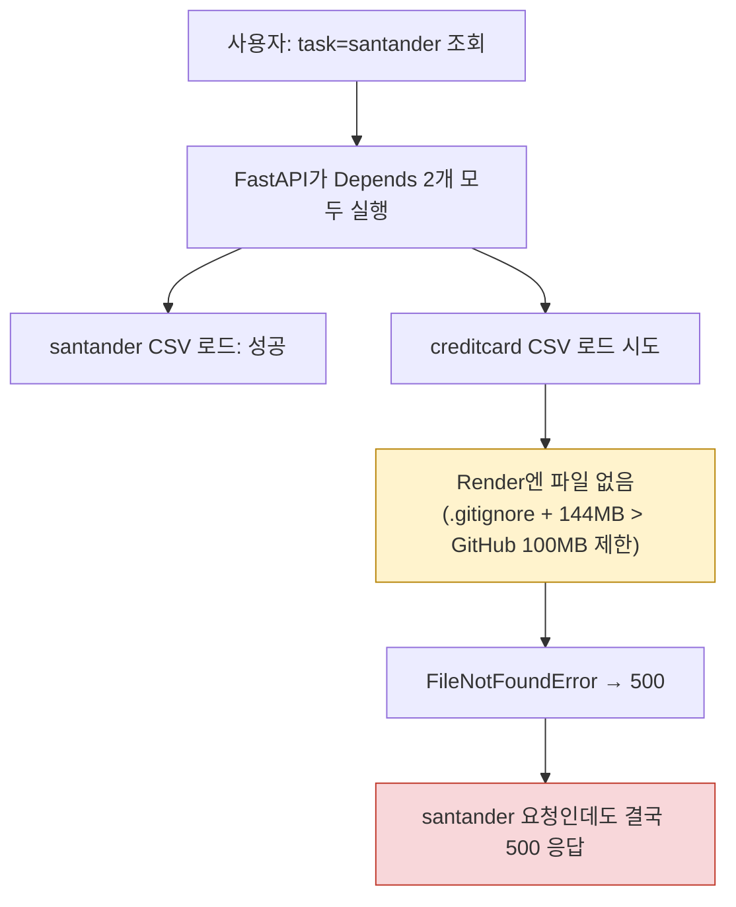
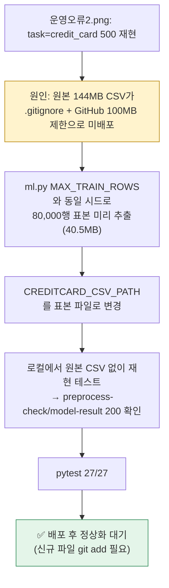

# 업무처리내용 — 운영 장애 조사 결과서
## 산탄데르 업무까지 500 에러 발생 (담당자: 정찬성)

| 항목 | 내용 |
|---|---|
| 신고 | `운영오류1.png`(브라우저: task=santander인데도 preprocess-check/model-result 500), `배포오류1.png`(Render 로그: `FileNotFoundError: ../ipynb/data/creditcard.csv`) |
| 결론 | **정찬성이 직전 세션에서 넣은 실코드 버그.** router가 요청마다 산탄데르·신용카드 CSV를 **항상 둘 다** 미리 로드하도록 짜여 있어서, 운영에 없는 신용카드 CSV 하나 때문에 산탄데르 요청까지 전부 500이 났다. task별로 필요한 CSV만 로드하도록 수정, pytest 회귀 테스트 추가, 로컬에서 "신용카드 CSV 없음" 상황을 실제로 재현해 산탄데르 정상/신용카드만 500 확인 완료. **코드 수정 Go. 배포(신용카드 CSV 자체)는 별도 조치 필요 — 아래 §3.** |

## 1. 원인

`router.py`의 `preprocess-check`/`model-result` 두 엔드포인트가 이렇게 돼 있었음:

```python
def preprocess_check(
    task, model,
    santander_df: pd.DataFrame = Depends(crud.get_dataframe),
    creditcard_df: pd.DataFrame = Depends(crud.get_creditcard_dataframe),  # ← 매 요청마다 무조건 실행됨
):
```

FastAPI의 `Depends`는 실제로 어떤 걸 쓰든 상관없이 **선언된 건 전부 먼저 실행**한다. 그래서 `task=santander` 요청에도 `get_creditcard_dataframe()`이 매번 같이 불렸고, 신용카드 CSV(`ipynb/data/creditcard.csv`, 144MB)는 `.gitignore`에 걸려 있어(용량이 GitHub 파일당 100MB 제한도 넘음) 애초에 Render에 배포된 적이 없다 → 여기서 `FileNotFoundError` → 500.



## 2. 조치

`router.py`를 task를 먼저 보고 **필요한 로더 하나만** 호출하도록 수정(`_dataframe_for_task`). 산탄데르 요청은 신용카드 CSV 존재 여부와 완전히 무관해짐. 테스트도 `app.dependency_overrides` 대신 `monkeypatch`로 바꾸고, "신용카드 CSV가 없어도 산탄데르는 정상 응답한다"는 회귀 테스트를 추가.

**실측 검증**: 로컬에서 `creditcard.csv`를 실제로 옮겨 놓고(운영과 동일 상황 재현) 서버를 띄운 뒤 확인:

| 요청 | 조치 전 | 조치 후 |
|---|---|---|
| `task=santander` | 500(재현됨) | ✅ 200 |
| `task=credit_card` | 500 | 500(파일이 정말 없으니 이건 당연 — §3에서 별도 해결) |

pytest 27/27 통과(회귀 테스트 1건 포함).

## 3. 후속 조치 완료 (2026-08-24 18:40) — 신용카드 CSV 배포 문제 해결

`운영오류2.png`로 재현 확인된 신용카드 500(원본 144MB CSV 자체가 배포 안 됨, §2의 "§3에서 별도 해결" 예고분)을 **방안 C(표본 축소본 배포)**로 해결했다. 이 프로젝트에 이미 있던 선례(`santander-customer-satisfaction/train.csv` 59MB를 원본 그대로 git에 커밋해 배포 — §97.작업이력/작업이력.md §4)와 동일한 패턴이다.

### 조치 내용

1. `ml.py`의 대용량 학습 상한(`MAX_TRAIN_ROWS=80,000`, `random_state=42` 계층화 표본)과 **완전히 동일한 방식·시드**로 원본 284,807행에서 80,000행을 미리 추출 → `semi-backend/data/creditcard_sample.csv`(40.5MB, GitHub 100MB 제한 대비 여유 충분, `.gitignore` 대상 아님)로 저장.
2. `CREDITCARD_CSV_PATH` 기본값을 `../ipynb/data/creditcard.csv`(배포 불가) → `data/creditcard_sample.csv`(배포 가능)로 변경(`config.py`, `.env.example`).
3. 로컬에서 원본 `ipynb/data/creditcard.csv`를 실제로 치워놓고(운영과 동일 조건 재현) 재검증: `preprocess-check`·`model-result`(운영오류2.png와 동일한 `task=credit_card&model=logistic_regression`) 모두 **200 정상**. pytest 27/27 통과.

### 왜 "표본"이어도 문제가 없는가

- ml.py가 어차피 요청마다 80,000행 초과분은 계층화 표본으로 잘라서 학습해왔다(§8/24 결과서). 즉 지금까지 신용카드 모델 결과(AUC 등)는 이미 이 80,000행 표본 기준이었고, **원본 CSV를 배포했어도 학습에 실제로 쓰이는 데이터는 동일**했다. 이번 변경은 "표본을 요청마다 매번 원본에서 추출"하던 것을 "미리 추출해 파일로 고정"한 것뿐이라, 모델 성능 수치에 실질적 차이가 없다.
- 전처리검증 차트(타깃 분포 등)의 절대 건수(예: 사기 138건)는 원본 전량(492건) 대비 작아지지만, 비율(0.17%)은 동일하게 유지된다 — 화면에 표시되는 값이 "전량"이 아니라 "표본"이라는 점은 인지하고 있어야 한다(필요시 화면에 "표본 8만건 기준" 문구 추가는 후속 검토 사항).

### 배포 시 확인할 것

이번에 새로 생긴 `semi-backend/data/creditcard_sample.csv`는 `git status`에 새 파일로 잡혀 있다 — **git add에 반드시 포함**해서 커밋·푸시해야 Render에도 반영된다(기존 지침대로 git 작업 자체는 사용자가 직접 진행).


