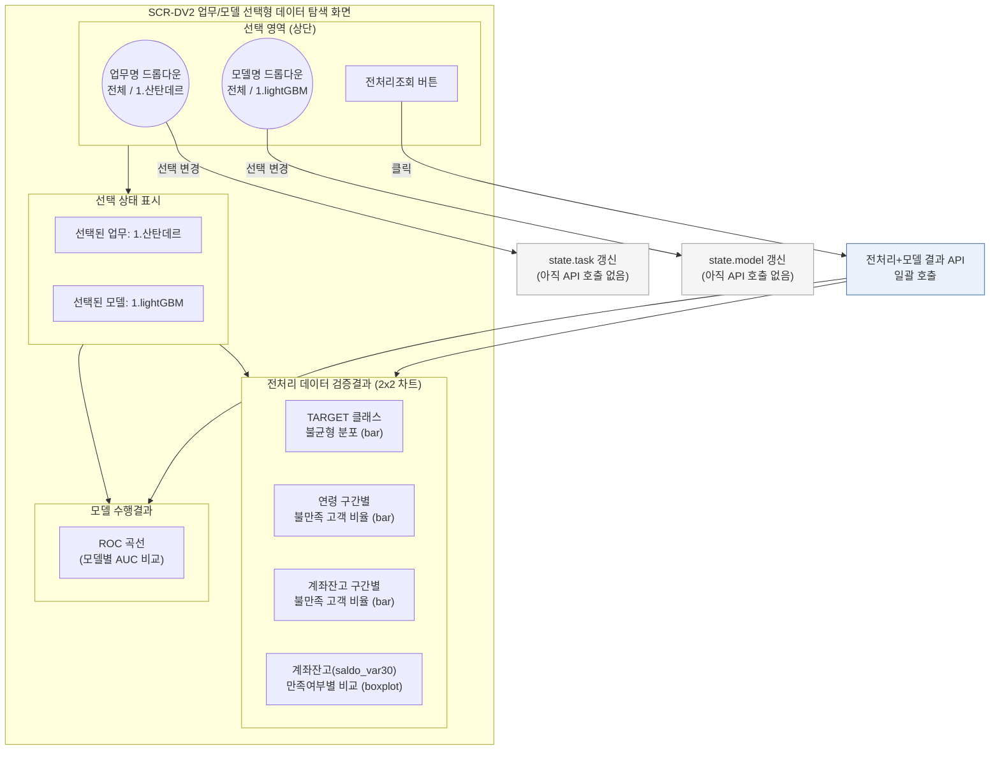
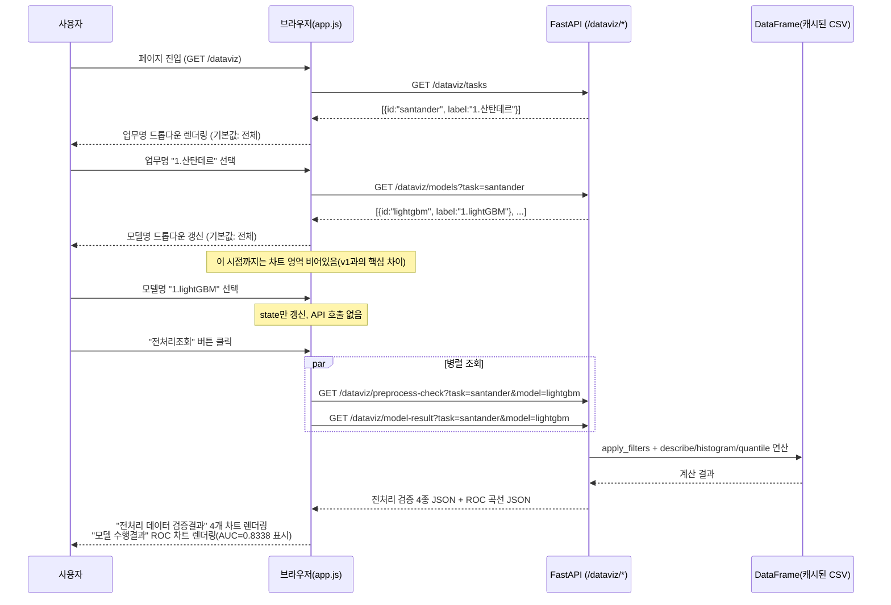

# SEMI TRD — 산탄데르 고객만족 데이터 탐색 대시보드 (v2, 업무/모델 선택형)

> 기존 `SEMI TRD_메인화면.md`(필터 실시간 반영형 대시보드)의 내용을 그대로 유지하되, 화면 구성을 첨부 이미지(`1_싼탄데르화면전체구성.png`, `1_싼탄데르상세화면_01~04.png`) 기준으로 전면 재구성한 문서다. 가장 큰 구조적 차이는 **"필터 변경 즉시 반영" → "업무/모델 선택 후 버튼 클릭으로 일괄 조회"** 방식으로 바뀌었다는 점이다(작성 시점: 2026-08-23).

## 0. 화면 구조가 왜 바뀌었는가

기존 v1은 TARGET/연령/지역 필터를 바꿀 때마다 관련 API를 즉시 재호출하는 "실시간 반영형" 구조였다. 반면 이번에 전달받은 화면 이미지는 다음과 같은 다른 요구를 담고 있다.

- **업무(=데이터셋) 단위 선택**이 먼저다: `업무명` 드롭다운에서 "산탄데르"를 고르는 게 1단계고, 그 업무에 속한 `모델명`(lightGBM, RandomForest 등)을 고르는 게 2단계다. 즉 이 화면은 하나의 필터 세트가 아니라 **"업무 × 모델" 조합을 바꿔가며 결과를 비교**하는 화면이다.
- **필터 변경 = 즉시 조회가 아니라, `전처리조회` 버튼 클릭이 트리거**다. 업무/모델을 바꿔도 버튼을 누르기 전까지는 화면이 갱신되지 않는다 — 오조작(드롭다운 스크롤 중 값이 바뀌어 불필요한 API 호출이 나가는 상황)을 막기 위한 의도적 설계다.
- 결과 영역이 **"전처리 데이터 검증결과"(4개 차트, 필터/전처리 품질 확인용)** 와 **"모델 수행결과"(ROC, 모델 성능 확인용)** 두 섹션으로 명확히 분리된다. v1처럼 "차트 3개 + 테이블"이 아니라, **전처리 검증 → 모델 성능**이라는 파이프라인 순서를 화면 배치로 그대로 드러낸다.

→ **20년차 설계자 판단**: 데이터/컬럼 스코프(§본문 하단 참고, `ID/var3/var15/var38/saldo_var30/TARGET`)와 백엔드 원칙(CSV 1회 로딩, `lru_cache`, boolean indexing 기반 필터)은 v1과 동일하게 유지한다. 바뀌는 것은 **"언제 API를 부르는가"(즉시 반영 → 버튼 트리거)** 와 **"화면을 어떤 단위로 나누는가"(필터바+차트3+테이블 → 업무/모델 선택 + 전처리검증 4종 + 모델결과 1종)** 뿐이다. 레코드 테이블(§1의 `TABLE`)은 이번 화면 이미지에는 없으므로 스코프에서 제외한다.

## 1. 화면 UI 레이아웃 (SCR-DV2, `GET /dataviz`)



**v1과의 차이 요약**

| 구분 | v1 (필터 실시간형) | v2 (업무/모델 선택형, 본 문서) |
|---|---|---|
| 1차 선택 기준 | TARGET/연령/지역 (모두 동일 데이터셋 내부 필터) | 업무명(데이터셋) → 모델명(그 업무의 모델) 2단계 |
| 반영 시점 | 값 변경 시 즉시 API 호출 | `전처리조회` 버튼 클릭 시에만 호출 |
| 결과 구성 | 요약카드5 + 필터바 + 차트3 + 페이징 테이블 | 전처리 검증 차트4 + 모델 수행결과(ROC) 1 |
| 목적 | 데이터 탐색(EDA) 중심 | 전처리 품질 검증 + 모델 성능 비교 중심 |

## 2. 데이터 구조 / 아키텍처

v1과 동일하게 캐글 원본 CSV(`santander-customer-satisfaction/train.csv`)를 그대로 읽는다. 다만 계좌잔고 관련 차트(P3, P4)에 `saldo_var30` 컬럼이 추가로 필요하므로 `USE_COLUMNS`를 확장한다.

```python
# app/domains/dataviz/crud.py
USE_COLUMNS = ["ID", "var3", "var15", "var38", "saldo_var30", "TARGET"]  # v1 대비 saldo_var30 추가
TOTAL_COLUMNS = 371

@lru_cache
def load_dataframe() -> pd.DataFrame:
    return pd.read_csv(settings.santander_csv_path, encoding="latin-1", usecols=USE_COLUMNS)

def get_dataframe() -> pd.DataFrame:
    """FastAPI Depends 진입점. 테스트에서는 app.dependency_overrides로 표본 DataFrame으로 교체."""
    return load_dataframe()
```

업무/모델 조합은 CSV가 아니라 **정적 매핑 테이블(코드 상수 또는 소규모 config)** 로 관리한다. 업무·모델 종류가 지금은 각각 1개뿐이지만(산탄데르/lightGBM), 향후 다른 캐글 데이터셋·다른 모델(RandomForest 등)이 추가될 것을 고려해 확장 가능한 구조로 잡는다.

```python
# app/domains/dataviz/registry.py
TASKS = [{"id": "santander", "label": "1.산탄데르"}]
MODELS = {
    "santander": [
        {"id": "lightgbm", "label": "1.lightGBM"},
        {"id": "random_forest", "label": "2.RandomForest"},  # 향후 확장 대비 예시
    ]
}
```

### API 엔드포인트

| 메서드/경로 | 쿼리 파라미터 | 응답 | 비고 |
|---|---|---|---|
| `GET /dataviz` | - | HTML | 대시보드 화면(`static/dataviz/index.html`) |
| `GET /dataviz/tasks` | - | `TaskOption[]` | 업무명 드롭다운 옵션 |
| `GET /dataviz/models` | `task` | `ModelOption[]` | 선택된 업무에 속한 모델 옵션. `task` 미지정(전체) 시 전체 모델 반환 |
| `GET /dataviz/preprocess-check` | `task, model` | `PreprocessCheckResponse` | **`전처리조회` 버튼 클릭 시에만 호출.** 전처리 검증 차트 4종 데이터를 한 번에 반환 |
| `GET /dataviz/model-result` | `task, model` | `ModelResultResponse` | ROC 곡선 데이터(FPR/TPR 배열) + AUC 값. `model=전체`면 등록된 모든 모델의 곡선을 함께 반환(비교용) |

`PreprocessCheckResponse`는 v1의 개별 차트 API(target-distribution, age-distribution 등)를 하나로 묶은 것이다 — 버튼 클릭 한 번에 화면 절반(전처리 검증 4개 차트)이 동시에 갱신되어야 하므로, 왕복(round trip) 횟수를 줄이기 위해 **단일 응답으로 통합**했다(v1은 필터별로 세밀하게 나눠 불필요한 재조회를 막는 게 목적이었다면, v2는 버튼 클릭 1회 = 결과 1세트이므로 통합이 더 적합하다).

```python
# 응답 스키마 예시
class PreprocessCheckResponse(BaseModel):
    target_distribution: dict          # {"satisfied": 72928, "unsatisfied": 3008}
    age_unsatisfied_ratio: list[dict]   # [{"range": "(4.999,23.0]", "ratio": 0.70}, ...]
    balance_unsatisfied_ratio: list[dict]  # [{"range": "(5163.7,61496.9]", "ratio": 5.81}, ...]
    balance_boxplot: dict               # {"satisfied": {min,q1,median,q3,max}, "unsatisfied": {...}}

class ModelResultResponse(BaseModel):
    curves: list[dict]  # [{"model": "lightgbm", "label": "LightGBM", "auc": 0.8338, "fpr": [...], "tpr": [...]}]
```

## 3. 이벤트(상호작용) 흐름



## 4. 화면 구성

| 요소 | 동작 | 호출 API | 반응 |
|---|---|---|---|
| 업무명 드롭다운 | 값 변경 | `GET /dataviz/models?task=` | 모델명 드롭다운 옵션만 갱신, 차트는 그대로(비어있는 상태 유지) |
| 모델명 드롭다운 | 값 변경 | 없음 | 화면 state에만 반영, API 호출 없음 |
| 전처리조회 버튼 | 클릭 | `preprocess-check`, `model-result` (병렬) | 전처리 검증 차트 4개 + ROC 차트 1개 동시 갱신 |
| TARGET 클래스 불균형 분포 (bar) | 조회 결과 표시 | `preprocess-check` 응답 내 `target_distribution` | 만족(0)/불만족(1) 건수 막대 2개 |
| 연령 구간별 불만족 비율 (bar) | 조회 결과 표시 | `preprocess-check` 응답 내 `age_unsatisfied_ratio` | 5분위(Quantile) 구간별 비율(%) |
| 계좌잔고 구간별 불만족 비율 (bar) | 조회 결과 표시 | `preprocess-check` 응답 내 `balance_unsatisfied_ratio` | 5분위 구간별 비율(%), 잔고 낮을수록 불만족 비율 높은 경향 |
| 계좌잔고 boxplot | 조회 결과 표시 | `preprocess-check` 응답 내 `balance_boxplot` | 만족/불만족 그룹별 saldo_var30 분포 비교 |
| ROC 곡선 | 조회 결과 표시 | `model-result` 응답 내 `curves` | 모델별 곡선 + AUC 값 범례 표시. `model=전체`면 다중 곡선 오버레이 |

## 5. 인수기준(AC)

| AC | 내용 | 검증 방법 |
|---|---|---|
| AC-DV1 | 업무명을 선택하기 전에는 모델명 드롭다운이 비활성 또는 "전체"만 노출되어야 한다 | 초기 진입 시 모델명 옵션 상태 확인 |
| AC-DV2 | 업무명/모델명을 변경해도 `전처리조회` 버튼을 누르기 전까지는 어떤 차트 영역도 갱신되지 않아야 한다 | 드롭다운 변경 후 네트워크 탭에 API 호출이 없는지 확인 |
| AC-DV3 | `전처리조회` 클릭 시 전처리 검증 차트 4개와 모델 수행결과 ROC 차트가 한 번의 클릭으로 모두 갱신되어야 한다 | 클릭 후 5개 위젯 모두 로딩 완료 여부 확인 |
| AC-DV4 | TARGET 클래스 불균형 분포의 두 막대 합계는 전체 행 수(76,020)와 일치해야 한다 | `satisfied + unsatisfied == 76020` 실측 확인 |
| AC-DV5 | ROC 차트의 AUC 값은 곡선 아래 면적을 실제 계산한 값과 일치해야 하며, 모델을 바꾸면 다른 AUC가 표시되어야 한다 | lightGBM 선택 시 AUC≈0.8338, RandomForest 선택 시 AUC≈0.8070 등 모델별 상이한 값 확인 |

## 6. 테스트 시나리오

`tests/test_dataviz.py`에 5행 표본 DataFrame을 `app.dependency_overrides[crud.get_dataframe]`로 주입해 검증한다(v1과 동일하게 실제 59MB CSV는 읽지 않는다).

| TC | 입력/행위 | 기대 결과 | 대응 AC |
|---|---|---|---|
| TC-DV1 | `GET /dataviz/tasks` | `[{id:"santander", label:"1.산탄데르"}]` 반환 | - |
| TC-DV2 | `GET /dataviz/models?task=santander` | lightGBM 포함 모델 목록 반환 | AC-DV1 |
| TC-DV3 | `GET /dataviz/preprocess-check?task=santander&model=lightgbm` (버튼 클릭 이전 호출 없음 가정) | `target_distribution.satisfied + unsatisfied == 5`(표본 기준) | AC-DV2, AC-DV4 |
| TC-DV4 | `preprocess-check` 응답의 `age_unsatisfied_ratio` 구간 수 | 5개 구간(Quantile bins=5) | - |
| TC-DV5 | `preprocess-check` 응답의 `balance_boxplot` | 만족/불만족 각각 min/q1/median/q3/max 5개 값 존재 | - |
| TC-DV6 | `GET /dataviz/model-result?task=santander&model=lightgbm` | `curves[0].auc`가 0~1 사이 값, `fpr`/`tpr` 길이 동일 | AC-DV5 |
| TC-DV7 | `GET /dataviz/model-result?task=santander&model=전체` | `curves` 배열에 등록된 모델 수만큼 원소 존재(다중 곡선) | AC-DV5 |
| TC-DV8(브라우저 실측) | 실제 76,020행 데이터로 업무="1.산탄데르", 모델="1.lightGBM" 선택 후 전처리조회 클릭 | TARGET 분포 만족 72,928 / 불만족 3,008 정확히 표시, ROC 차트 AUC=0.8338 표시 | AC-DV3, AC-DV4, AC-DV5 |

## 7. 실행 방법

```bash
cd 정찬성/semi-backend
.venv\Scripts\activate
uvicorn app.main:app --reload
# http://127.0.0.1:8000/dataviz
```

CSV 경로는 v1과 동일하게 `.env`의 `SANTANDER_CSV_PATH`로 설정한다. 이번 화면 변경으로 `saldo_var30` 컬럼이 추가되므로, v1 배포 환경에서 그대로 사용 시 `USE_COLUMNS` 갱신을 반드시 반영해야 한다(누락 시 boxplot API에서 `KeyError` 발생).

## 8. 다음 단계 제안 (20년차 설계자 관점, 지금 하지 않음)

- **모델 레지스트리 DB화**: 지금은 `TASKS`/`MODELS`를 코드 상수로 관리하지만, 모델이 3개 이상으로 늘어나면(RandomForest, XGBoost 등) `models.py` 테이블로 옮기고 학습 메타데이터(학습일시, 하이퍼파라미터)까지 함께 관리하는 게 맞다.
- **ROC 다중 비교 UX**: `model=전체` 선택 시 여러 곡선을 겹쳐 그리는 기능은 이번 스코프에 API만 설계해두고 프론트 구현은 별도 이터레이션으로 분리하는 것을 권장한다(범례가 많아지면 가독성 문제가 생기므로 색상/스타일 가이드가 먼저 필요).
- **전처리조회 결과 캐싱**: 동일한 업무/모델 조합을 반복 조회할 경우, 매번 `describe`/분위수 계산을 다시 하지 않도록 `(task, model)` 키 기준 결과 캐시를 추가하면 응답속도를 개선할 수 있다.
