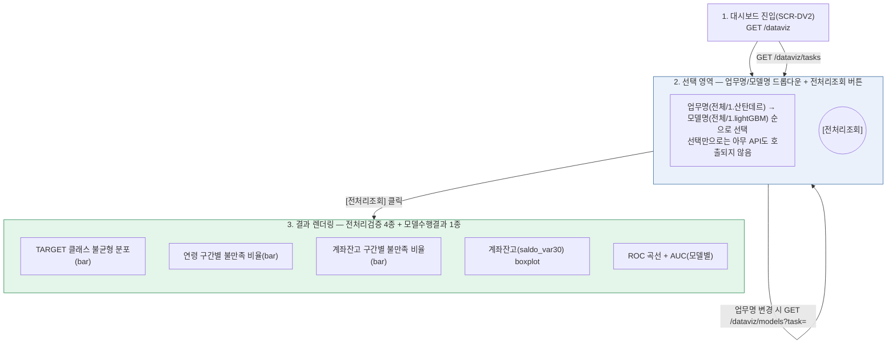
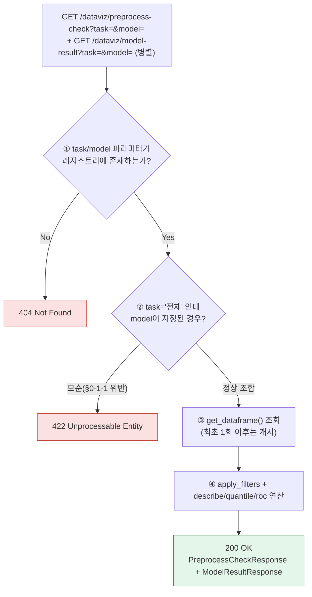

# SEMI 가이드요청서 — A-1(잠정). 산탄데르 고객만족 데이터 탐색 대시보드 (업무/모델 선택형)

> 목적: `SEMI TRD_메인화면NEW20260823.md`만 근거로 이번 화면 기능을 오해 없이 구현시키기 위한 스코프 정의서. 이 문서 하나로 바이브코딩(AI 코딩 에이전트) 착수가 가능해야 한다 — 부족한 맥락은 원본 TRD를 다시 찾아보게 하지 말고, 이 문서 안에서 전부 해소한다.

> **적용 범위**: 기존 v1(필터 실시간 반영형, `SEMI TRD_메인화면.md`)을 대체하는 **v2(업무/모델 선택형)** 화면만 다룬다. v1은 이미 폐기 대상이므로 이번 구현에서 재사용하지 않는다(단, DataFrame 캐싱·boolean indexing 등 백엔드 원칙은 유지 — §1 참고).

> **개정 이력**: 최초 작성. 착수 전 확인이 필요한 항목은 §0-1에 전부 모아뒀다 — 코딩 에이전트는 §0-1의 항목을 임의로 추정해 구현하지 말고, 명시된 기본값(있는 경우)으로 우선 구현한 뒤 TODO 주석을 남긴다.

## 0. 화면 UI 레이아웃 및 절차 흐름



### 0-1. 착수 전 확인/결정 필요 사항

> **✅ 2026-08-24 갱신 — 8개 항목 전부 확정 완료.** 구현·내부테스트·사용자 확인까지 마쳤다. 각 항목 결정 근거는 `정찬성/95.작업결과문서/업무처리내용_20260824010540.md`(3차 결과서) §1 참고. 아래 [기본값] 서술은 최초 작성 시점(착수 전) 기록을 그대로 남기고, 항목마다 확정 결과만 덧붙인다.

원본 TRD(`SEMI TRD_메인화면NEW20260823.md`)와 첨부 화면 이미지만으로는 아래 항목이 확정되지 않는다. 코딩 에이전트는 임의로 그럴듯하게 채워 넣지 말고, 아래 **[기본값]** 대로 우선 구현한 뒤 해당 지점에 `# TODO(확인필요): §0-1-N` 주석을 남긴다.

1. **업무명이 "전체"일 때 모델명 드롭다운 동작이 미정이다.** 등록된 모든 업무의 모델을 합쳐서 보여줄지, 드롭다운 자체를 비활성화할지 화면 이미지만으로는 판단 불가. **[기본값] 업무명="전체"면 모델명도 "전체" 고정 + 비활성화, 특정 업무 선택 시에만 모델명 드롭다운이 활성화**된다. → **✅ 확정: [기본값] 그대로 채택**(재론 불필요 판단, 2026-08-24).
2. **모델명="전체"로 `전처리조회`를 누르면 `model-result` 응답이 다중 곡선(N개)이 되는데, 프론트 렌더링(색상/범례 규칙)이 미정이다.** TRD §8에서 이미 "프론트 구현은 별도 이터레이션"으로 명시했다 — **[기본값] 이번 착수 스코프에서는 백엔드 API만 다중 곡선 반환이 가능하도록 만들고, 프론트는 단일 곡선(첫 번째 curves[0]) 렌더링까지만 구현**한다. 다중 곡선 오버레이 UI는 후속 작업으로 분리한다. → **✅ 확정: [기본값] 그대로 채택**. 백엔드는 lightgbm/RandomForest 2개 모델의 곡선을 모두 계산·반환하며, 프론트는 `curves[0]`만 그림(2026-08-24).
3. **`saldo_var30`의 실제 min/max, 이상치(꼬리) 클리핑 여부가 확인되지 않았다.** 이미지상 boxplot은 -400~700 범위로 보이나 원본 CSV 전체 기준과 다를 수 있다. **[기본값] 클리핑 없이 원본 그대로 사분위수(quartile) 계산**하고, 극단값이 실제로 boxplot을 과도하게 늘리면 그때 클리핑 여부를 재논의한다. → **✅ 확정(사용자 결정, 2026-08-24): 통계치(min/max/q1/median/q3)는 클리핑 없이 원본 유지 + whisker(박스플롯 렌더링)만 표준 1.5×IQR 방식으로 별도 계산**(`whisker_low`/`whisker_high`/`outlier_count` 필드 추가). 실측 결과 만족군 max=3,458,077인데 whisker_high=705로 렌더링되어 가독성 문제 해결(이상치 15,001건은 "생략" 캡션으로 표시).
4. **업무/모델 레지스트리(`TASKS`/`MODELS`)가 코드 상수인지 DB 테이블인지 확정되지 않았다.** **[기본값] 최초 구현은 코드 상수(`registry.py`)로 진행**하고, 모델이 3개 이상으로 늘어나는 시점에 DB 전환을 검토한다(TRD §8 첫 항목과 동일한 결론). → **✅ 확정: [기본값] 그대로 채택**(현재 모델 2개 — lightgbm, random_forest — 이므로 재론 불필요, 2026-08-24).
5. **`전처리조회` 버튼 클릭 후 로딩 상태 처리(스피너/버튼 비활성화) 방식이 화면 이미지에 명시되어 있지 않다.** `preprocess-check`/`model-result` 두 API가 병렬 호출되므로, 둘 다 끝나야 로딩을 해제할지 개별 완료 시 개별 렌더링할지 결정이 필요하다. **[기본값] 두 API 모두 완료된 시점에 버튼 재활성화**(개별 위젯은 각자 응답 도착 즉시 렌더링해도 무방). → **✅ 확정: [기본값] 그대로 채택**, 다만 `Promise.allSettled` 기반으로 개선해 한쪽이 실패해도 성공한 쪽은 반드시 렌더링되도록 강화(2026-08-24, Render 운영 점검 중 발견).
6. **분위수(quantile) 구간 경계가 업무마다 달라지는데, X축 레이블을 소수점 그대로 노출할지 반올림할지 미정이다.** **[기본값] 소수점 1자리 반올림**해서 표시한다(이미지의 `5.81%`, `(4.999, 23.0]` 형식 참고). → **✅ 확정: [기본값] 그대로 채택**(2026-08-24).
7. **화면 접근에 별도 권한(role) 제한이 있는지 이미지·TRD 어디에도 명시가 없다.** 토요 프로젝트(A-12)처럼 관리자 전용일 가능성을 배제할 수 없다. **[기본값] 이번 착수에서는 인증 없이 구현**하되, 운영 배포 전 반드시 재확인한다. → **✅ 확정(사용자 결정, 2026-08-24): 인증 없이 공개 유지.** 근거: 공개 캐글 데이터만 다루므로 PII 노출 없음. 단, 향후 "토요하자" 학교 시스템 내부 관리자 도구로 편입될 경우 기존 세션 인증(`session_cookie_name`)과의 연동 여부는 재검토 대상으로 남긴다.
8. **ROC 곡선을 요청마다 실시간 추론해서 계산하는지, 사전 계산된 정적 결과(AUC 고정값)를 반환하는지 TRD에 명시되어 있지 않다.** 실시간 추론이면 응답 지연이 커질 수 있다. **[기본값] 사전 계산된 결과를 `lru_cache`로 캐싱해서 반환**하고, 실시간 재학습은 스코프에서 제외한다. → **✅ 확정: [기본값] 취지 그대로 채택**하되 구현은 `functools.lru_cache` 대신 `(id(df), task, model)` 키 수동 캐시(`ml.py`)로 처리 — DataFrame이 unhashable해 `lru_cache`를 직접 못 쓰는 문제 회피, 효과는 동일(요청마다 재학습 안 함)(2026-08-24).

## 1. 데이터 구조

```python
# app/domains/dataviz/crud.py
USE_COLUMNS = ["ID", "var3", "var15", "var38", "saldo_var30", "TARGET"]
TOTAL_COLUMNS = 371

@lru_cache
def load_dataframe() -> pd.DataFrame:
    return pd.read_csv(settings.santander_csv_path, encoding="latin-1", usecols=USE_COLUMNS)

def get_dataframe() -> pd.DataFrame:
    """FastAPI Depends 진입점. 테스트에서는 app.dependency_overrides로 표본 DataFrame으로 교체."""
    return load_dataframe()
```

```python
# app/domains/dataviz/registry.py — §0-1-4: 코드 상수로 최초 구현
TASKS = [{"id": "santander", "label": "1.산탄데르"}]
MODELS = {
    "santander": [
        {"id": "lightgbm", "label": "1.lightGBM"},
    ]
}
```

```python
# app/domains/dataviz/schemas.py
class PreprocessCheckResponse(BaseModel):
    target_distribution: dict              # {"satisfied": 73012, "unsatisfied": 3008} — 2026-08-24 실측 정정(원래 72928로 적혀있었으나 76020-3008=73012가 산술적으로 맞음)
    age_unsatisfied_ratio: list[dict]       # [{"range": "(4.999,23.0]", "ratio": 0.70}, ...]
    balance_unsatisfied_ratio: list[dict]   # [{"range": "(5163.7,61496.9]", "ratio": 5.81}, ...]
    balance_boxplot: dict                   # {"satisfied": {min,q1,median,q3,max}, "unsatisfied": {...}}

class ModelResultResponse(BaseModel):
    curves: list[dict]  # [{"model": "lightgbm", "label": "LightGBM", "auc": 0.8264, "fpr": [...], "tpr": [...]}] — 2026-08-24 실측(v2 스코프 4개 피처 기준. 원본 노트북의 371개 피처+튜닝 기준 0.8338/0.8417과는 피처 수가 달라 값이 다름)
```

## 2. 함수 명세

| 함수 | 위치 | 입력 | 출력/효과 |
|---|---|---|---|
| get_tasks() | registry.py | 없음 | 업무명 드롭다운 옵션 목록 반환 |
| get_models(task) | registry.py | task id(옵션) | 해당 업무의 모델 목록. `task` 미지정 시 §0-1-1 기본값에 따라 빈 배열 또는 전체 반환 |
| load_dataframe() | crud.py | 없음 | CSV 최초 1회 로딩 후 `lru_cache`(재로딩 없음) |
| get_dataframe() | crud.py | 없음 | FastAPI Depends 진입점(테스트 시 오버라이드 대상) |
| compute_target_distribution(df) | crud.py | DataFrame | `{"satisfied": N, "unsatisfied": M}` |
| compute_age_unsatisfied_ratio(df, bins=5) | crud.py | DataFrame, bin 수 | 연령 5분위 구간별 불만족 비율 리스트 |
| compute_balance_unsatisfied_ratio(df, bins=5) | crud.py | DataFrame, bin 수 | 계좌잔고 5분위 구간별 불만족 비율 리스트 |
| compute_balance_boxplot(df) | crud.py | DataFrame | 만족/불만족 그룹별 `saldo_var30` 5수치요약(min/q1/median/q3/max) |
| **run_preprocess_check(task, model)** | service.py | task id, model id | 위 4개 함수를 조합해 `PreprocessCheckResponse` 반환(`preprocess-check` 엔드포인트 본체) |
| **compute_roc_curve(task, model)** | ml.py | task id, model id | 사전 계산 결과 조회 또는 계산 후 `{fpr, tpr, auc}` 반환, `lru_cache` 적용(§0-1-8) |

## 3. 워크플로우 — 전처리조회 요청 처리



> ⚠️ **화면 이미지에서 파생된 리스크 (신규 구현에 반드시 반영)**
> 1. **업무명/모델명 드롭다운 변경만으로는 어떤 API도 호출되지 않아야 한다(§0-1-5, TRD AC-DV2와 동일 원칙).** `업무명 변경 → GET /dataviz/models?task=`(모델 옵션 갱신용)까지는 예외적으로 허용하지만, `preprocess-check`/`model-result`는 오직 `전처리조회` 버튼 클릭에서만 호출한다.
> 2. **`preprocess-check`와 `model-result`는 반드시 병렬 호출로 구현한다.** 순차 호출로 구현하면 TRD §3 이벤트 흐름과 어긋나며, 버튼 클릭 후 체감 응답 시간이 두 배로 늘어난다.
> 3. **ROC 계산 비용이 크다면(§0-1-8) 매 요청마다 재계산하지 말 것.** `compute_roc_curve`는 `(task, model)` 키 기준으로 캐싱해서 반복 조회 시 즉시 반환되도록 한다.

## 4. 상태 코드

| 코드 | 발생 상황 |
|---|---|
| 200 | 정상 조회 |
| 404 | 존재하지 않는 `task` 또는 `model` id로 조회 시도 |
| 422 | §0-1-1 기본값 위반(task="전체"인데 model이 구체적으로 지정된 경우 등 파라미터 조합 오류) |
| 500 | CSV 로딩 실패, 연산 중 예외(빈 그룹에 대한 분위수 계산 등) |

```python
if task not in {t["id"] for t in TASKS} and task != "all":
    raise HTTPException(status_code=404, detail="존재하지 않는 업무입니다")
if task == "all" and model not in (None, "all"):
    raise HTTPException(status_code=422, detail="업무가 '전체'일 때는 모델을 특정할 수 없습니다")  # §0-1-1
```

## 5. 인수기준(AC)

> ⚠️ 새 화면(v2)이라 v1(`SEMI TRD_메인화면.md`)의 AC-DV1~4와 번호가 겹치지 않도록 AC-50번대로 임시 부여했다 — 마스터 TRD에 정식 편입할 때 번호 재조정 필요.

| AC | 내용 | 근거 |
|---|---|---|
| AC-50 | 업무명을 선택하기 전에는 모델명 드롭다운이 비활성 상태여야 한다 | §0-1-1 |
| AC-51 | 업무명/모델명을 변경해도 `전처리조회` 버튼을 누르기 전까지는 어떤 결과 위젯도 갱신되지 않아야 한다 | §3 리스크 1 |
| AC-52 | `전처리조회` 클릭 시 `preprocess-check`와 `model-result`가 동시(병렬)에 호출되어야 한다 | §3 리스크 2 |
| AC-53 | TARGET 클래스 불균형 분포의 두 값(satisfied+unsatisfied) 합계는 전체 행 수(76,020)와 일치해야 한다 | §1 데이터 구조 |
| AC-54 | ROC 응답의 AUC 값은 모델을 바꾸면 다른 값이 나와야 하며, 동일 `(task, model)` 재조회 시 캐시된 동일 값을 반환해야 한다 | §0-1-8 |
| AC-55 | `task="전체"`인 상태로 `model`을 구체 지정해 조회하면 422로 거부되어야 한다 | §0-1-1, §4 |

## 6. 테스트 시나리오

`tests/test_dataviz.py`에 5행 표본 DataFrame을 `app.dependency_overrides[crud.get_dataframe]`로 주입해 검증한다(실제 59MB CSV는 읽지 않는다).

| TC | 입력/행위 | 기대 결과 | 대응 AC |
|---|---|---|---|
| TC-50 | `GET /dataviz/tasks` | `[{id:"santander", label:"1.산탄데르"}]` 반환 | - |
| TC-51 | `GET /dataviz/models?task=santander` | lightGBM 포함 모델 목록 반환 | AC-50 |
| TC-52 | `GET /dataviz/models` (task 파라미터 없음) | 빈 배열 또는 §0-1-1 기본값에 따른 응답(비활성 상태 대응) | AC-50 |
| TC-53 | `GET /dataviz/preprocess-check?task=santander&model=lightgbm` | `target_distribution.satisfied + unsatisfied == 5`(표본 기준) | AC-53 |
| TC-54 | `GET /dataviz/model-result?task=santander&model=lightgbm` | `curves[0].auc`가 0~1 사이 값, 재조회 시 동일 값(캐시 확인) | AC-54 |
| TC-55 | `GET /dataviz/preprocess-check?task=all&model=lightgbm` | 422 반환 | AC-55 |
| TC-56 | `GET /dataviz/preprocess-check?task=unknown&model=lightgbm` | 404 반환 | §4 |
| TC-57(브라우저 실측) | 업무="1.산탄데르", 모델="1.lightGBM" 선택 후 전처리조회 클릭 | 네트워크 탭에 `preprocess-check`+`model-result` 동시 발생, TARGET 분포 **73,012/3,008** 정확 표시, ROC **AUC=0.8264** 표시 (2026-08-24 실측치로 정정, §0-1 상단 갱신 안내 참고) | AC-51, AC-52, AC-53, AC-54 |
| TC-57 | **✅ 2026-08-24 완료** — Render 운영 서버(`https://semi-project.onrender.com/dataviz`)에서 API 실측 완료(수치 위와 일치). 브라우저 DOM 클릭 조작까지는 사용자가 직접 확인(로컬 uvicorn) 완료 | | |
