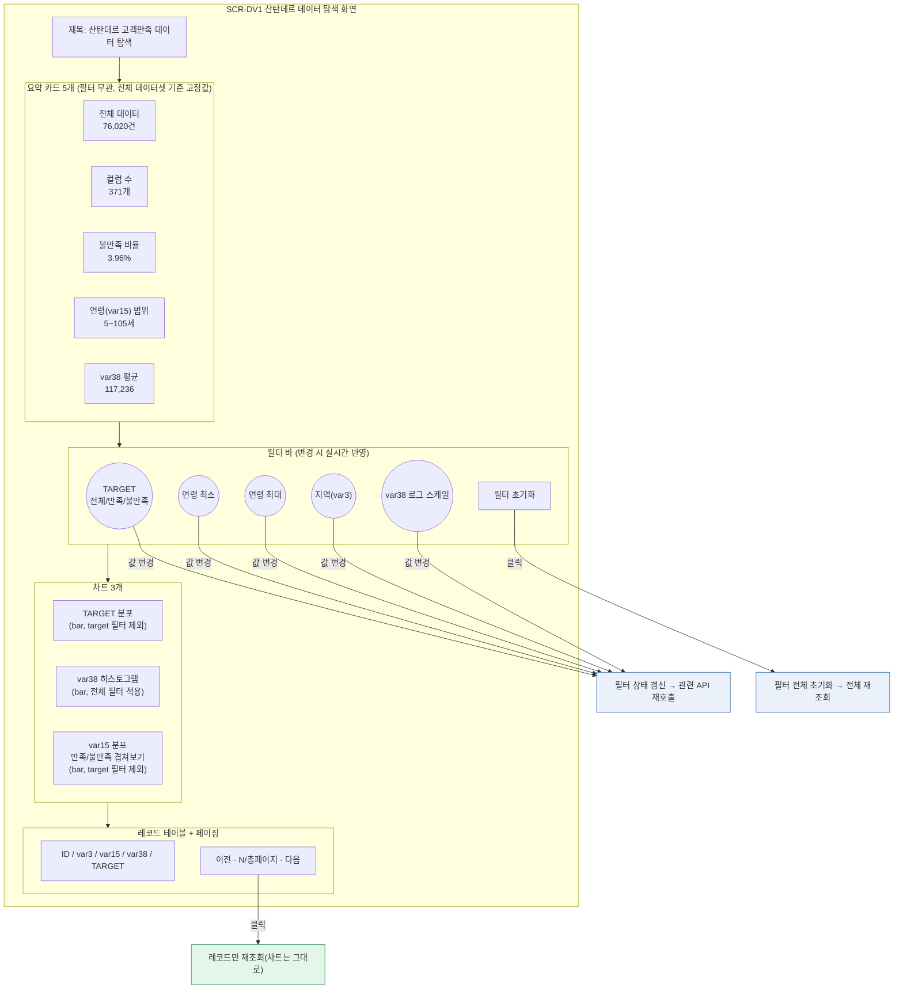
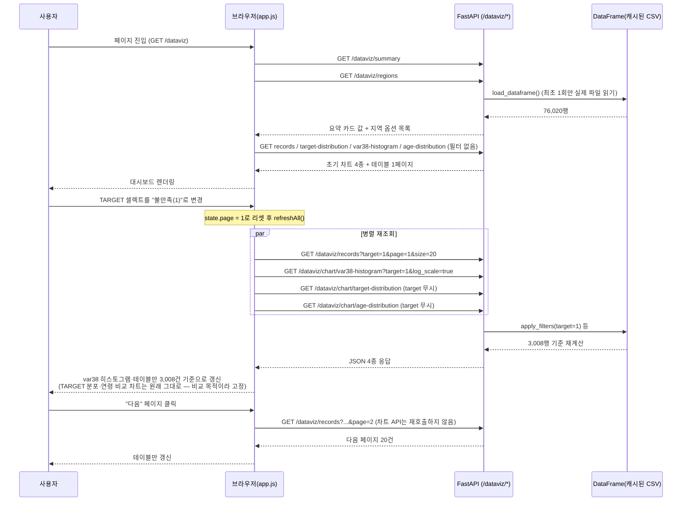

# SEMI TRD — 산탄데르 고객만족 데이터 탐색 대시보드

> `정찬성/캐글산탄데르/캐글산탄데르.ipynb`(산탄데르 은행 고객만족 예측 EDA)를 정적 노트북에서 끝내지 않고, 필터를 바꾸면 그래프와 표가 즉시 갱신되는 웹 화면으로 재구성했다. 실제로 `semi-backend/`에 구현·기동·브라우저 검증까지 마친 결과를 기준으로 작성한 as-built 문서다(작성 시점: 2026-08-19).

## 0. 왜 노트북을 그대로 두지 않았는가

원본 노트북은 7개 셀로 구성된 초기 EDA 단계였다(데이터 로딩 → 불균형 확인 → `describe()` → `var38` 히스토그램 1개). 이 상태로는:

- 셀을 재실행하지 않으면 다른 조건(연령대, 지역, TARGET)의 분포를 볼 수 없다
- 76,020행 전체를 한 번에 그려야 해서 `var38`처럼 꼬리가 매우 긴 변수는 로그 변환 없이는 분포가 안 보인다(노트북 마지막 셀이 정확히 이 문제에서 멈춰 있었다)
- 팀원들이 각자 로컬에서 노트북을 열어야만 분석 결과를 볼 수 있다

→ **20년차 설계자 판단**: 노트북의 결론을 그대로 옮기는 대신, 노트북이 다루던 5개 핵심 컬럼(`ID`, `var3`=지역, `var15`=나이, `var38`=대출액수, `TARGET`)을 웹에서 필터링·조회할 수 있는 대시보드로 재구성하고, 전체 371개 컬럼 중 원본 노트북이 실제로 탐색하지 않은 나머지 컬럼은 이번 화면 스코프에서 제외했다(과설계 방지).

## 1. 화면 UI 레이아웃 (SCR-DV1, `GET /dataviz`)



## 2. 데이터 구조 / 아키텍처

DB 테이블이 아니라 캐글 원본 CSV(`santander-customer-satisfaction/train.csv`, 76,020행 × 371열)를 그대로 읽는다. `semi-backend/app/domains/dataviz/`에 `models.py`가 없는 이유이기도 하다(`app/domains/README.md` "예외: dataviz/" 참고).

```python
# app/domains/dataviz/crud.py
USE_COLUMNS = ["ID", "var3", "var15", "var38", "TARGET"]   # 371개 중 노트북이 실제 탐색한 5개만 로드
TOTAL_COLUMNS = 371                                          # 노트북 1번 셀 주석 기준 상수화

@lru_cache
def load_dataframe() -> pd.DataFrame:
    return pd.read_csv(settings.santander_csv_path, encoding="latin-1", usecols=USE_COLUMNS)

def get_dataframe() -> pd.DataFrame:
    """FastAPI Depends 진입점. 테스트에서는 app.dependency_overrides로 표본 DataFrame으로 교체."""
    return load_dataframe()
```

- CSV는 서버 최초 요청 시 1회만 로드하고 `lru_cache`로 캐싱한다(76,020 × 5컬럼, 재로딩 없음)
- 필터는 pandas boolean indexing으로 처리하고(`apply_filters`), 히스토그램은 `numpy.histogram`으로 bin을 계산한다
- `var3 == -999999`는 노트북이 "이상치"로만 언급하고 실제 처리는 하지 않았던 값이다. 이번 대시보드도 원본 그대로 노출한다(§6 향후 개선 참고)

### API 엔드포인트

| 메서드/경로 | 쿼리 파라미터 | 응답 | 비고 |
|---|---|---|---|
| `GET /dataviz` | - | HTML | 대시보드 화면(`static/dataviz/index.html`) |
| `GET /dataviz/summary` | - | `SummaryResponse` | 전체 데이터셋 고정 통계(필터 무관) |
| `GET /dataviz/regions` | - | `RegionOption[]` | var3 상위 20개(빈도순) — 지역 셀렉트박스 채우기용 |
| `GET /dataviz/records` | `target, age_min, age_max, region, page, size` | `RecordsResponse` | 페이징 테이블 |
| `GET /dataviz/chart/target-distribution` | `age_min, age_max, region` | `TargetDistributionResponse` | **target 파라미터 없음**(의도적 — §4 참고) |
| `GET /dataviz/chart/var38-histogram` | `target, age_min, age_max, region, bins, log_scale` | `HistogramResponse` | `log_scale` 기본값 `true`(꼬리가 매우 길어 `log1p` 기본 적용) |
| `GET /dataviz/chart/age-distribution` | `region, bins` | `AgeDistributionResponse` | **target 파라미터 없음**(의도적 — 만족/불만족 겹쳐보기가 목적) |

## 3. 이벤트(상호작용) 흐름



> **설계 의도**: TARGET 분포 차트와 연령 분포 차트는 일부러 `target` 쿼리 파라미터를 받지 않는다. 이 두 차트의 존재 목적 자체가 "만족군 vs 불만족군 비교"이기 때문에, TARGET 필터를 적용하면 차트가 막대 1개만 남아 비교가 불가능해진다. 나머지(연령/지역) 필터는 두 차트에도 동일하게 적용된다.

## 4. 화면 구성

| 요소 | 동작 | 호출 API | 반응 |
|---|---|---|---|
| 요약 카드 5개 | 최초 진입 시 1회 표시 | `GET /dataviz/summary` | 필터와 무관하게 전체 데이터셋 기준 고정 |
| TARGET 셀렉트 | 값 변경 | records, var38-histogram (target 포함) | 즉시 재조회, 페이지 1로 리셋 |
| 연령 최소/최대 입력 | 입력(400ms 디바운스) | records, 3개 차트 (target-distribution/age-distribution 제외 대상엔 미포함) | 즉시 재조회, 페이지 1로 리셋 |
| 지역(var3) 셀렉트 | 값 변경 | records, 3개 차트 전부 | 즉시 재조회, 페이지 1로 리셋 |
| var38 로그 스케일 체크박스 | 값 변경 | var38-histogram만 | var38 차트만 재조회(나머지는 그대로) |
| 필터 초기화 버튼 | 클릭 | 전체 API | 모든 필터 리셋 후 전체 재조회 |
| 이전/다음 페이지 버튼 | 클릭 | records만 | 테이블만 갱신(차트 재조회 없음 — 불필요한 API 호출 방지) |

## 5. 인수기준(AC)

| AC | 내용 | 검증 방법 |
|---|---|---|
| AC-DV1 | `/dataviz/summary`의 `unsatisfied_ratio`는 `TARGET==1` 건수 / 전체 건수와 일치해야 한다 | 76,020건 기준 3,008/76,020 = 0.0396 실측 확인 |
| AC-DV2 | TARGET 필터를 "불만족(1)"로 바꾸면 레코드 테이블·var38 히스토그램만 갱신되고, TARGET 분포·연령 비교 차트는 그대로 유지되어야 한다 | 브라우저에서 필터 변경 후 4개 위젯 각각의 갱신 여부 확인 |
| AC-DV3 | 페이지네이션은 차트를 재호출하지 않고 테이블만 갱신해야 한다 | 페이지 이동 시 네트워크 요청에 `/dataviz/records`만 발생하는지 확인 |
| AC-DV4 | 필터 조합(target+age_min+age_max+region)을 동시에 걸었을 때 records의 `total`과 실제 반환된 `rows` 조건이 모두 일치해야 한다 | 쿼리 파라미터 조합 테스트 |

## 6. 테스트 시나리오

`tests/test_dataviz.py`에 5행 표본 DataFrame을 `app.dependency_overrides[crud.get_dataframe]`로 주입해 10개 케이스로 검증했다(전체 통과, 실제 59MB CSV는 읽지 않아 테스트가 빠르다).

| TC | 입력/행위 | 기대 결과 | 대응 AC |
|---|---|---|---|
| TC-DV1 | `GET /dataviz/summary` | `total_rows=5, satisfied=3, unsatisfied=2, ratio=0.4` | AC-DV1 |
| TC-DV2 | `GET /dataviz/regions` | `var3=2`(3건), `var3=8`(2건) 둘 다 포함 | - |
| TC-DV3 | `GET /dataviz/records?target=1` | `total=2`, 반환된 모든 행의 `target==1` | AC-DV2, AC-DV4 |
| TC-DV4 | `GET /dataviz/records?age_min=30&age_max=60` | `total=3`, 모든 행이 30≤var15≤60 | AC-DV4 |
| TC-DV5 | `GET /dataviz/records?page=2&size=2` | `page=2, size=2`, 반환 2건 | AC-DV3 |
| TC-DV6 | `GET /dataviz/chart/target-distribution` (target 파라미터 없이도 항상) | `counts=[3,2]` 고정 | AC-DV2 |
| TC-DV7 | `GET /dataviz/chart/var38-histogram?bins=5&log_scale=false` | `bin_edges` 6개(경계), `counts` 합계 5 | - |
| TC-DV8 | `GET /dataviz/chart/age-distribution?bins=5` | `satisfied_counts` 합계 3, `unsatisfied_counts` 합계 2 | AC-DV2 |
| TC-DV9 | `GET /dataviz` | `200`, `content-type: text/html` | - |
| TC-DV10(브라우저 실측) | 실제 76,020행 데이터로 TARGET 필터를 "불만족(1)"로 변경 | var38 차트 y축이 25,000→800대로 축소, 테이블 총건수 76,020→3,008건, TARGET/연령 비교 차트는 불변 | AC-DV1, AC-DV2 |

> TC-DV10은 `claude-in-chrome`으로 실제 브라우저에서 수행했다 — 스크린샷상 var38 히스토그램의 y축 최대값이 25,000(전체)에서 800(불만족만)으로 바뀌었고, 레코드 테이블 총건수가 정확히 3,008건으로 표시됨을 확인했다.

## 7. 실행 방법

```bash
cd 정찬성/semi-backend
.venv\Scripts\activate
uvicorn app.main:app --reload
# http://127.0.0.1:8000/dataviz
```

CSV 경로는 `.env`의 `SANTANDER_CSV_PATH`(기본값 `../santander-customer-satisfaction/train.csv`, `semi-backend/` 기준 상대경로)로 설정한다. 이번 기능을 위해 `pyproject.toml`에 `pandas==3.0.5`, `numpy==2.5.2`를 추가했다(기존 기술 스택 문서 `1. 기술 스택(신규).md`에는 없던 의존성 — 학교 메뉴 시스템과 무관한 별도 데이터 탐색 기능이라 분리 추가).

## 8. 다음 단계 제안 (20년차 설계자 관점, 지금 하지 않음)

- **var3 이상치 처리**: `-999999` 값 116건이 그대로 노출된다. 결측 표기(NaN)였을 가능성이 높아 보이나, 원본 노트북도 "이상치"로만 언급하고 처리하지 않았다 — 실제 의미를 데이터 제공팀/원본 노트북 작성자에게 확인 후 결정할 사항
- **371개 전체 컬럼 탐색**: 이번 화면은 노트북이 다룬 5개 컬럼만 다룬다. `imp_*`/`saldo_*` 등 나머지 366개 컬럼을 볼 필요가 생기면 컬럼 선택 UI를 별도로 설계해야 한다(한 화면에 371개를 다 보여주는 건 사용성 문제)
- **모델링 결과 연동**: 현재는 EDA 단계만 반영했다. 노트북에 분류 모델(XGBoost 등) 학습이 추가되면 피처 중요도·ROC 커브 등을 보여주는 탭을 이 화면에 추가하는 방향을 권장
