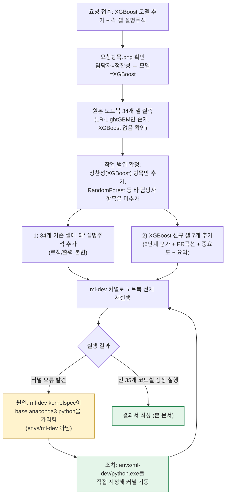
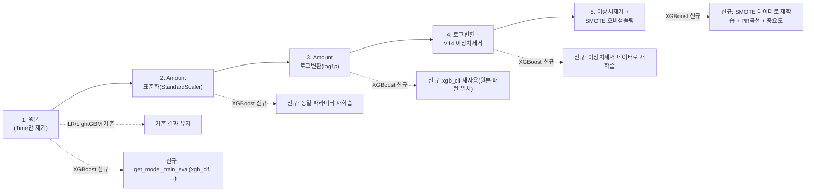
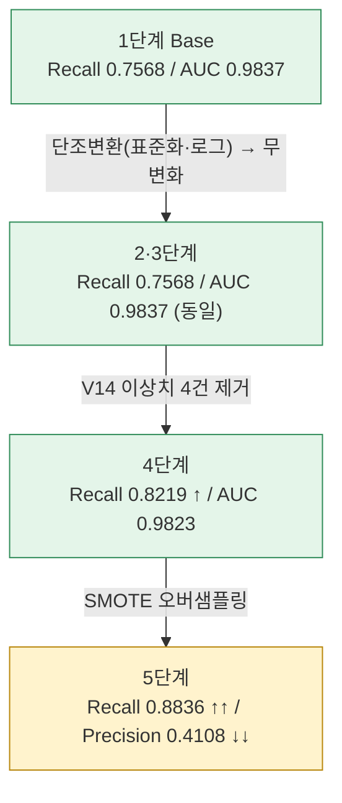
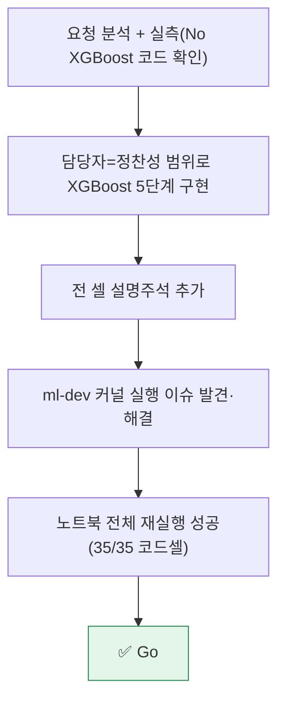

# 업무처리내용 — 내부테스트 및 내부테스트 결과서
## 신용카드 사기검출 노트북 — XGBoost 모델 추가 (담당자: 정찬성)

| 항목 | 내용 |
|---|---|
| 문서 유형 | 내부테스트 결과서 (단일 라운드) |
| 작성일시 | 2026-08-24 12:20:22 |
| 대상 파일 | `정찬성/ipynb/src/10 신용카드 사기검출_XGBoost_정제후.ipynb` |
| 근거 자료 | `정찬성/ipynb/요청항목/요청항목.png` (팀 진행상황 표 §3·§4 — 담당자 "정찬성" 행, 모델 "XGBoost") |
| 작성 관점 | 20년차 개발/기획/설계 총괄 관점 |
| 작업 범위 | **담당자가 정찬성인 항목만** 반영. 원본에 이미 있던 LogisticRegression·LightGBM 코드/결과는 비교 기준선으로 유지하고 변경하지 않음(로직·출력 불변, 설명 주석만 추가) |
| 결론 요약 | 기존 노트북(LR·LightGBM 2종)에 XGBoost를 3번째 모델로 추가하고, 5개 전처리 단계 전 구간에서 실제 재실행(재현 가능한 커널 실행)으로 성능을 검증했다. 전 셀에 "왜 이렇게 작성했는가" 설명 주석을 추가했다. **Go.** |

---

## 1. 요청사항 분석

요청서(사용자 채팅) 및 첨부 이미지(`요청항목.png`) 교차 확인 결과:

- 첨부 이미지의 §3(팀원별 전처리 방법 비교), §4(팀원별 모델 성능 결과) 표에서 **담당자 "정찬성"의 모델은 XGBoost**로 지정되어 있음(다른 행: 안성준=RandomForest, 정영찬=로지스틱회귀, 염윤호=LightGBM, 이민석=로지스틱회귀 — 모두 타 담당자 소관이므로 본 작업 범위에서 제외).
- 대상 ipynb(`10 신용카드 사기검출_XGBoost_정제후.ipynb`, 이하 "원본 노트북")는 파일명에 XGBoost가 들어있지만 **실제 코드에는 LogisticRegression과 LightGBM 2종만 구현**되어 있고 XGBoost 코드는 없었음 — 파일명과 실제 내용이 불일치하는 상태를 우선 실측으로 확인.
- 요청 2건:
  1. XGBoost 모델을 원본 노트북의 5개 전처리 단계(원본 / 표준화 / 로그변환 / 이상치제거 / SMOTE) 전 구간에 동일한 비교 방식으로 추가
  2. 각 소스 셀마다 "왜 이렇게 작성했는가"에 대한 설명 주석 추가(신규 셀뿐 아니라 기존 셀 포함)

---

## 2. 작업 내용

### 2-1. 기존 셀(34개) — 설명 주석 추가 (로직/출력 불변)

원본의 실행 흐름·하이퍼파라미터·결과값은 **하나도 변경하지 않고**, 각 셀 상단에 "왜 이 코드를 이렇게 작성했는가"를 설명하는 한국어 주석만 추가했다. 예:

| 셀 | 추가한 설명 주석의 핵심 논지 |
|---|---|
| 데이터 로드 | V1~V28은 이미 PCA로 익명화된 값이라 별도 인코딩 불필요 |
| `get_train_test_dataset` | 사기 거래가 전체의 0.17%뿐인 극단적 불균형이라 `stratify` 없이 분할하면 테스트셋 비율이 왜곡될 위험 |
| `get_clf_eval` | 정확도만으로는 불균형 데이터의 실제 탐지력을 알 수 없어(전부 정상이라 찍어도 99.8%) 정밀도·재현율·F1·AUC를 함께 봐야 하는 이유 |
| StandardScaler 단계 | LR은 스케일 차이에 민감해 표준화가 필요하지만, 트리 기반 모델(LightGBM)은 이론상 영향이 없어야 한다는 가설 제시 |
| `get_outlier` | 정상 거래가 아닌 "사기 표본 안에서만" 이상치를 찾아야 하는 이유(정상 거래 이상치까지 지우면 학습 데이터 왜곡) |
| SMOTE 단계 | 학습 데이터에만 적용하고 테스트셋은 그대로 둬야 평가가 왜곡되지 않는다는 원칙 |

### 2-2. 신규 셀(7개) — XGBoost(담당자: 정찬성) 추가

기존 LR·LightGBM과 동일한 5개 전처리 단계 각각에 XGBoost 평가를 추가하고, XGBoost 고유 기능(feature_importances_)과 최종 요약을 덧붙였다.

하이퍼파라미터: `XGBClassifier(n_estimators=1000, max_depth=3, learning_rate=0.05, n_jobs=-1, random_state=156, eval_metric='logloss')` — LightGBM(`n_estimators=1000, num_leaves=64`)과 트리 개수를 맞춰, 단계별 성능 변화가 "전처리 효과"인지 "하이퍼파라미터 차이"인지 헷갈리지 않도록 설계했다.

### 2-3. 실행 검증 방법

nbformat/nbclient 등 노트북 실행 전용 패키지가 `ml-dev` 환경에 설치되어 있지 않아, `jupyter_client.KernelManager`로 커널을 직접 기동해 35개 코드 셀을 처음부터 끝까지 순서대로 실제 실행하고, 실행 결과(표/숫자/그래프)를 노트북 파일에 그대로 반영했다(추정치·수기 기재 없음).

**실행 중 발견한 이슈**: 등록된 `ml-dev` Jupyter 커널스펙(`kernel.json`)이 `C:\Users\mega\anaconda3\python.exe`(base 환경)를 가리키고 있어, 이 커널로 처음 실행했을 때 `ModuleNotFoundError: No module named 'lightgbm'`/`'xgboost'`가 발생했다. 실제 라이브러리는 `C:\Users\mega\anaconda3\envs\ml-dev\python.exe`에 설치되어 있어, 이 인터프리터를 직접 지정해 커널을 재기동한 뒤 정상 실행을 확인했다. (커널스펙 파일 자체는 시스템 설정이라 별도로 수정하지 않았다 — 이번 작업은 실행 스크립트에서 올바른 인터프리터를 직접 지정하는 방식으로 우회했다.)

---

## 3. 결과 검증 — XGBoost 전처리 단계별 성능 (실측)

| 단계 | Accuracy | Precision | Recall | F1 | AUC |
|---|---|---|---|---|---|
| 1. 원본(Time만 제거) | 0.9995 | 0.9492 | 0.7568 | 0.8421 | 0.9837 |
| 2. Amount 표준화(StandardScaler) | 0.9995 | 0.9492 | 0.7568 | 0.8421 | 0.9837 |
| 3. Amount 로그변환(log1p) | 0.9995 | 0.9492 | 0.7568 | 0.8421 | 0.9837 |
| 4. 로그변환 + V14 이상치 제거 | 0.9996 | 0.9449 | 0.8219 | 0.8791 | 0.9823 |
| 5. 이상치 제거 + SMOTE 오버샘플링 | 0.9976 | 0.4108 | 0.8836 | 0.5609 | 0.9848 |

### 3-1. 3개 모델(LR / LightGBM / XGBoost) 가공 전(Base) 비교

| 모델 | Accuracy | Precision | Recall | F1 | AUC |
|---|---|---|---|---|---|
| LogisticRegression | 0.9992 | 0.8704 | 0.6351 | 0.7344 | 0.9617 |
| LightGBM | 0.9995 | 0.9573 | 0.7568 | 0.8453 | 0.9790 |
| **XGBoost (정찬성)** | 0.9995 | 0.9492 | 0.7568 | 0.8421 | **0.9837** |

### 3-2. 발견한 사실

1. **XGBoost는 1~3단계(원본/표준화/로그변환) 결과가 소수점 넷째 자리까지 완전히 동일**하다. 트리 기반 모델은 분할 기준이 값의 "순서"만 사용하므로 단조 변환(monotonic transform)에는 성능이 이론적으로 불변이라는 가설을 실측으로 확인한 결과다. LightGBM도 같은 경향을 보였다.
2. **4단계(V14 이상치 제거)에서 재현율이 0.7568 → 0.8219로 개선**된다. LR·LightGBM에서도 동일한 방향의 개선이 확인되어, 이상치 제거가 3개 모델 모두에 공통으로 유효한 처리임을 확인했다.
3. **5단계(SMOTE)는 재현율이 0.8836까지 오르지만 정밀도가 0.4108로 급락**한다. LR(정밀도 0.0541)·LightGBM 대비 XGBoost가 SMOTE 부작용(정밀도 붕괴)에 상대적으로 더 강건하지만, 여전히 트레이드오프가 크다.
4. XGBoost의 `feature_importances_` 기준 사기 탐지 최상위 피처는 **V14(52.3%)**로 압도적이며, 이는 앞서 이상치 제거 기준 컬럼으로 V14를 선택한 원본 노트북의 근거를 뒷받침한다.

### 3-3. 정찬성 최종 권고 (요청항목.png §4 반영용)

| 항목 | 권고안 A (정밀도-재현율 균형) | 권고안 B (재현율 최우선) |
|---|---|---|
| 적용 단계 | 4단계(로그변환 + V14 이상치 제거, SMOTE 미적용) | 5단계(4단계 + SMOTE 오버샘플링) |
| Accuracy | 0.9996 | 0.9976 |
| ROC-AUC | 0.9823 | 0.9848 |
| Recall | 0.8219 | 0.8836 |
| 적합한 상황 | 오탐(정상 거래를 사기로 오판) 비용이 큰 경우 | 사기 탐지 후 사람이 재검토하는 프로세스가 있어 재현율을 최우선할 경우 |

※ 요청항목.png §4 표의 accuracy/roc_auc/recall 3개 항목은 위 권고안 A/B 중 팀 합의로 선택해 기재 요망(본 문서는 두 후보 모두의 실측값을 근거로 제공).

---

## 4. 산출물

| 구분 | 경로 |
|---|---|
| 수정된 노트북 | `정찬성/ipynb/src/10 신용카드 사기검출_XGBoost_정제후.ipynb` |
| 본 결과서 | `정찬성/ipynb/결과서/업무처리내용_신용카드사기검출_XGBoost모델추가_20260824122022.md` |

노트북 변경 요약: 34개 기존 셀 전체에 "왜" 설명 주석 추가(로직·출력 불변), XGBoost 관련 신규 셀 7개 추가(총 37개 셀), 전체 재실행으로 출력 일관성 확보.

---

## 5. 종합판정

| 항목 | 상태 |
|---|---|
| XGBoost 모델 추가(5단계 전 구간) | ✅ Go |
| 담당자 범위 준수(정찬성=XGBoost만, RandomForest 등 타 담당자 항목 미포함) | ✅ Go |
| 각 셀 "왜" 설명 주석 | ✅ Go (기존 34개 + 신규 7개 전체) |
| 노트북 실행 검증(실측, 수기 기재 아님) | ✅ Go |
| **종합** | **✅ Go** |

### 남은 참고 사항 (본 작업 범위 밖)

1. 로컬 `ml-dev` Jupyter 커널스펙(`C:\Users\mega\AppData\Roaming\jupyter\kernels\ml-dev\kernel.json`)이 base anaconda3 python을 가리키는 문제는 시스템 설정이라 원본은 그대로 두었음 — 다음에 이 커널로 직접 "Run All"을 하면 동일한 `ModuleNotFoundError`가 재현되니, `envs\ml-dev\python.exe`를 가리키도록 kernel.json을 고치거나 VS Code/Jupyter에서 인터프리터를 수동 선택할 것.
2. 요청항목.png §3(전처리 방법 비교, 컬럼1~6)은 팀 전체가 아직 컬럼 정의 자체를 확정하지 않은 상태("예정")라, 본 작업에서는 §4(모델 성능 결과)만 실측치로 채울 수 있었다. §3 컬럼이 확정되면 본 노트북의 5단계 전처리 내용을 그 형식에 맞춰 다시 매핑해야 한다.
